# 📊 Sơ Đồ Activity (Activity Diagrams) — Hệ Thống HRMS

> **Hệ thống Quản lý Nhân sự (Human Resource Management System)**
> Môn học: SE104 – Nhập môn Công nghệ Phần mềm

---

## Quy ước ký hiệu

| Ký hiệu Mermaid | Ý nghĩa UML Activity |
|------------------|----------------------|
| `([...])` | Nút bắt đầu / Kết thúc |
| `[...]` | Hành động (Action) |
| `{...}` | Nút quyết định (Decision) |
| `-->` | Luồng điều khiển (Control Flow) |
| Swimlane (`subgraph`) | Phân vùng trách nhiệm (Partition) |

---

## AD-1. Đăng nhập Hệ thống

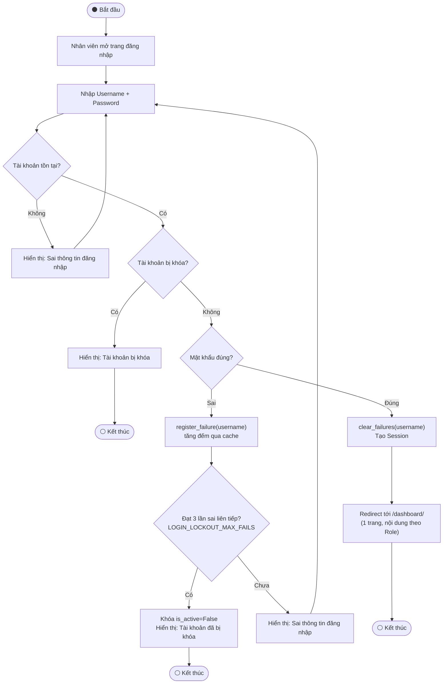

---

## AD-2. Quên mật khẩu (OTP qua Email)

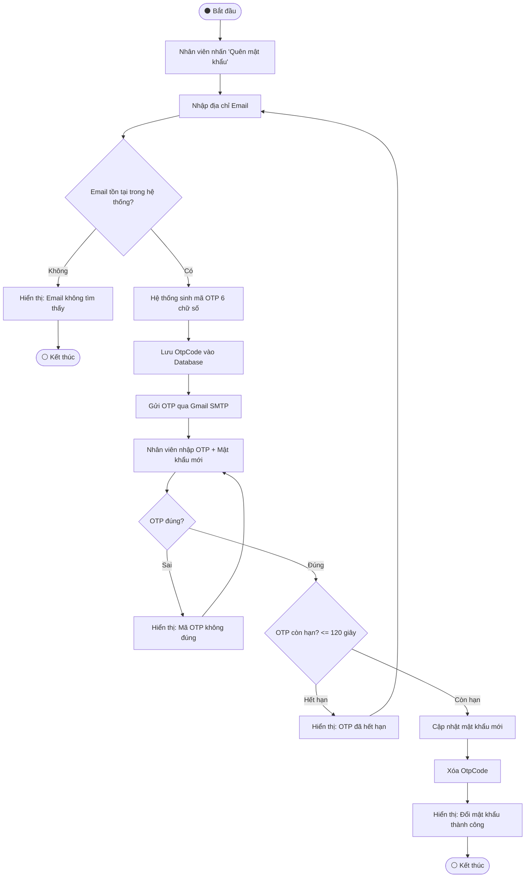

---

## AD-3. Tạo Hồ sơ Nhân viên Mới (HR)

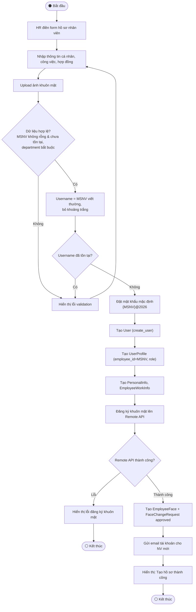

---

## AD-4. Đăng ký / Cập nhật Khuôn mặt

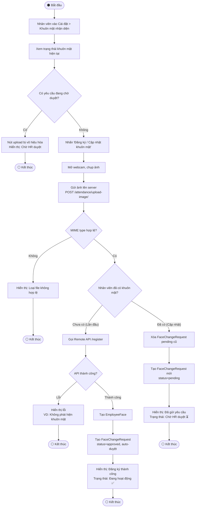

---

## AD-5. HR Duyệt Yêu cầu Đổi Khuôn mặt

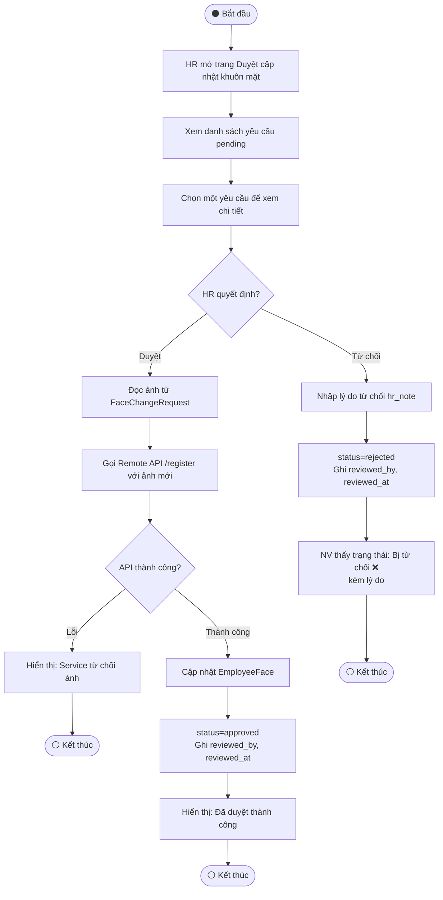

---

## AD-6. Chấm công bằng FaceID

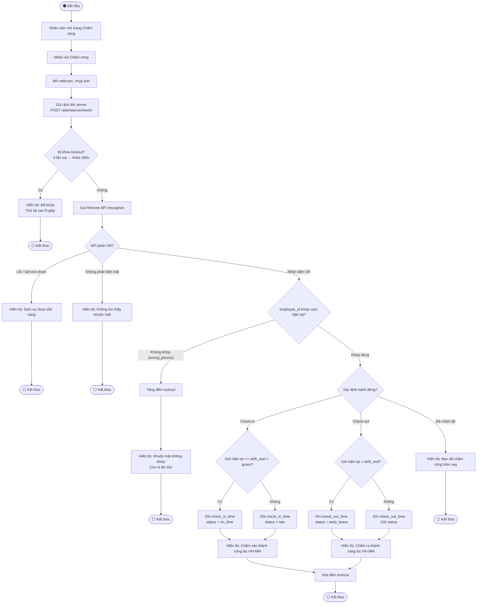

---

## AD-7. Yêu cầu Điều chỉnh Giờ công

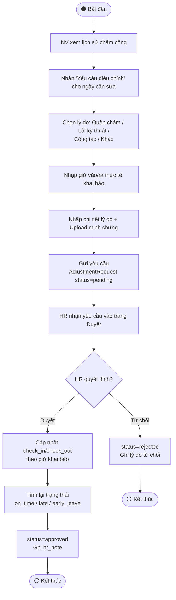

---

## AD-8. Nghỉ phép — Phê duyệt 2 cấp

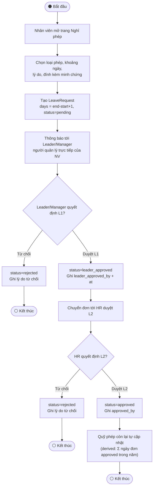

---

## AD-9. Tăng ca (OT) — Phê duyệt 2 cấp

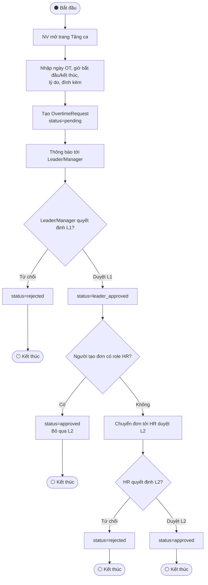

---

## AD-10. Đánh giá Nhân viên

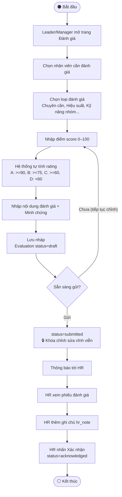

---

## AD-11. Khen thưởng / Xử phạt — Phê duyệt 2 cấp

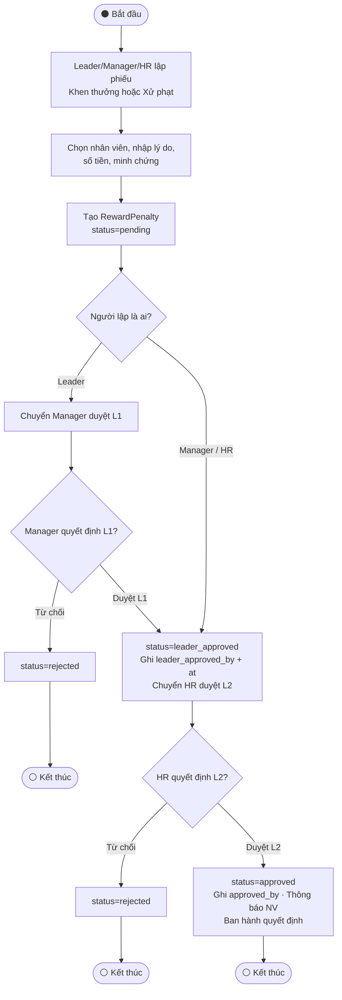

---

## AD-12. Báo cáo Công việc

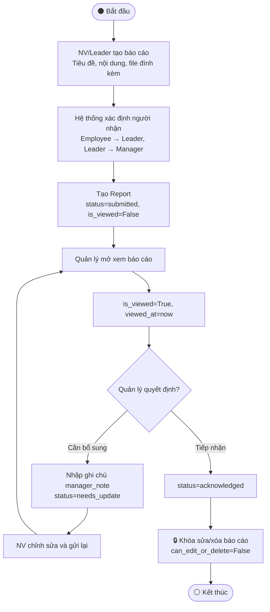

---

## AD-13. Helpdesk Ticket — Tiếp nhận & Xử lý

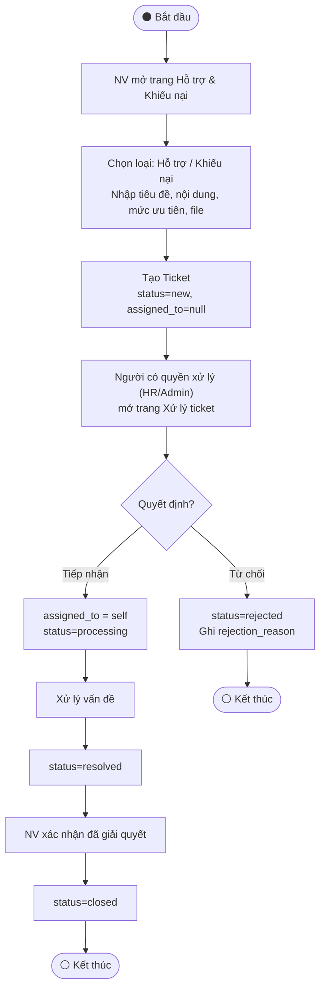

---

## AD-14. Cảnh báo Hợp đồng Hết hạn (Batch Job)

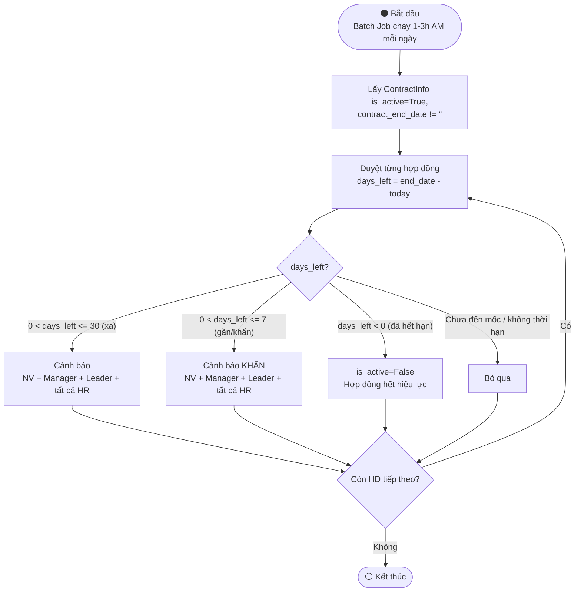
