# Activity Diagrams — Business Web Project

> **Per-function** — mỗi chức năng 1 activity diagram, đối chiếu code thật.
> Thứ tự block = thứ tự chức năng 1.1 → 10.6 ⇒ `svg/activity-diagrams-NN.svg` (NN theo thứ tự).
> Xem ma trận phủ: `docs/diagrams/COVERAGE.md`.

---

## 1. Quản lý tài khoản & phân quyền

### 1.1 Đăng nhập

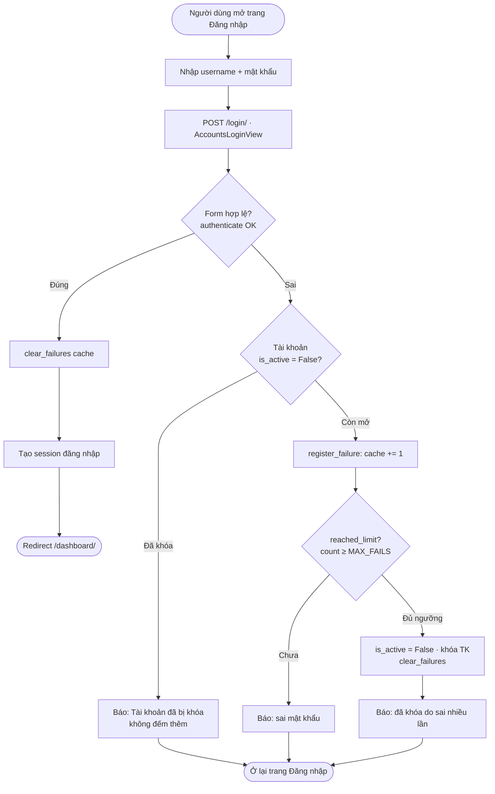
```mermaid
flowchart TD
  A([Người dùng mở trang Đăng nhập]) --> B[Nhập username + mật khẩu]
  B --> C[POST /login/ · AccountsLoginView]
  C --> D{Form hợp lệ?<br/>authenticate OK}
  D -- Đúng --> E[clear_failures cache]
  E --> F[Tạo session đăng nhập]
  F --> G([Redirect /dashboard/])
  D -- Sai --> H{Tài khoản<br/>is_active = False?}
  H -- Đã khóa --> I[Báo: Tài khoản đã bị khóa<br/>không đếm thêm]
  H -- Còn mở --> J[register_failure: cache += 1]
  J --> K{reached_limit?<br/>count ≥ MAX_FAILS}
  K -- Chưa --> L[Báo: sai mật khẩu]
  K -- Đủ ngưỡng --> M[is_active = False · khóa TK<br/>clear_failures]
  M --> N[Báo: đã khóa do sai nhiều lần]
  I --> O([Ở lại trang Đăng nhập])
  L --> O
  N --> O
```

### 1.2 Đăng xuất

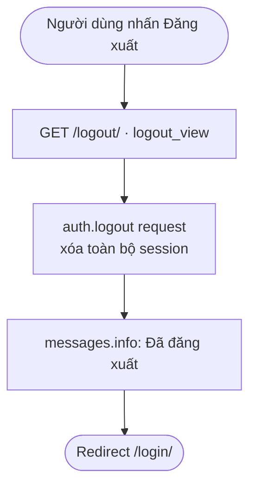
```mermaid
flowchart TD
  A([Người dùng nhấn Đăng xuất]) --> B[GET /logout/ · logout_view]
  B --> C[auth.logout request<br/>xóa toàn bộ session]
  C --> D[messages.info: Đã đăng xuất]
  D --> E([Redirect /login/])
```

### 1.3 Quên mật khẩu — OTP

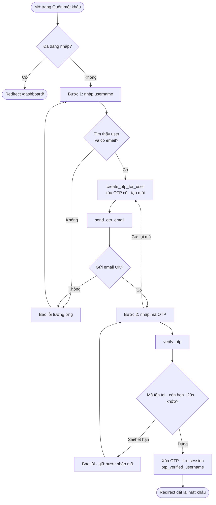
```mermaid
flowchart TD
  A([Mở trang Quên mật khẩu]) --> B{Đã đăng nhập?}
  B -- Có --> Z([Redirect /dashboard/])
  B -- Không --> C[Bước 1: nhập username]
  C --> D{Tìm thấy user<br/>và có email?}
  D -- Không --> E[Báo lỗi tương ứng] --> C
  D -- Có --> F[create_otp_for_user<br/>xóa OTP cũ · tạo mới]
  F --> G[send_otp_email]
  G --> H{Gửi email OK?}
  H -- Không --> E
  H -- Có --> I[Bước 2: nhập mã OTP]
  I --> J[verify_otp]
  J --> K{Mã tồn tại · còn hạn 120s · khớp?}
  K -- Sai/hết hạn --> L[Báo lỗi · giữ bước nhập mã] --> I
  K -- Đúng --> M[Xóa OTP · lưu session<br/>otp_verified_username]
  M --> N([Redirect đặt lại mật khẩu])
  I -. Gửi lại mã .-> F
```

### 1.4 Khóa / Mở khóa tài khoản

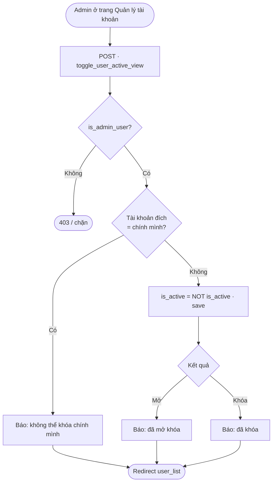
```mermaid
flowchart TD
  A([Admin ở trang Quản lý tài khoản]) --> B[POST · toggle_user_active_view]
  B --> C{is_admin_user?}
  C -- Không --> Z([403 / chặn])
  C -- Có --> D{Tài khoản đích<br/>= chính mình?}
  D -- Có --> E[Báo: không thể khóa chính mình]
  D -- Không --> F[is_active = NOT is_active · save]
  F --> G{Kết quả}
  G -- Mở --> H[Báo: đã mở khóa]
  G -- Khóa --> I[Báo: đã khóa]
  E --> Y([Redirect user_list])
  H --> Y
  I --> Y
```

### 1.5 Đặt lại mật khẩu nhân viên

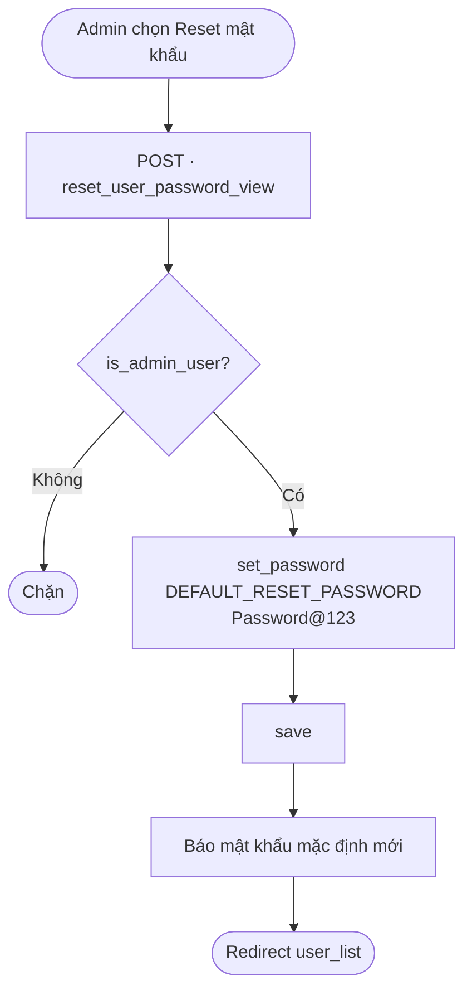
```mermaid
flowchart TD
  A([Admin chọn Reset mật khẩu]) --> B[POST · reset_user_password_view]
  B --> C{is_admin_user?}
  C -- Không --> Z([Chặn])
  C -- Có --> D[set_password DEFAULT_RESET_PASSWORD<br/>Password@123]
  D --> E[save]
  E --> F[Báo mật khẩu mặc định mới]
  F --> Y([Redirect user_list])
```

### 1.6 Gán vai trò & quyền

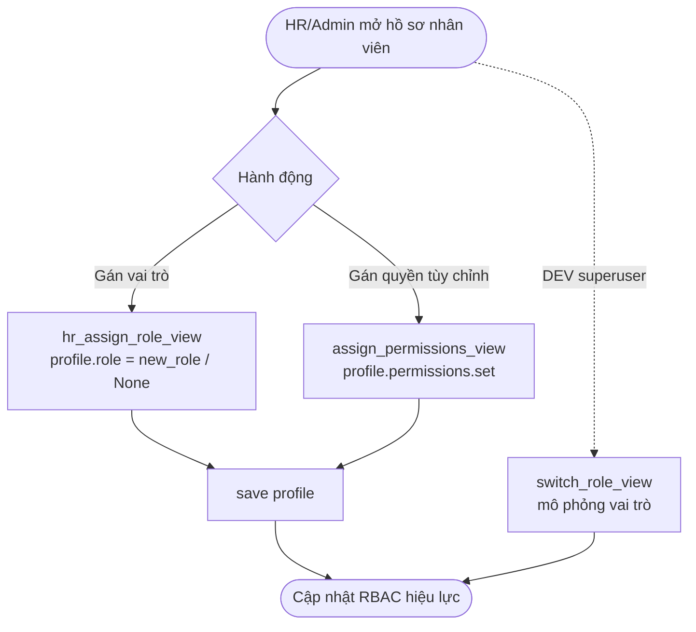
```mermaid
flowchart TD
  A([HR/Admin mở hồ sơ nhân viên]) --> B{Hành động}
  B -- Gán vai trò --> C[hr_assign_role_view<br/>profile.role = new_role / None]
  B -- Gán quyền tùy chỉnh --> D[assign_permissions_view<br/>profile.permissions.set]
  C --> E[save profile]
  D --> E
  E --> F([Cập nhật RBAC hiệu lực])
  A -. DEV superuser .-> G[switch_role_view<br/>mô phỏng vai trò] --> F
```

### 1.7 Tạo tài khoản mới (Admin)

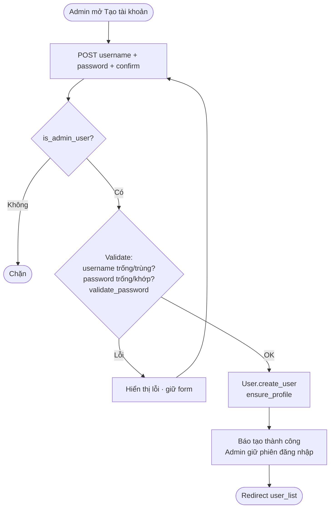
```mermaid
flowchart TD
  A([Admin mở Tạo tài khoản]) --> B[POST username + password + confirm]
  B --> C{is_admin_user?}
  C -- Không --> Z([Chặn])
  C -- Có --> D{Validate:<br/>username trống/trùng?<br/>password trống/khớp?<br/>validate_password}
  D -- Lỗi --> E[Hiển thị lỗi · giữ form] --> B
  D -- OK --> F[User.create_user<br/>ensure_profile]
  F --> G[Báo tạo thành công<br/>Admin giữ phiên đăng nhập]
  G --> Y([Redirect user_list])
```

---

## 2. Quản lý hồ sơ nhân viên

### 2.1 Xem hồ sơ nhân viên

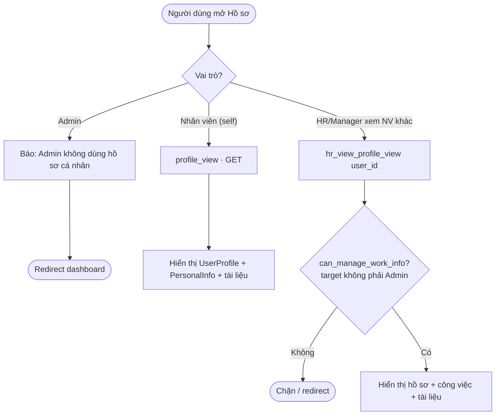
```mermaid
flowchart TD
  A([Người dùng mở Hồ sơ]) --> B{Vai trò?}
  B -- Admin --> Z[Báo: Admin không dùng hồ sơ cá nhân]
  Z --> Z2([Redirect dashboard])
  B -- Nhân viên (self) --> C[profile_view · GET]
  C --> D[Hiển thị UserProfile + PersonalInfo + tài liệu]
  B -- HR/Manager xem NV khác --> E[hr_view_profile_view user_id]
  E --> F{can_manage_work_info?<br/>target không phải Admin}
  F -- Không --> Z3([Chặn / redirect])
  F -- Có --> G[Hiển thị hồ sơ + công việc + tài liệu]
```

### 2.2 Tạo nhân viên mới

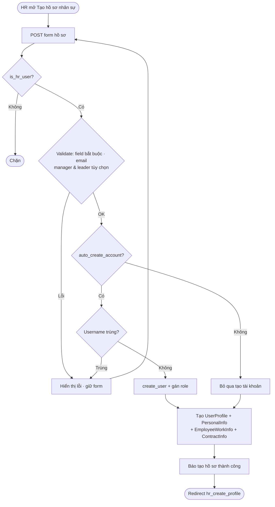
```mermaid
flowchart TD
  A([HR mở Tạo hồ sơ nhân sự]) --> B[POST form hồ sơ]
  B --> C{is_hr_user?}
  C -- Không --> Z([Chặn])
  C -- Có --> D{Validate: field bắt buộc · email<br/>manager & leader tùy chọn}
  D -- Lỗi --> E[Hiển thị lỗi · giữ form] --> B
  D -- OK --> F{auto_create_account?}
  F -- Có --> G{Username trùng?}
  G -- Trùng --> E
  G -- Không --> H[create_user + gán role]
  F -- Không --> I[Bỏ qua tạo tài khoản]
  H --> J[Tạo UserProfile + PersonalInfo<br/>+ EmployeeWorkInfo + ContractInfo]
  I --> J
  J --> K[Báo tạo hồ sơ thành công]
  K --> Y([Redirect hr_create_profile])
```

### 2.3 Chỉnh sửa thông tin cá nhân

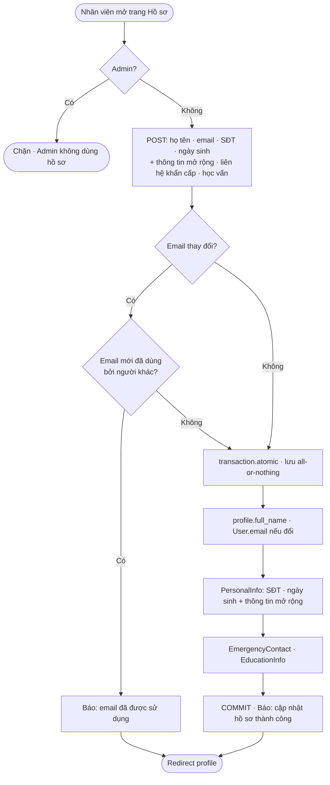
```mermaid
flowchart TD
  A([Nhân viên mở trang Hồ sơ]) --> B{Admin?}
  B -- Có --> Z([Chặn · Admin không dùng hồ sơ])
  B -- Không --> C[POST: họ tên · email · SĐT · ngày sinh<br/>+ thông tin mở rộng · liên hệ khẩn cấp · học vấn]
  C --> D{Email thay đổi?}
  D -- Có --> E{Email mới đã dùng<br/>bởi người khác?}
  E -- Có --> F[Báo: email đã được sử dụng]
  F --> Y([Redirect profile])
  E -- Không --> G[transaction.atomic · lưu all-or-nothing]
  D -- Không --> G
  G --> H[profile.full_name · User.email nếu đổi]
  H --> I[PersonalInfo: SĐT · ngày sinh + thông tin mở rộng]
  I --> J[EmergencyContact · EducationInfo]
  J --> K[COMMIT · Báo: cập nhật hồ sơ thành công]
  K --> Y
```

### 2.4 Cập nhật thông tin công việc

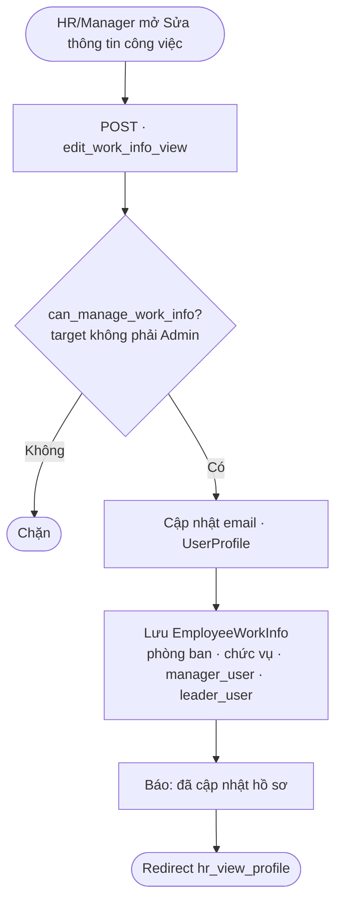
```mermaid
flowchart TD
  A([HR/Manager mở Sửa thông tin công việc]) --> B[POST · edit_work_info_view]
  B --> C{can_manage_work_info?<br/>target không phải Admin}
  C -- Không --> Z([Chặn])
  C -- Có --> D[Cập nhật email · UserProfile]
  D --> E[Lưu EmployeeWorkInfo<br/>phòng ban · chức vụ · manager_user · leader_user]
  E --> F[Báo: đã cập nhật hồ sơ]
  F --> Y([Redirect hr_view_profile])
```

### 2.5 Quản lý tài liệu nhân viên

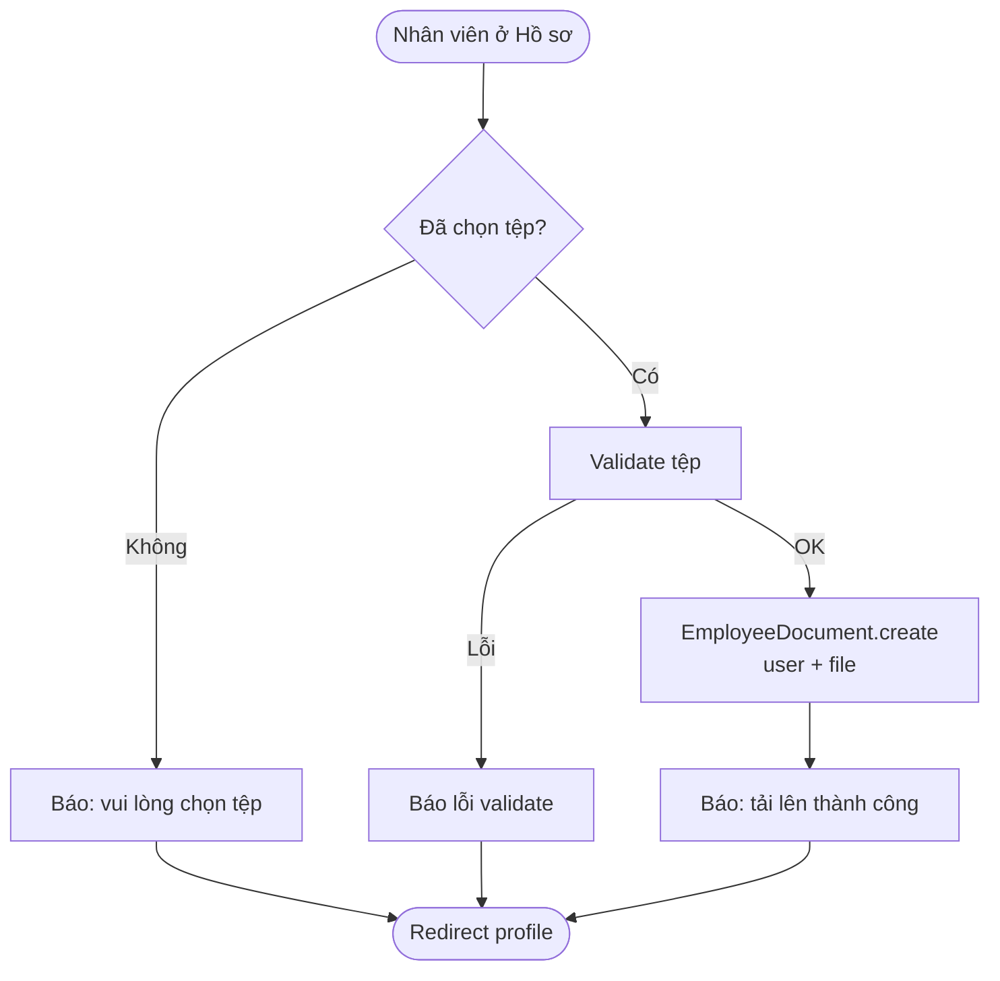
```mermaid
flowchart TD
  A([Nhân viên ở Hồ sơ]) --> B{Đã chọn tệp?}
  B -- Không --> C[Báo: vui lòng chọn tệp]
  C --> Y([Redirect profile])
  B -- Có --> D[Validate tệp]
  D -- Lỗi --> E[Báo lỗi validate] --> Y
  D -- OK --> F[EmployeeDocument.create<br/>user + file]
  F --> G[Báo: tải lên thành công]
  G --> Y
```

### 2.6 Tra cứu danh sách nhân viên

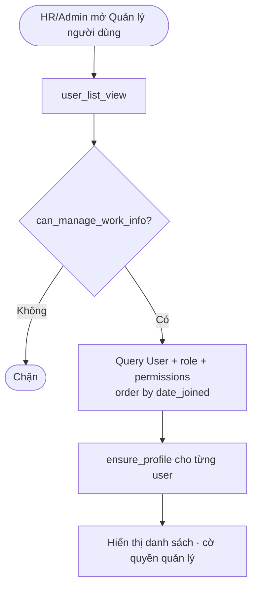
```mermaid
flowchart TD
  A([HR/Admin mở Quản lý người dùng]) --> B[user_list_view]
  B --> C{can_manage_work_info?}
  C -- Không --> Z([Chặn])
  C -- Có --> D[Query User + role + permissions<br/>order by date_joined]
  D --> E[ensure_profile cho từng user]
  E --> F[Hiển thị danh sách · cờ quyền quản lý]
```

---

## 3. Quản lý hợp đồng lao động

### 3.1 Xem hợp đồng lao động

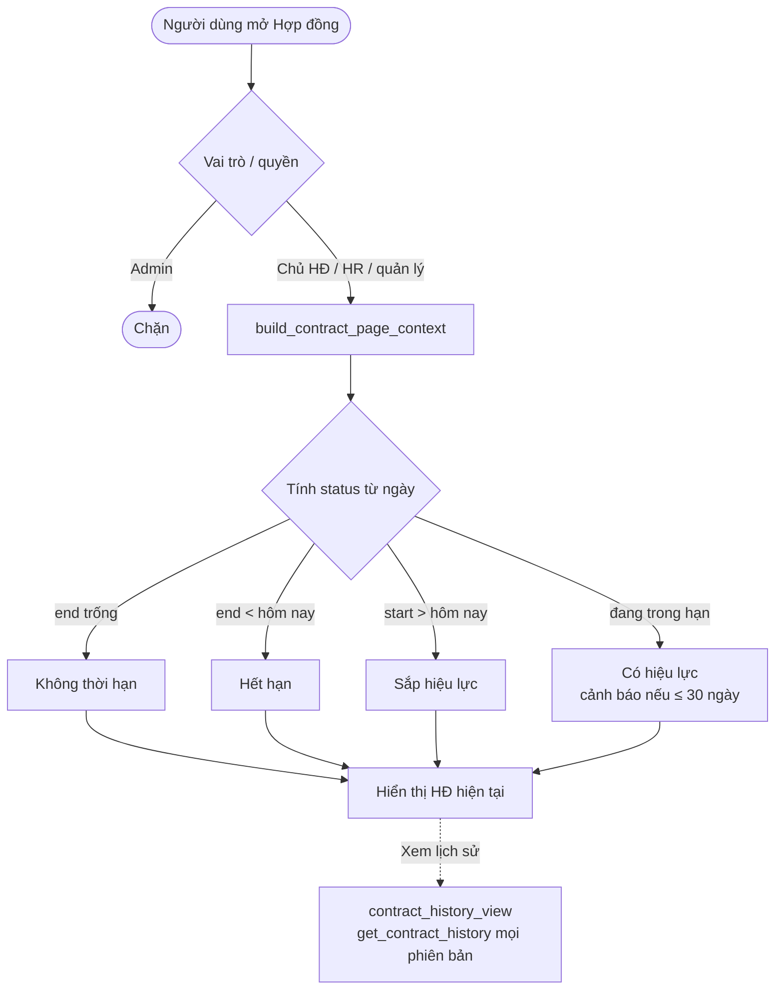
```mermaid
flowchart TD
  A([Người dùng mở Hợp đồng]) --> B{Vai trò / quyền}
  B -- Admin --> Z([Chặn])
  B -- Chủ HĐ / HR / quản lý --> C[build_contract_page_context]
  C --> D{Tính status từ ngày}
  D -- end trống --> E[Không thời hạn]
  D -- end < hôm nay --> F[Hết hạn]
  D -- start > hôm nay --> G[Sắp hiệu lực]
  D -- đang trong hạn --> H[Có hiệu lực<br/>cảnh báo nếu ≤ 30 ngày]
  E --> I[Hiển thị HĐ hiện tại]
  F --> I
  G --> I
  H --> I
  I -. Xem lịch sử .-> J[contract_history_view<br/>get_contract_history mọi phiên bản]
```

### 3.2 Tạo hợp đồng lao động

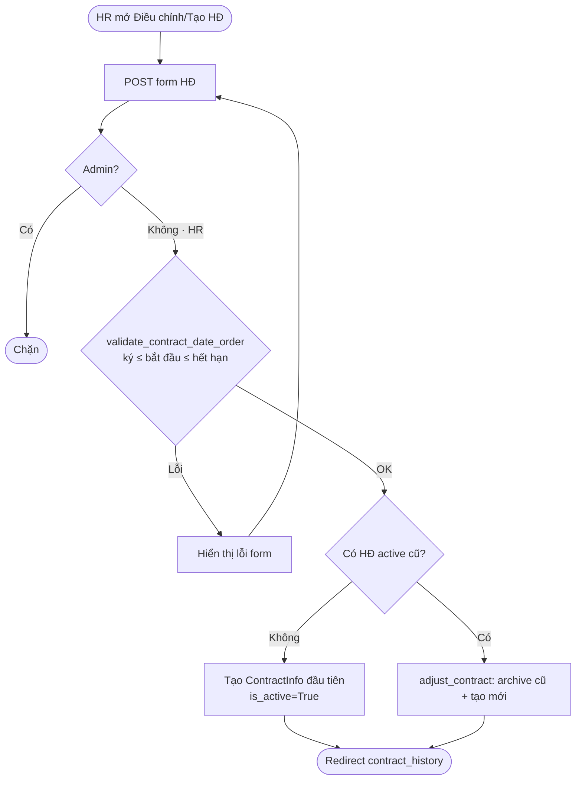
```mermaid
flowchart TD
  A([HR mở Điều chỉnh/Tạo HĐ]) --> B[POST form HĐ]
  B --> C{Admin?}
  C -- Có --> Z([Chặn])
  C -- Không · HR --> D{validate_contract_date_order<br/>ký ≤ bắt đầu ≤ hết hạn}
  D -- Lỗi --> E[Hiển thị lỗi form] --> B
  D -- OK --> F{Có HĐ active cũ?}
  F -- Không --> G[Tạo ContractInfo đầu tiên<br/>is_active=True]
  F -- Có --> H[adjust_contract: archive cũ + tạo mới]
  G --> Y([Redirect contract_history])
  H --> Y
```

### 3.3 Chỉnh sửa hợp đồng lao động

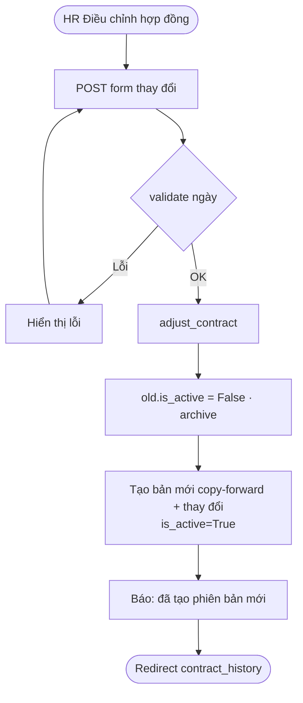
```mermaid
flowchart TD
  A([HR Điều chỉnh hợp đồng]) --> B[POST form thay đổi]
  B --> C{validate ngày}
  C -- Lỗi --> D[Hiển thị lỗi] --> B
  C -- OK --> E[adjust_contract]
  E --> F[old.is_active = False · archive]
  F --> G[Tạo bản mới copy-forward + thay đổi<br/>is_active=True]
  G --> H[Báo: đã tạo phiên bản mới]
  H --> Y([Redirect contract_history])
```

### 3.4 Gia hạn hợp đồng lao động

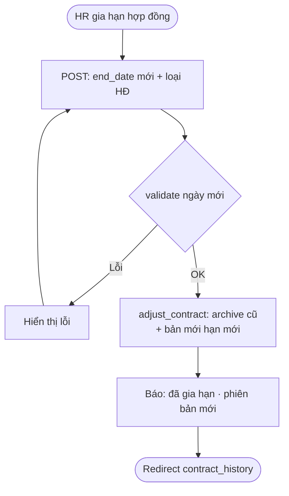
```mermaid
flowchart TD
  A([HR gia hạn hợp đồng]) --> B[POST: end_date mới + loại HĐ]
  B --> C{validate ngày mới}
  C -- Lỗi --> D[Hiển thị lỗi] --> B
  C -- OK --> E[adjust_contract: archive cũ<br/>+ bản mới hạn mới]
  E --> F[Báo: đã gia hạn · phiên bản mới]
  F --> Y([Redirect contract_history])
```

### 3.5 Cảnh báo hợp đồng sắp hết hạn (Tự động)

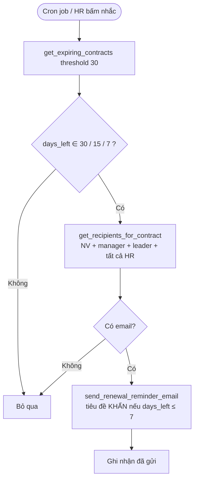
```mermaid
flowchart TD
  A([Cron job / HR bấm nhắc]) --> B[get_expiring_contracts threshold 30]
  B --> C{days_left ∈ 30 / 15 / 7 ?}
  C -- Không --> D[Bỏ qua]
  C -- Có --> E[get_recipients_for_contract<br/>NV + manager + leader + tất cả HR]
  E --> F{Có email?}
  F -- Không --> D
  F -- Có --> G[send_renewal_reminder_email<br/>tiêu đề KHẨN nếu days_left ≤ 7]
  G --> H[Ghi nhận đã gửi]
```

### 3.6 Tự động khóa hợp đồng hết hạn (Tự động)

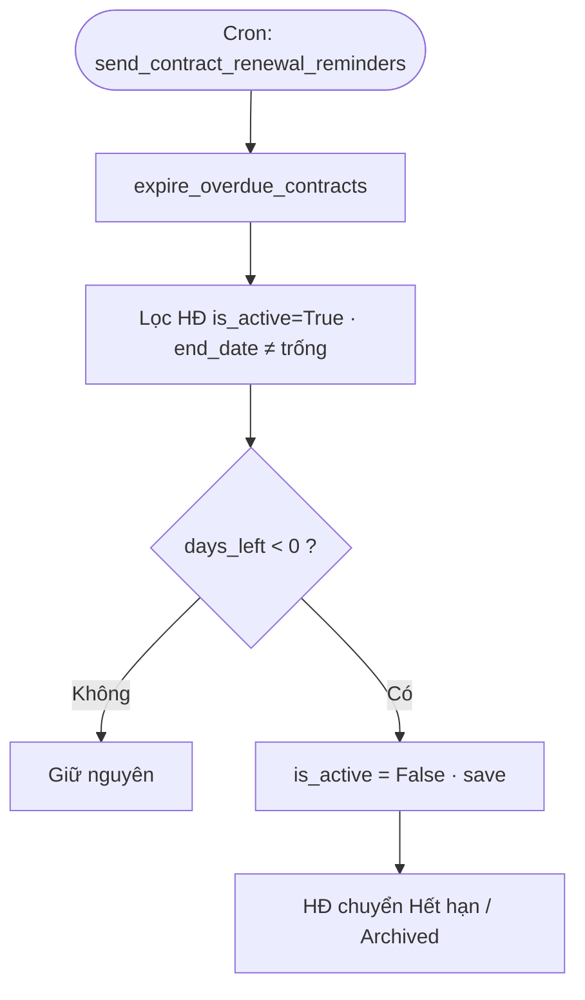
```mermaid
flowchart TD
  A([Cron: send_contract_renewal_reminders]) --> B[expire_overdue_contracts]
  B --> C[Lọc HĐ is_active=True · end_date ≠ trống]
  C --> D{days_left < 0 ?}
  D -- Không --> E[Giữ nguyên]
  D -- Có --> F[is_active = False · save]
  F --> G[HĐ chuyển Hết hạn / Archived]
```

---

## 4. Quản lý chấm công (FaceID)

### 4.1 Đăng ký khuôn mặt lần đầu

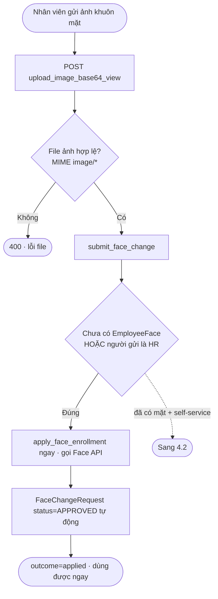
```mermaid
flowchart TD
  A([Nhân viên gửi ảnh khuôn mặt]) --> B[POST upload_image_base64_view]
  B --> C{File ảnh hợp lệ?<br/>MIME image/*}
  C -- Không --> Z([400 · lỗi file])
  C -- Có --> D[submit_face_change]
  D --> E{Chưa có EmployeeFace<br/>HOẶC người gửi là HR}
  E -- Đúng --> F[apply_face_enrollment ngay · gọi Face API]
  F --> G[FaceChangeRequest status=APPROVED tự động]
  G --> H([outcome=applied · dùng được ngay])
  E -. đã có mặt + self-service .-> I([Sang 4.2])
```

### 4.2 Cập nhật khuôn mặt

```mermaid
flowchart TD
  A([Nhân viên đã có mặt · gửi ảnh mới]) --> B[POST upload_image_base64_view]
  B --> C{File hợp lệ?}
  C -- Không --> Z([400])
  C -- Có --> D[submit_face_change · self-service]
  D --> E[Xóa FaceChangeRequest PENDING cũ]
  E --> F[Tạo FaceChangeRequest status=PENDING<br/>lưu ảnh chờ HR]
  F --> G([outcome=pending · CHƯA đổi mặt nhận diện])
```

### 4.3 Duyệt yêu cầu đổi khuôn mặt

```mermaid
flowchart TD
  A([HR mở trang duyệt đổi mặt]) --> B{is_hr_user?}
  B -- Không --> Z([Chặn])
  B -- Có --> C{Hành động}
  C -- Duyệt --> D[approve_face_change]
  D --> E{status == PENDING?}
  E -- Không --> F[Báo: đã xử lý]
  E -- Có --> G[apply enrollment · status=APPROVED<br/>xóa ảnh tạm]
  C -- Từ chối --> H[reject_face_change · status=REJECTED<br/>giữ ảnh minh chứng]
  G --> Y([Redirect face_change_review])
  H --> Y
  F --> Y
```

### 4.4 Chấm công vào (Check-in)

```mermaid
flowchart TD
  A([Nhân viên bấm Chấm công · gửi ảnh]) --> B[POST face_check_view]
  B --> C{is_locked? cache lockout}
  C -- Khóa --> Z([423 · chờ retry_after])
  C -- Không --> D[verify_face_for_user]
  D --> E{Kết quả}
  E -- wrong_person --> F([register_failure · 403 fails_left])
  E -- no_match --> G([401])
  E -- no_face --> H([400])
  E -- service_down --> I([503])
  E -- success --> J[decide_next_action]
  J --> K{action}
  K -- check_in --> L[record_check_in · status on_time/late<br/>clear_failures]
  L --> M([Trả giờ vào + status])
```

### 4.5 Chấm công ra (Check-out)

```mermaid
flowchart TD
  A([Nhân viên chấm công lần 2 trong ngày]) --> B[POST face_check_view · verify OK]
  B --> C[decide_next_action]
  C --> D{action}
  D -- check_out --> E[record_check_out · ghi giờ ra<br/>clear_failures]
  E --> F([Trả giờ ra])
  D -- done --> G([Đã đủ vào/ra · no-op])
```

### 4.6 Xem lịch sử chấm công

```mermaid
flowchart TD
  A([Nhân viên mở Chấm công]) --> B[attendance_view]
  B --> C[_history_rows: record tháng hiện tại<br/>+ map AdjustmentRequest]
  C --> D[Hiển thị bảng lịch sử + trạng thái từng ngày]
  D --> E{Record có thể điều chỉnh?}
  E -- Có --> F[Hiện nút Yêu cầu điều chỉnh]
```

### 4.7 Yêu cầu điều chỉnh giờ công

```mermaid
flowchart TD
  A([Nhân viên chọn 1 ngày · Yêu cầu điều chỉnh]) --> B[submit_adjustment_view record_id]
  B --> C{Đã có request cho record?<br/>OneToOne}
  C -- Có --> D[Báo: ngày này đã có yêu cầu]
  D --> Y([Redirect attendance])
  C -- Không --> E{Record thuộc tháng hiện tại?}
  E -- Không --> F[Báo: chỉ điều chỉnh trong tháng] --> Y
  E -- Có --> G[POST form: lý do + giờ + minh chứng]
  G --> H{Form hợp lệ?}
  H -- Không --> G
  H -- Có --> I[Tạo AdjustmentRequest status=pending<br/>record.status=pending_adjustment]
  I --> J[Báo: đã gửi tới HR] --> Y
```

### 4.8 Duyệt yêu cầu điều chỉnh

```mermaid
flowchart TD
  A([HR mở trang duyệt điều chỉnh]) --> B{is_hr_user?}
  B -- Không --> Z([Chặn])
  B -- Có --> C{Hành động}
  C -- Duyệt --> D[approve_adjustment]
  D --> E[Áp giờ vào/ra khai báo<br/>recompute_record_status]
  E --> F[adj.status=approved · record cập nhật]
  C -- Từ chối --> G[reject_adjustment<br/>recompute_record_status · adj=rejected]
  F --> Y([Redirect review])
  G --> Y
```

### 4.9 Theo dõi trạng thái khuôn mặt

```mermaid
flowchart TD
  A([Nhân viên mở Chấm công / Hồ sơ mặt]) --> B{Đã có EmployeeFace?}
  B -- Chưa --> C[Trạng thái: Chưa đăng ký]
  B -- Có --> D{FaceChangeRequest PENDING?}
  D -- Có --> E[Trạng thái: Chờ HR duyệt đổi mặt]
  D -- Không --> F[Trạng thái: Đang dùng · Active]
  E --> G[Mặt nhận diện vẫn là mặt cũ tới khi duyệt]
```

---

## 5. Quản lý nghỉ phép

### 5.1 Nộp đơn xin nghỉ phép

```mermaid
flowchart TD
  A([Nhân viên mở Nghỉ phép]) --> B[POST LeaveRequestForm]
  B --> C{Form hợp lệ?}
  C -- Không --> D[Báo lỗi form] --> B
  C -- Có --> E[create_leave_request<br/>days = end−start+1]
  E --> R{Có leader/manager?}
  R -- Có ≥1 --> P[status=PENDING · chờ duyệt L1]
  R -- Trống cả 2 --> Q{Nhân viên là HR?}
  Q -- Có --> S[status=APPROVED · tự động duyệt]
  Q -- Không --> T[status=LEADER_APPROVED · chuyển thẳng HR L2]
  P --> F{days > remaining_days?}
  S --> F
  T --> F
  F -- Có --> G[Cảnh báo vượt quỹ · đơn vẫn gửi]
  F -- Không --> H[Báo: gửi đơn thành công]
  G --> Y([Redirect leave])
  H --> Y
```

### 5.2 Xem đơn nghỉ phép của tôi

```mermaid
flowchart TD
  A([Nhân viên mở Nghỉ phép]) --> B[leave_view · GET]
  B --> C[get_user_leave_stats<br/>used · remaining · pending_count]
  C --> D[get_user_leave_requests danh sách]
  D --> E[Hiển thị quỹ phép + bảng đơn + trạng thái]
```

### 5.3 Phê duyệt cấp L1

```mermaid
flowchart TD
  A([Quản lý/Leader mở trang duyệt]) --> B{can_manage_requests?}
  B -- Không --> Z([Chặn])
  B -- Có --> C[approve_leave_request pk]
  C --> D{Tự duyệt đơn mình?}
  D -- Có --> E[Chặn: không tự duyệt]
  D -- Không --> F{status == PENDING?}
  F -- Có --> G{Đúng supervisor trực tiếp?}
  G -- Không --> H[Chặn: không phải quản lý trực tiếp]
  G -- Có --> I{Nhân viên là HR?}
  I -- Có --> J[status=APPROVED · bỏ qua L2]
  I -- Không --> K[status=LEADER_APPROVED · chờ HR]
  J --> Y([Redirect approval])
  K --> Y
```

### 5.4 Phê duyệt cấp L2

```mermaid
flowchart TD
  A([HR mở trang duyệt bước 2]) --> B[approve_leave_request pk]
  B --> C{status == LEADER_APPROVED?}
  C -- Không --> D[Báo: không ở bước chờ HR]
  C -- Có --> E{Là HR?}
  E -- Không --> F[Chặn]
  E -- Có --> G[approved_by=HR · status=APPROVED<br/>tạo notification]
  G --> Y([Redirect approval])
  D --> Y
```

### 5.5 Từ chối đơn nghỉ phép

```mermaid
flowchart TD
  A([Quản lý/HR chọn Từ chối]) --> B{can_manage_requests?}
  B -- Không --> Z([Chặn])
  B -- Có --> C[reject_leave_request pk + lý do]
  C --> D[status=REJECTED · rejected_reason<br/>tạo notification]
  D --> Y([Redirect approval])
```

### 5.6 Xem quỹ phép còn lại

```mermaid
flowchart TD
  A([Nhân viên mở Nghỉ phép]) --> B[get_user_leave_stats]
  B --> C[total_allowed = HĐ active<br/>contract_annual_leave_days]
  C --> D[used_days = Σ days đơn APPROVED trong năm]
  D --> E[remaining_days = max total − used, 0]
  E --> F[Hiển thị: tổng · đã dùng · còn lại · pending_count]
```

---

## 6. Quản lý tăng ca (OT)

### 6.1 Đăng ký tăng ca

```mermaid
flowchart TD
  A([Nhân viên mở Tăng ca]) --> B[POST OvertimeForm: ngày + giờ vào/ra + lý do]
  B --> C{end_time > start_time?<br/>form validation}
  C -- Không --> D[Lỗi: giờ kết thúc phải sau giờ bắt đầu] --> B
  C -- Có --> E[create_overtime_request<br/>hours = end−start]
  E --> R{Có leader/manager?}
  R -- Có ≥1 --> P[status=PENDING · chờ duyệt L1]
  R -- Trống cả 2 --> Q{Nhân viên là HR?}
  Q -- Có --> S[status=APPROVED · tự động duyệt]
  Q -- Không --> T[status=LEADER_APPROVED · chuyển thẳng HR L2]
  P --> F[Báo: gửi đơn tăng ca thành công]
  S --> F
  T --> F
  F --> Y([Redirect overtime])
```

### 6.2 Xem đơn tăng ca của tôi

```mermaid
flowchart TD
  A([Nhân viên mở Tăng ca]) --> B[overtime_view · GET]
  B --> C[Stats: total_hours · total_pay · pending_count]
  C --> D[Danh sách đơn OT + trạng thái]
  D --> E[Hiển thị form + bảng]
```

### 6.3 Phê duyệt OT cấp L1

```mermaid
flowchart TD
  A([Quản lý/Leader duyệt]) --> B{can_manage_requests?}
  B -- Không --> Z([Chặn])
  B -- Có --> C[approve_overtime_request pk]
  C --> D{Tự duyệt?}
  D -- Có --> E[Chặn]
  D -- Không --> F{PENDING + supervisor trực tiếp?}
  F -- Không --> G[Chặn]
  F -- Có --> H{NV là HR?}
  H -- Có --> I[status=APPROVED · bỏ qua L2]
  H -- Không --> J[status=LEADER_APPROVED · chờ HR]
  I --> Y([Redirect approval])
  J --> Y
```

### 6.4 Phê duyệt OT cấp L2

```mermaid
flowchart TD
  A([HR duyệt bước 2]) --> B[approve_overtime_request pk]
  B --> C{status==LEADER_APPROVED & là HR?}
  C -- Không --> D[Chặn]
  C -- Có --> E[status=APPROVED · approved_by=HR<br/>tạo notification]
  E --> Y([Redirect approval])
  D --> Y
```

### 6.5 Từ chối đơn tăng ca

```mermaid
flowchart TD
  A([Quản lý/HR từ chối]) --> B{can_manage_requests?}
  B -- Không --> Z([Chặn])
  B -- Có --> C[reject_overtime_request pk + lý do]
  C --> D{Đúng cấp duyệt?<br/>PENDING→supervisor · LEADER_APPROVED→HR}
  D -- Không --> E[Chặn]
  D -- Có --> F[status=REJECTED · lý do · notification]
  F --> Y([Redirect approval])
```

---

## 7. Đánh giá hiệu suất (KPI)

### 7.1 Xem phiếu đánh giá của tôi

```mermaid
flowchart TD
  A([Mở trang Đánh giá]) --> B{can_access_evaluations?}
  B -- Không · nhân viên thường --> Z([Chặn · xem kết quả qua hồ sơ/thông báo])
  B -- Có · Manager/Leader --> C[build_evaluations_page_context]
  C --> D[exclude_self_records<br/>bỏ phiếu mà người xem là đối tượng]
  D --> E[Hiển thị danh sách + score + rating + trạng thái]
```

### 7.2 Lập phiếu đánh giá

```mermaid
flowchart TD
  A([Manager/Leader mở Đánh giá]) --> B[POST: nhân viên + score + nhận xét + minh chứng]
  B --> C{can_submit_evaluation_demo?}
  C -- Không --> D[Báo: chỉ được xem]
  C -- Có --> E[create_evaluation]
  E --> F[score → rating tự động<br/>≥90 A · ≥75 B · ≥60 C · <60 D]
  F --> G[Lưu Evaluation status=submitted]
  G --> H[Báo: đã gửi đánh giá]
```

### 7.3 Gửi phiếu đánh giá

```mermaid
flowchart TD
  A([create_evaluation · status=submitted]) --> B[Phiếu vào hàng chờ HR<br/>get_pending_evaluations_for_hr]
  B --> C[Hiển thị ở trang HR xác nhận]
  C --> D([Chờ HR xác nhận])
  N[/Ghi chú: Lập = Gửi · cùng create_evaluation<br/>không có bước draft riêng/] -.-> A
```

### 7.4 Xác nhận phiếu đánh giá

```mermaid
flowchart TD
  A([HR mở trang xác nhận]) --> B{can_acknowledge_evaluation?}
  B -- Không --> Z([Chặn])
  B -- Có --> C[POST acknowledge_evaluation pk + hr_note]
  C --> D{status == submitted?}
  D -- Không --> E[Báo: không hợp lệ]
  D -- Có --> F[status=acknowledged<br/>acknowledged_by/at · immutable]
  F --> Y([Redirect evaluation_hr_approval])
  E --> Y
```

---

## 8. Khen thưởng & Kỷ luật

### 8.1 Xem quyết định thưởng/phạt

```mermaid
flowchart TD
  A([Mở Khen thưởng & Xử phạt]) --> B{Employee hoặc Admin?}
  B -- Có --> Z([Chặn truy cập])
  B -- Không · Leader/Manager/HR --> C{Là HR?}
  C -- HR --> D[Chọn nhân viên · loại tài khoản Admin]
  C -- Quản lý --> E[Xem phiếu trong phạm vi]
  D --> F[records của nhân viên<br/>tính tổng thưởng/phạt/net]
  E --> F
  F --> G[Hiển thị danh sách + trạng thái + tổng]
```

### 8.2 Đề xuất khen thưởng

```mermaid
flowchart TD
  A([Leader/Manager/HR mở trang]) --> B[POST create · decision_type=reward + amount + lý do]
  B --> C{Form hợp lệ?<br/>amount PositiveInteger ≥ 0}
  C -- Không --> D[Báo lỗi biểu mẫu] --> B
  C -- Có --> E[proposer = người lập]
  E --> F[status = initial_status_for]
  F --> G{Người lập là Leader?}
  G -- Có --> H[status=PENDING · chờ Manager L1]
  G -- Không · Manager/HR --> I[status=LEADER_APPROVED · thẳng HR L2]
  H --> Y([Báo gửi · Redirect])
  I --> Y
```

### 8.3 Đề xuất xử phạt

```mermaid
flowchart TD
  A([Người có quyền lập phiếu xử phạt]) --> B[POST decision_type=penalty + amount + lý do]
  B --> C{amount ≥ 0?}
  C -- Không --> D[Field PositiveInteger từ chối số âm] --> B
  C -- Có --> E[status = initial_status_for proposer]
  E --> F{Leader lập?}
  F -- Có --> G[PENDING · chờ L1]
  F -- Không --> H[LEADER_APPROVED · chờ L2]
  G --> Y([Redirect])
  H --> Y
```

### 8.4 Phê duyệt cấp L1

```mermaid
flowchart TD
  A([Manager mở trang duyệt]) --> B[get_pending_for_approver: Manager → PENDING]
  B --> C[approve pk]
  C --> CA{proposer == approver?}
  CA -- Có --> E0[Chặn: không tự duyệt phiếu của mình]
  CA -- Không --> D{status==PENDING & _is_l1_approver?<br/>Manager}
  D -- Không --> E[Chặn]
  D -- Có --> F[status=LEADER_APPROVED<br/>leader_approved_by/at]
  F --> Y([Redirect approval])
```

### 8.5 Phê duyệt cấp L2

```mermaid
flowchart TD
  A([HR mở trang duyệt]) --> B[get_pending_for_approver: HR → LEADER_APPROVED]
  B --> C[approve pk]
  C --> CA{proposer == approver?}
  CA -- Có --> E0[Chặn: không tự duyệt · HR lập phải HR khác duyệt]
  CA -- Không --> D{status==LEADER_APPROVED & _is_l2_approver?<br/>HR}
  D -- Không --> E[Chặn]
  D -- Có --> F[status=APPROVED · approved_by]
  F --> Y([Redirect approval])
```

### 8.6 Từ chối đề xuất

```mermaid
flowchart TD
  A([Người duyệt chọn Từ chối]) --> B[reject pk]
  B --> C{Đúng cấp?<br/>PENDING→L1 · LEADER_APPROVED→L2}
  C -- Không --> D[Chặn]
  C -- Có --> E{status ∈ pending / leader_approved?}
  E -- Không --> F[Báo: không hợp lệ]
  E -- Có --> G[status=REJECTED]
  G --> Y([Redirect approval])
  D --> Y
  F --> Y
```

---

## 9. Báo cáo Công việc & Helpdesk Ticket

### 9.1 Gửi báo cáo công việc

```mermaid
flowchart TD
  A([Nhân viên mở Báo cáo]) --> B{action}
  B -- create --> C[Tạo Report · author · status=submitted]
  B -- edit --> D{can_edit_or_delete?<br/>chưa acknowledged}
  D -- Không --> E[Báo: đã tiếp nhận · không sửa]
  D -- Có --> F[Lưu nội dung]
  F --> G{status == needs_update?}
  G -- Có --> H[Reset status=submitted]
  G -- Không --> I[Giữ submitted]
  B -- delete --> J{can_edit_or_delete?}
  J -- Không --> E
  J -- Có --> K[Xóa báo cáo]
  C --> Y([Redirect reports])
  H --> Y
  I --> Y
  K --> Y
  E --> Y
```

### 9.2 Xem và phản hồi báo cáo

```mermaid
flowchart TD
  A([Người nhận/tác giả mở chi tiết]) --> B{is_author / recipient?}
  B -- Không --> Z([Chặn])
  B -- Có --> C{is_recipient & chưa viewed?}
  C -- Có --> D[is_viewed=True · viewed_at]
  C -- Không --> E[Hiển thị nội dung]
  D --> F{POST hành động · recipient}
  E --> F
  F -- needs_update --> G[status=NEEDS_UPDATE · manager_note]
  F -- acknowledge --> H[status=ACKNOWLEDGED · khóa sửa/xóa]
  F -- chỉ xem --> I[Không đổi trạng thái]
  G --> Y([Redirect report_detail])
  H --> Y
  I --> Y
```

### 9.3 Gửi ticket hỗ trợ/khiếu nại

```mermaid
flowchart TD
  A([Nhân viên mở Ticket]) --> B[POST create · tiêu đề + nội dung]
  B --> C{Form hợp lệ?}
  C -- Không --> D[Báo lỗi] --> B
  C -- Có --> E[Tạo Ticket · author · status=new]
  E --> F[Báo: tạo yêu cầu thành công]
  F --> Y([Redirect tickets])
```

### 9.4 Xử lý ticket

```mermaid
flowchart TD
  A([HR/Admin mở Xử lý ticket]) --> B{can_process_tickets?<br/>HR + Admin · Admin giữ kênh hỗ trợ}
  B -- Không --> Z([Chặn])
  B -- Có --> C{action}
  C -- receive --> D[status=processing · assigned_to]
  C -- resolve --> E[status=resolved]
  C -- close --> F[status=closed]
  C -- reject --> G{Có lý do?}
  G -- Không --> H[Báo: nhập lý do từ chối]
  G -- Có --> I[status=rejected · rejection_reason]
  D --> Y([Redirect ticket_process])
  E --> Y
  F --> Y
  I --> Y
  H --> Y
```

---

## 10. Thống kê & Cài đặt hệ thống

> 10.5 *Cấu hình thông tin công ty* **không có trong code** (không có model/CompanyInfo) → không vẽ.

### 10.1 Xem thống kê nhóm trực thuộc (Dashboard Quản lý)

```mermaid
flowchart TD
  A([Quản lý/Leader mở Thống kê]) --> B[statistics_view]
  B --> C{Quyền xem?<br/>Manager/Leader/HR · Admin bị chặn}
  C -- Không · employee --> Z([Chặn])
  C -- Có --> D[Lọc phạm vi: nhân viên trực thuộc<br/>leader_user / manager_user]
  D --> E[Tổng hợp chấm công · nghỉ · OT · đánh giá]
  E --> F[Hiển thị dashboard nhóm]
```

### 10.2 Xem thống kê toàn công ty (Dashboard HR)

```mermaid
flowchart TD
  A([HR mở Thống kê]) --> B[statistics_view]
  B --> C{is_hr_user?<br/>Admin bị chặn}
  C -- Không --> Z([Phạm vi nhóm · xem 10.1])
  C -- Có --> D[Phạm vi: toàn bộ nhân viên]
  D --> E[Tổng hợp toàn công ty theo phòng ban]
  E --> F[Hiển thị dashboard tổng]
```

### 10.3 Xuất báo cáo dữ liệu

```mermaid
flowchart TD
  A([Người có quyền mở Thống kê]) --> B{Hành động xuất}
  B -- Excel --> C[statistics_export_excel_view<br/>ghi header + rows]
  C --> D[Trả file .xlsx · content-type xlsx]
  B -- In --> E[statistics_print_view<br/>render bản in]
  E --> F[Trang in · HTTP 200]
```

### 10.4 Cài đặt cá nhân

```mermaid
flowchart TD
  A([Người dùng mở Cài đặt]) --> B[settings_view / account_update_view]
  B --> C[Hiển thị trang Cài đặt]
  C --> D[Thông tin cá nhân chỉnh ở trang Hồ sơ · mục 2.3]
  N[/Ghi chú: account_update_view hiện là placeholder UI/] -.-> B
```

### 10.6 Cấu hình quy định nhân sự

```mermaid
flowchart TD
  A([HR mở Cài đặt]) --> B[settings_view · WorkScheduleConfig.get_solo]
  B --> C{POST form_section=work_schedule?}
  C -- Không --> D[Hiển thị cấu hình hiện tại]
  C -- Có --> E{Form hợp lệ?<br/>shift_start < shift_end · late_grace}
  E -- Không --> F[Render lại panel kèm lỗi]
  E -- Có --> G[schedule_form.save<br/>cập nhật ca chuẩn + ân hạn trễ]
  G --> H[Báo: đã lưu cấu hình]
```

<!-- BUILD-CURSOR -->
