# 🧩 Sơ Đồ Lớp (Class Diagram) — Hệ Thống HRMS

> **Hệ thống Quản lý Nhân sự (Human Resource Management System)**
> Môn học: SE104 – Nhập môn Công nghệ Phần mềm
>
> Sinh từ các Django model thực tế trong `business_web/`. Lớp `User` là model
> có sẵn của Django (`django.contrib.auth.models.User`) — đóng vai trò **hub trung tâm**,
> mọi nghiệp vụ đều tham chiếu tới nó.

---

## Quy ước

| Ký hiệu | Ý nghĩa |
|---------|---------|
| `1 -- 1` | Quan hệ 1–1 (`OneToOneField`) |
| `1 -- 0..*` | Quan hệ 1–nhiều (`ForeignKey`) |
| `* -- *` | Quan hệ nhiều–nhiều (`ManyToManyField`) |
| `+name type` | Thuộc tính công khai |
| `+name() type` | Phương thức / property tính toán |
| `<<django>>` | Lớp có sẵn của Django |
| `namespace` | Django app |

> Field có `choices` (status, role, leave_type, priority...) hiển thị kiểu `str` — giá trị enum xem trong phần mô tả & code.

> **Render:** Mermaid — hiển thị trực tiếp trên GitHub, VSCode (Markdown Preview), hoặc <https://mermaid.live>.

---

## Sơ đồ tổng thể

```mermaid
classDiagram
    direction LR

    class User {
        <<django>>
        +str username
        +str password
        +str email
        +str first_name
        +str last_name
        +bool is_active
        +bool is_staff
    }

    namespace accounts {
        class UserProfile {
            +str full_name
            +str employee_id
            +has_custom_permission(codename) bool
            +get_role_name() str
        }
        class Role {
            +str name
            +text description
            +get_name_display() str
        }
        class CustomPermission {
            +str codename
            +str name
            +text description
        }
        class OtpCode {
            +str code
            +datetime created_at
            +int OTP_EXPIRY_SECONDS
            +is_expired() bool
        }
        class Notification {
            +str title
            +text message
            +str link
            +bool is_read
            +datetime created_at
        }
    }

    namespace employee_profiles {
        class PersonalInfo {
            +str phone_number
            +str date_of_birth
            +str gender
            +str marital_status
            +str nationality
            +str id_card_number
            +str id_card_issue_place
            +str id_card_issue_date
            +text permanent_address
            +text temporary_address
            +employee_id() str
        }
        class EmployeeWorkInfo {
            +str employee_type
            +str department
            +str position
            +str workplace
            +str probation_start
            +str official_start_date
            +str work_status
        }
        class EducationAndSkills {
            +str education_level
            +str degree
            +str major
            +text certificates
            +text foreign_languages
            +text professional_skills
        }
        class EmergencyContact {
            +str contact_name
            +str contact_phone
            +str relation
            +text contact_address
        }
        class EmployeeDocument {
            +str title
            +str document_type
            +FileField file
            +datetime uploaded_at
        }
    }

    namespace contracts {
        class ContractInfo {
            +bool is_active
            +str contract_number
            +str contract_type
            +str contract_signed_date
            +str contract_start_date
            +str contract_end_date
            +int contract_annual_leave_days
            +str contract_standard_shift
            +time shift_start_time
            +time shift_end_time
            +str contract_attachment_reference
        }
    }

    namespace attendance {
        class AttendanceRecord {
            +date record_date
            +time check_in_time
            +time check_out_time
            +str status
        }
        class AttendanceAdjustmentRequest {
            +str reason
            +text reason_detail
            +time claimed_check_in_time
            +time claimed_check_out_time
            +FileField evidence
            +str status
            +datetime submitted_at
            +datetime reviewed_at
            +text hr_note
        }
        class EmployeeFace {
            +text face_base64
            +int slot_id
            +str content_type
            +datetime created_at
            +datetime updated_at
        }
        class FaceChangeRequest {
            +text image_base64
            +str content_type
            +str image_sha256
            +str ip_address
            +str status
            +datetime reviewed_at
            +text hr_note
            +datetime created_at
            +is_cross_user() bool
        }
    }

    namespace leaves {
        class LeaveRequest {
            +str leave_type
            +date start_date
            +date end_date
            +decimal days
            +text reason
            +str status
            +datetime leader_approved_at
            +text rejected_reason
            +FileField attachment
            +datetime created_at
            +date_range_display() str
            +is_waiting() bool
        }
    }

    namespace overtime {
        class OvertimeRequest {
            +date overtime_date
            +time start_time
            +time end_time
            +decimal hours
            +text reason
            +str status
            +datetime leader_approved_at
            +text rejected_reason
            +FileField attachment
            +datetime created_at
            +time_range_display() str
            +is_waiting() bool
        }
    }

    namespace performance {
        class EvaluationCategory {
            +str name
            +text description
            +datetime created_at
        }
        class Evaluation {
            +str status
            +str rating
            +int score
            +date evaluation_date
            +text content
            +str evidence_reference
            +datetime acknowledged_at
            +text hr_note
            +datetime created_at
            +save() void
        }
    }

    namespace rewards_discipline {
        class RewardPenalty {
            +str record_type
            +int amount
            +str reason_title
            +text reason_detail
            +str status
            +datetime leader_approved_at
            +date application_date
            +FileField evidence_file
            +datetime created_at
            +evidence_filename() str
        }
    }

    namespace reports_interactions {
        class Report {
            +str title
            +text content
            +FileField file_attachment
            +bool is_viewed
            +datetime viewed_at
            +str status
            +text manager_note
            +datetime created_at
            +datetime updated_at
            +can_edit_or_delete() bool
            +filename() str
        }
        class Ticket {
            +str ticket_type
            +str priority
            +str title
            +text content
            +FileField evidence_file
            +str status
            +text rejection_reason
            +datetime created_at
            +datetime updated_at
        }
    }

    %% ===== accounts =====
    User "1" -- "1" UserProfile : profile
    UserProfile "0..*" -- "1" Role : role
    UserProfile "*" -- "*" CustomPermission : permissions
    User "1" -- "0..*" OtpCode : otp_codes
    User "1" -- "0..*" Notification : notifications

    %% ===== employee_profiles =====
    User "1" -- "1" PersonalInfo : personal_info
    User "1" -- "1" EmployeeWorkInfo : work_info
    User "1" -- "1" EducationAndSkills : education_and_skills
    User "1" -- "1" EmergencyContact : emergency_contact
    User "1" -- "0..*" EmployeeDocument : documents
    EmployeeWorkInfo "0..*" -- "1" User : manager_user
    EmployeeWorkInfo "0..*" -- "1" User : leader_user

    %% ===== contracts =====
    User "1" -- "0..*" ContractInfo : contracts

    %% ===== attendance =====
    User "1" -- "0..*" AttendanceRecord : attendance_records
    AttendanceRecord "1" -- "1" AttendanceAdjustmentRequest : adjustment_request
    AttendanceAdjustmentRequest "0..*" -- "1" User : submitted_by, reviewed_by
    User "1" -- "1" EmployeeFace : employee_face
    User "1" -- "0..*" FaceChangeRequest : face_change_requests
    FaceChangeRequest "0..*" -- "1" User : submitted_by, reviewed_by

    %% ===== leaves =====
    User "1" -- "0..*" LeaveRequest : leave_requests
    LeaveRequest "0..*" -- "1" User : approved_by

    %% ===== overtime =====
    User "1" -- "0..*" OvertimeRequest : overtime_requests
    OvertimeRequest "0..*" -- "1" User : approved_by

    %% ===== performance =====
    User "1" -- "0..*" Evaluation : employee
    User "1" -- "0..*" Evaluation : reviewer
    Evaluation "0..*" -- "1" EvaluationCategory : category
    Evaluation "0..*" -- "1" User : acknowledged_by

    %% ===== rewards_discipline =====
    User "1" -- "0..*" RewardPenalty : employee
    RewardPenalty "0..*" -- "1" User : proposer
    RewardPenalty "0..*" -- "1" User : leader_approved_by, approved_by

    %% ===== reports_interactions =====
    User "1" -- "0..*" Report : author
    Report "0..*" -- "1" User : recipient
    User "1" -- "0..*" Ticket : author
    Ticket "0..*" -- "1" User : assigned_to
```



---

## Ghi chú thiết kế

- **`User` là trung tâm:** mọi hồ sơ, đơn từ, đánh giá đều gắn `ForeignKey`/`OneToOneField`
  về `django.contrib.auth.models.User`. Hồ sơ mở rộng (`UserProfile`, `PersonalInfo`,
  `EmployeeWorkInfo`, `EducationAndSkills`, `EmergencyContact`, `EmployeeFace`) đều là
  quan hệ **1–1** với `User`.
- **Phân quyền:** `Role` (1 vai trò/người) + `CustomPermission` (nhiều quyền rời, M2M)
  qua `UserProfile`.
- **Tự tham chiếu quản lý:** `EmployeeWorkInfo.manager_user` và `.leader_user` trỏ ngược
  về `User` → tạo cây phân cấp tổ chức.
- **Quy trình duyệt 2 cấp:** `LeaveRequest`, `OvertimeRequest`, `RewardPenalty` dùng
  `leader_approved_by` (L1) + `approved_by` (L2 = HR).
- **Thông báo hệ thống:** `Notification` (1 User → N) sinh tự động khi đổi vai trò,
  duyệt/từ chối đơn từ — tạo qua service `create_notification()`.
- **App `stats_reports` KHÔNG có model** — chỉ đọc & tổng hợp dữ liệu từ các app khác.
- **Cấu hình công ty / quy định nhân sự** lưu ngoài DB (settings/JSON), không phải model.
```
