# Code Flow — Business Web Project

> **Cập nhật:** 2026-06-04 — verify lại 100% so với code thật (đã sửa các chỗ lệch ở mục 1, 3, 5, 6, 9, 12).

---

## 1. Luồng Đăng ký tài khoản (Register)

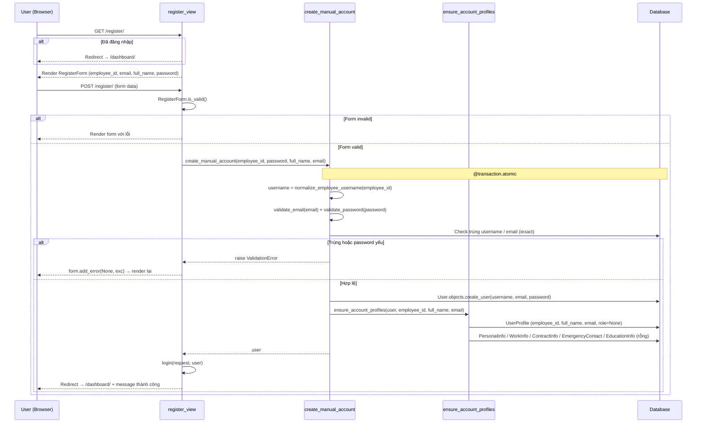

**Chi tiết từ code:**
- View gọi `create_manual_account` (KHÔNG phải `create_automatic_account` — hàm đó raise `NotImplementedError`).
- `normalize_employee_username`: `strip().lower().replace(" ", "")` → username.
- Transaction atomic: lỗi tạo profile → rollback cả User.
- Đăng ký xong **tự đăng nhập ngay** (`login()`) rồi redirect `/dashboard/` — không quay về trang login.
- User mới `role=None` → chờ Admin/HR gán.

---

## 2. Luồng Đăng nhập (Login)

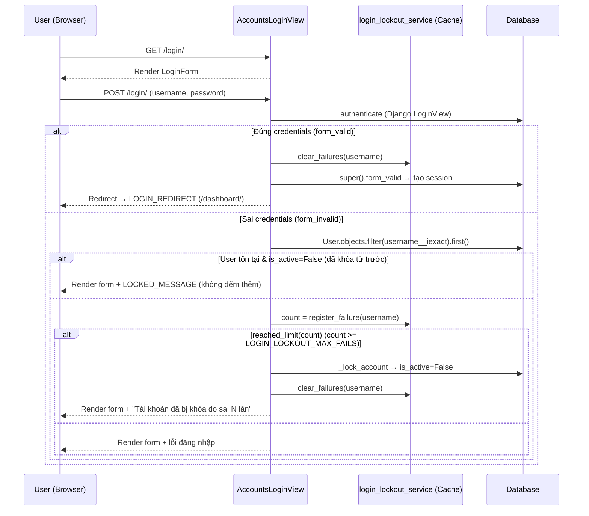

**Chi tiết từ code:**
- Counter lưu ở **cache** (`login_lockout:fails:<sha256(username)>`), không thêm model.
- `register_failure` dùng `cache.add` (init=1) rồi `cache.incr`; TTL = `LOGIN_LOCKOUT_WINDOW_SEC`.
- Chạm ngưỡng → `_lock_account` set `is_active=False` + `clear_failures` (HR/Admin mở khóa sau).
- Tài khoản đã khóa từ trước: báo `LOCKED_MESSAGE`, KHÔNG tăng counter.

---

## 3. Luồng Quên mật khẩu (Forgot Password + OTP)

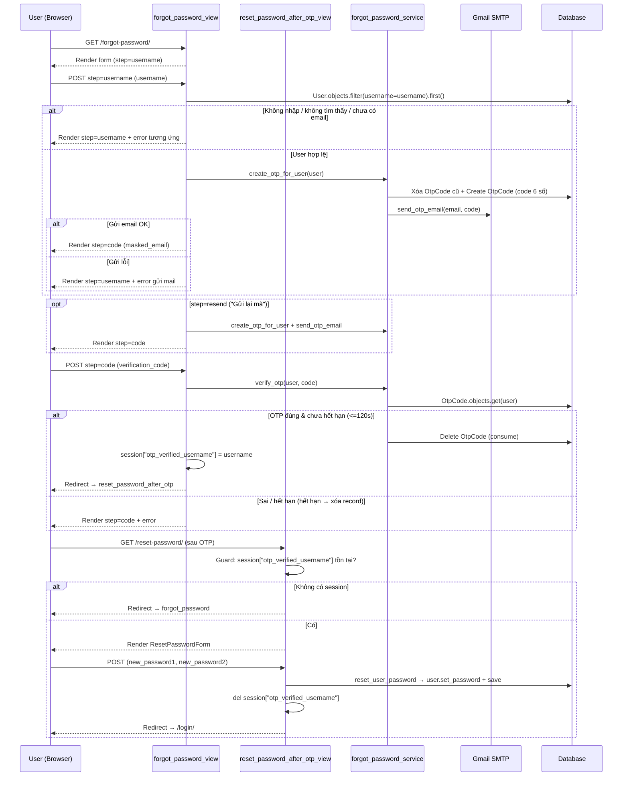

**Chi tiết từ code:**
- Tìm tài khoản bằng **`username`** trực tiếp (không qua employee_id/UserProfile).
- 3 step trong cùng view: `username` → `code` (+ `resend`); bước đổi mật khẩu là **view riêng** `reset_password_after_otp_view`, vào được nhờ session key `otp_verified_username`.
- OTP hết hạn thật theo model: `OtpCode.OTP_EXPIRY_SECONDS = 120` (text email ghi "1 phút" là không khớp model nhưng hiệu lực thực = 120s).

---

## 4. Luồng Phê duyệt 2 bước (Leaves / Overtime)

Hai module leaves và overtime dùng chung pattern phê duyệt 2 bước dưới đây.
**rewards_discipline khác** — xem note cuối mục:

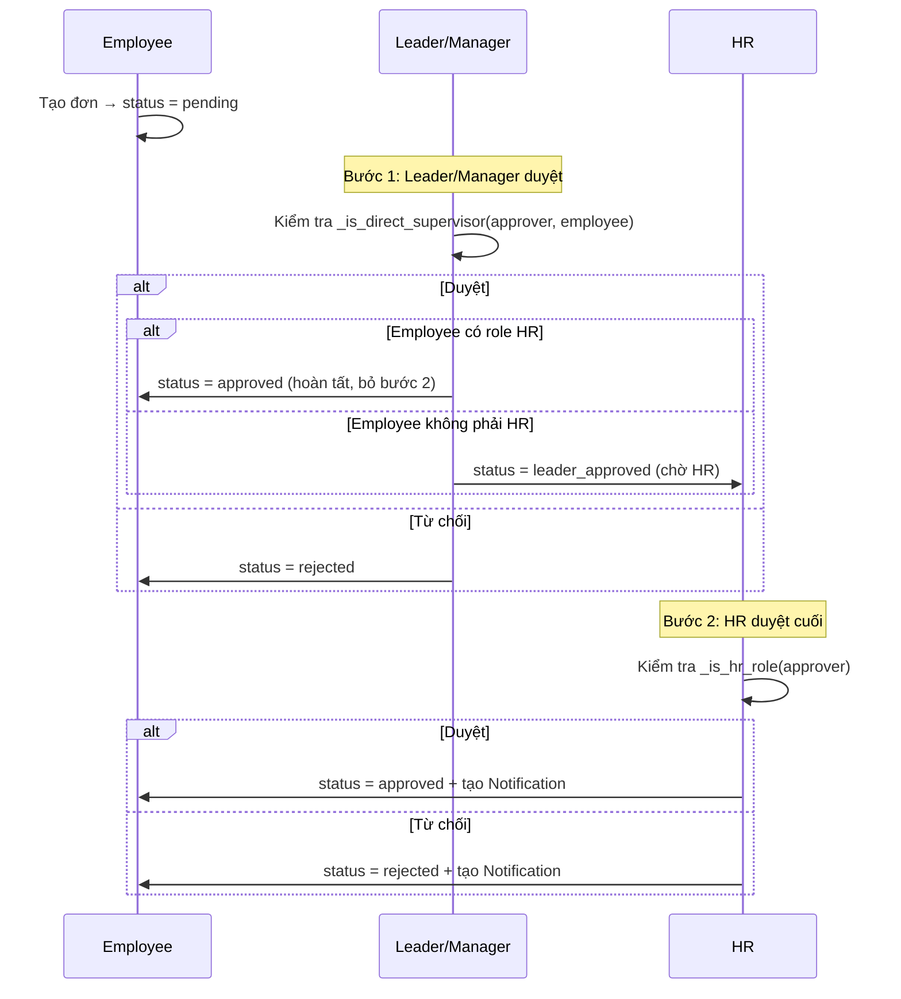

**Quy tắc chung (từ code):**
- Không thể tự duyệt/từ chối đơn của chính mình.
- Leader/Manager chỉ duyệt nhân viên trực tiếp (qua `EmployeeWorkInfo.leader_user` hoặc `manager_user`).
- HR duyệt tất cả đơn `leader_approved` (trừ đơn của chính mình).
- Employee hủy được đơn chỉ khi `status = pending` (chưa ai duyệt).
- Bulk approve: duyệt tất cả đơn thuộc quyền hạn.

**Khác biệt rewards_discipline (phiếu khen thưởng/xử phạt — xem ST-REWARD):**
- Người lập (`proposer`) lập phiếu cho NV khác → proposer ≠ đối tượng phiếu.
- Trạng thái đầu theo **role người lập**: Leader → `pending` (cần Manager L1); Manager/HR → `leader_approved` (bỏ L1).
- L1 = **Manager** (`_is_l1_approver`), không phải supervisor trực tiếp.
- **Không** có "HR thì bỏ L2": HR lập vẫn dừng `leader_approved`, cần **HR khác** duyệt L2 (tự duyệt bị chặn).

---

## 5. Luồng Chấm công khuôn mặt

### 5.1 Đăng ký khuôn mặt

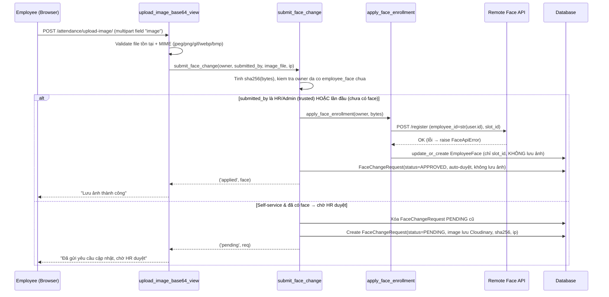

**Chi tiết từ code:**
- Ảnh gửi dạng **multipart/form-data** (field `image`), KHÔNG phải base64.
- `EmployeeFace` chỉ lưu `slot_id` (đánh dấu đã enroll); nhận diện chạy remote (FAISS), ảnh KHÔNG lưu local.
- `apply_face_enrollment` là điểm DUY NHẤT khiến một khuôn mặt thành enrollment có hiệu lực; remote từ chối → `FaceApiError`, không ghi row.

### 5.2 Nhận diện + Chấm công

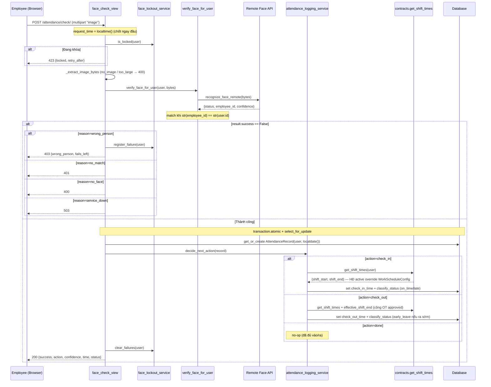

**Tính status (`classify_status`, từ code):**
- `late`: `check_in_time > shift_start + grace_minutes` (grace từ `WorkScheduleConfig`).
- `early_leave`: `check_out_time < shift_end` (shift_end đã dời theo OT approved qua `effective_shift_end`).
- ngược lại → `on_time`.
- `absent` / `no_checkout`: tính ở `recompute_record_status` / job đóng record, KHÔNG ở luồng check trực tiếp.

---

## 6. Luồng Hợp đồng — Versioning

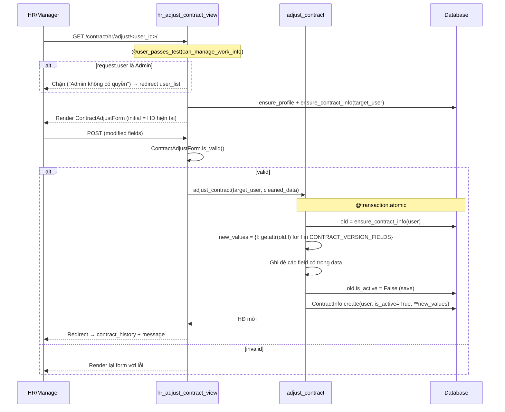

**CONTRACT_VERSION_FIELDS** (copy-forward khi tạo phiên bản mới):
- contract_number, contract_type, contract_signed_date, contract_start_date, contract_end_date
- contract_annual_leave_days, contract_standard_shift, shift_start_time, shift_end_time
- contract_attachment_reference

### 6.1 Xem lịch sử hợp đồng

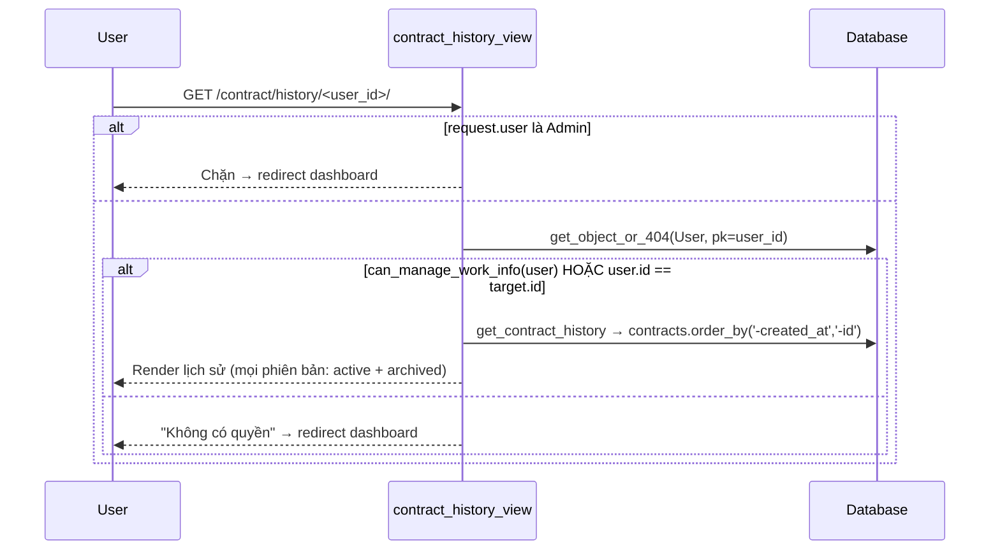

**Quyền xem (từ code):** HR/quản lý (`can_manage_work_info`) xem mọi người; nhân viên chỉ xem của chính mình; Admin bị chặn.

---

## 7. Luồng Báo cáo (Report Workflow)

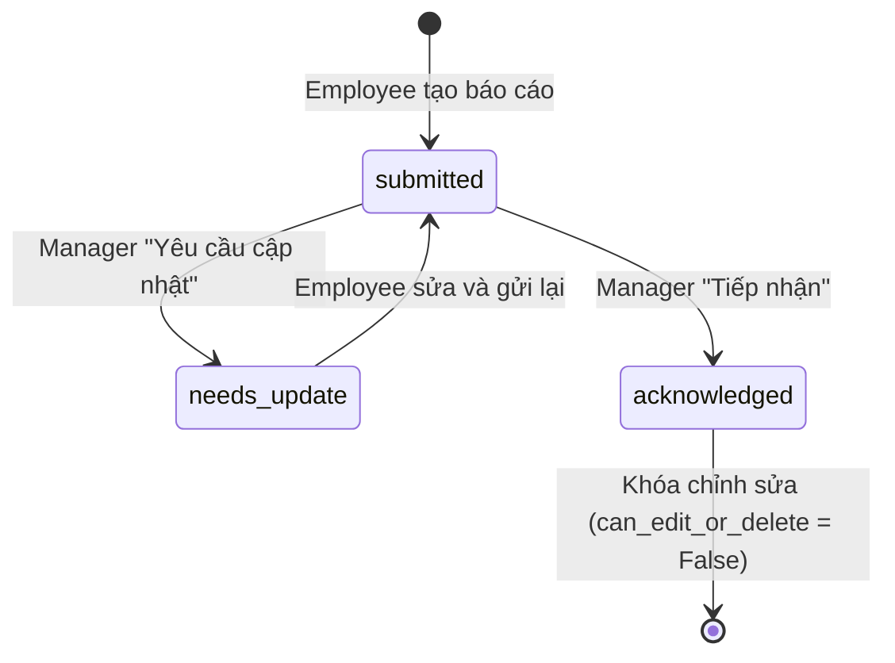

**Quy tắc:**
- `recipient` auto-set theo `EmployeeWorkInfo.manager_user` hoặc `leader_user`.
- Chỉ recipient mới được yêu cầu cập nhật hoặc tiếp nhận.
- Khi `status = acknowledged`: employee không thể sửa/xóa.

---

## 8. Luồng Ticket

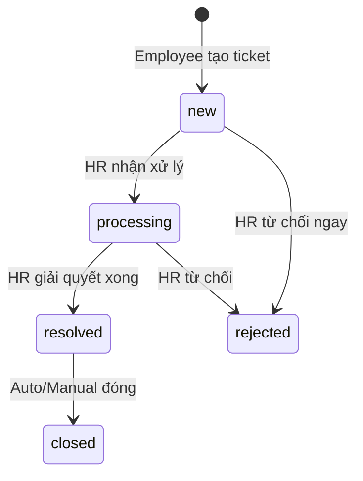

---

## 9. Luồng Đánh giá nhân viên (Performance)

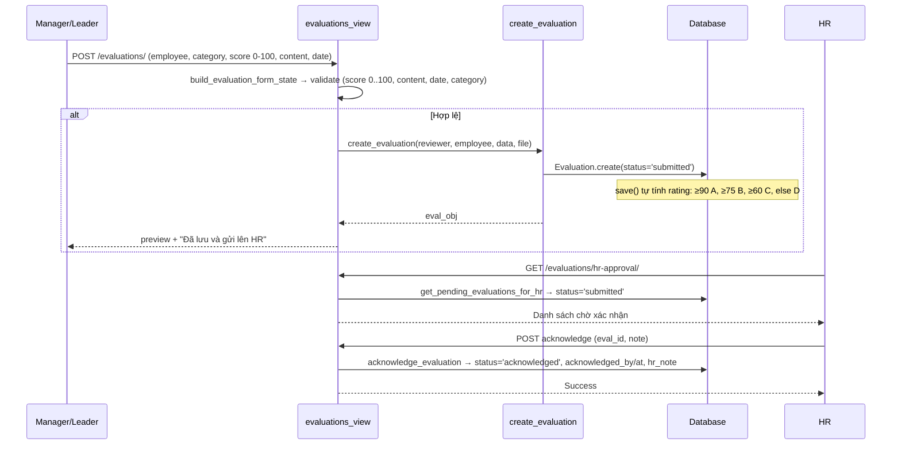

**Chi tiết từ code:** đánh giá tạo thẳng `status='submitted'` (KHÔNG có bước `draft`). `rating` auto-tính trong `Evaluation.save()` từ `score`.

---

## 10. Luồng Thống kê (Statistics)

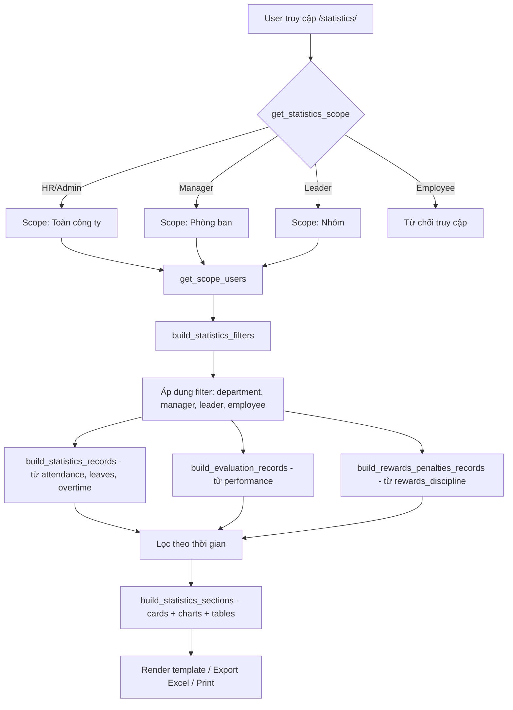

---

## 11. Luồng Notification System

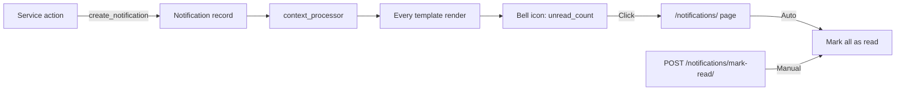

**Các sự kiện tạo notification:**
- Đơn nghỉ phép được duyệt/từ chối
- Đơn tăng ca được duyệt/từ chối
- (Mở rộng bởi các module khác)

---

## 12. Luồng Face Change Request (Anti-fraud)

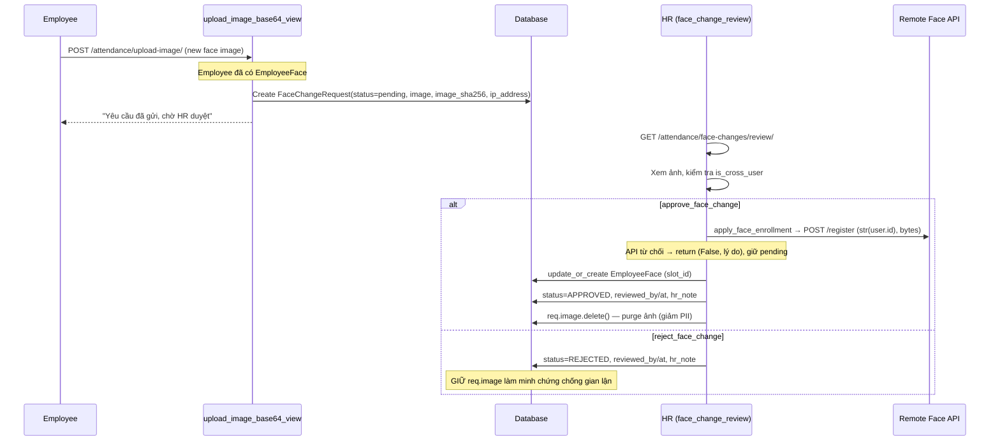

**Anti-fraud flags:**
- `is_cross_user` (property): True nếu `submitted_by_id != user_id` (người upload khác chủ khuôn mặt).
- `image_sha256`: Hash ảnh để phát hiện đảo ảnh.
- `ip_address`: Ghi nhận IP gửi yêu cầu.
- Approve xong **purge ảnh** (đã enroll remote); Reject **giữ ảnh** làm bằng chứng.

---

## 13. Luồng Cảnh báo hợp đồng sắp hết hạn

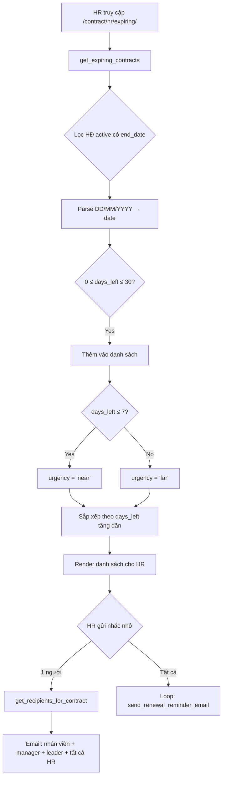
