# 🔄 Sơ Đồ Luồng Dữ Liệu (Data Flow Diagram) — Hệ Thống HRMS

> **Hệ thống Quản lý Nhân sự (Human Resource Management System)**
> Môn học: SE104 – Nhập môn Công nghệ Phần mềm
>
> Mỗi chức năng gồm: **DFD** (mermaid) · **Từ điển dữ liệu** · **Thuật toán xử lý**.
> Logic trích từ code thật trong `business_web/` (services & views).

---

## Quy ước ký hiệu DFD

| Hình | Ý nghĩa |
|------|---------|
| `[Tác nhân]` (chữ nhật) | **External Entity** — người/hệ thống ngoài (Nhân viên, HR, Gmail SMTP, Remote Face API) |
| `((Process))` (tròn) | **Process** — bước xử lý, đánh số `n.0` |
| `[(Data Store)]` (trụ) | **Data Store** — bảng CSDL |
| `-->|dữ liệu|` | **Data Flow** — luồng dữ liệu, nhãn = nội dung |

> **Render:** Mermaid — hiển thị trực tiếp trên GitHub, VSCode (Markdown Preview), hoặc <https://mermaid.live>.

---

## 🌐 DFD Mức 0 — Sơ đồ ngữ cảnh (Context Diagram)

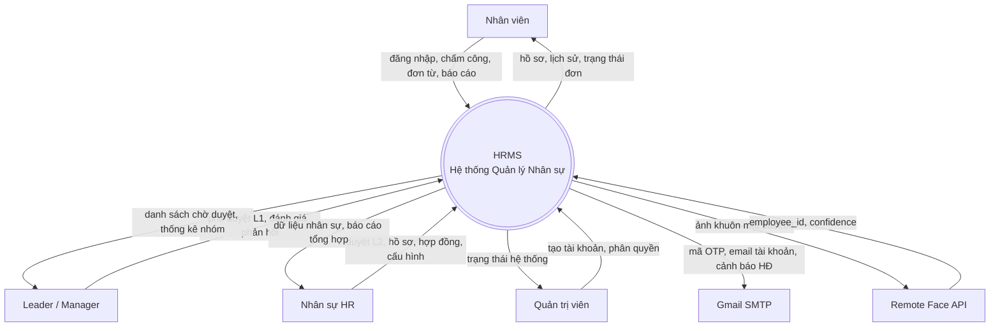

---

# 1. Đăng nhập hệ thống

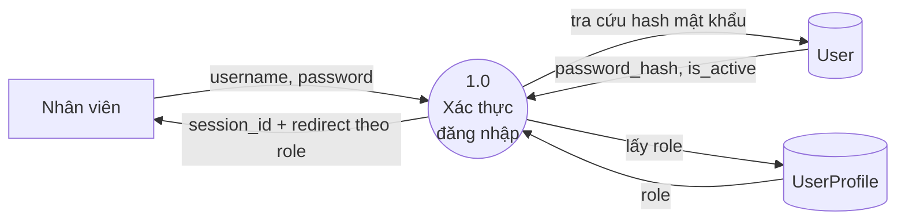

**Từ điển dữ liệu**

| Luồng | Dữ liệu | Kiểu |
|-------|---------|------|
| Đầu vào | `username`, `password` | str |
| Tra cứu | `password_hash`, `is_active` | str, bool |
| Đầu ra | `session_id`, trang đích theo vai trò | cookie, URL |

**Thuật toán**
1. Nhận `username` + `password` từ form.
2. `authenticate()` — băm `password` và so với `password_hash` trong `User`.
3. Sai → trả lỗi "Sai tài khoản hoặc mật khẩu".
4. Đúng nhưng `is_active = False` → chặn, báo "Tài khoản bị khóa".
5. Hợp lệ → `login()` tạo session.
6. Đọc `UserProfile.role` → điều hướng trang chủ tương ứng (admin/hr/manager/leader/employee).

---

# 2. Quên mật khẩu qua OTP

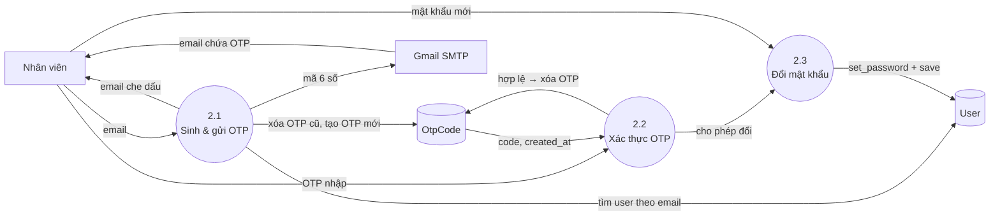

**Từ điển dữ liệu**

| Luồng | Dữ liệu | Kiểu |
|-------|---------|------|
| Đầu vào B1 | `email` | str |
| OtpCode | `code` (6 số), `created_at`, hạn `OTP_EXPIRY_SECONDS=120s` | str, datetime |
| Đầu vào B2 | `input_code` | str(6) |
| Đầu vào B3 | `new_password` | str |
| Đầu ra | email che dấu (`a***z@gmail.com`), mật khẩu mới đã lưu | str |

**Thuật toán** (`forgot_password_service.py`)
1. Nhận `email` → tìm `User`. Không có → báo lỗi (không lộ tồn tại).
2. `create_otp_for_user()`: **xóa toàn bộ OTP cũ** của user, sinh `generate_otp()` = 6 chữ số ngẫu nhiên, lưu `OtpCode`.
3. `send_otp_email()` qua Gmail SMTP; hiển thị `mask_email()` cho UI.
4. Người dùng nhập `input_code` → `verify_otp()`:
   - Không tồn tại OTP → "yêu cầu mã mới".
   - `is_expired()` (>120s) → **xóa record**, báo hết hạn.
   - `code != input_code` → báo sai.
   - Đúng & còn hạn → **xóa record** (one-time), trả hợp lệ.
5. `reset_user_password()`: `set_password(new_password)` + `save()`.

---

# 3. Tạo tài khoản & hồ sơ nhân viên mới (HR)

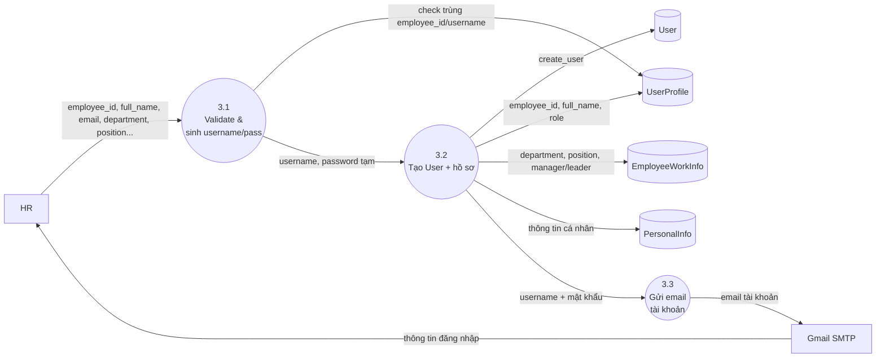

**Từ điển dữ liệu**

| Luồng | Dữ liệu | Kiểu |
|-------|---------|------|
| Đầu vào | `employee_id`, `full_name`, `email`, `department`, `position`, `manager_user`, `leader_user` | str/FK |
| Sinh ra | `username = employee_id.lower().replace(' ','')`, `password = "{employee_id}@2026"` | str |
| Đầu ra | email chứa username + mật khẩu tạm | email |

**Thuật toán** (`profile_views.py`, `register_service.py`)
1. Validate: `employee_id` không rỗng, **chưa tồn tại** trong `UserProfile`; `department` bắt buộc.
2. Sinh `username` từ `employee_id` (thường, bỏ khoảng trắng); chặn nếu `username` đã tồn tại.
3. Đặt mật khẩu tạm mặc định `"{employee_id}@2026"`.
4. `create_user(username, email, password)` → tạo `User`.
5. `ensure_account_profiles()` tạo `UserProfile` (gắn `employee_id`, `full_name`, role), `EmployeeWorkInfo`, `PersonalInfo`.
6. Gửi email chứa thông tin đăng nhập cho nhân viên mới.

---

# 4. Chấm công bằng FaceID (Check-in / Check-out)

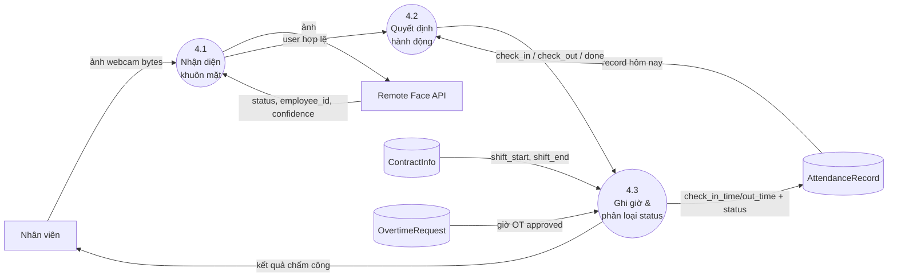

**Từ điển dữ liệu**

| Luồng | Dữ liệu | Kiểu |
|-------|---------|------|
| Đầu vào | `image_bytes` (ảnh webcam) | bytes |
| Face API trả | `status`, `employee_id`, `confidence` | json |
| Hợp đồng | `shift_start_time`, `shift_end_time` | time |
| Ghi | `check_in_time`, `check_out_time`, `status ∈ {on_time, late, early_leave, no_checkout, absent}` | time, str |

**Thuật toán** (`face_verification_service.py`, `attendance_logging_service.py`)
1. Chụp ảnh → `recognize_face_remote(image_bytes)`.
   - Lỗi `no_face` → "không thấy mặt"; lỗi khác → `service_down`.
2. `status != success` → `no_match`.
3. **Đối chiếu 1:1**: `matched_employee_id == str(user.id)`?
   - Khác → `wrong_person` (chặn — chống chấm hộ).
   - Trùng → `ok`.
4. `decide_next_action(record)`:
   - `check_in_time is None` → **check_in**;
   - `check_out_time is None` → **check_out**;
   - else → **done**.
5. Lấy ca làm từ `ContractInfo` (`get_shift_times`).
6. `classify_status()`:
   - vào > `shift_start + WORK_LATE_GRACE_MIN` → `late`, ngược lại `on_time`;
   - ra < `shift_end` (đã dời theo OT approved nếu có) → `early_leave`.
7. Lưu giờ + `status` vào `AttendanceRecord` (transaction).

---

# 5. Đăng ký / Cập nhật khuôn mặt + Duyệt (chống gian lận)

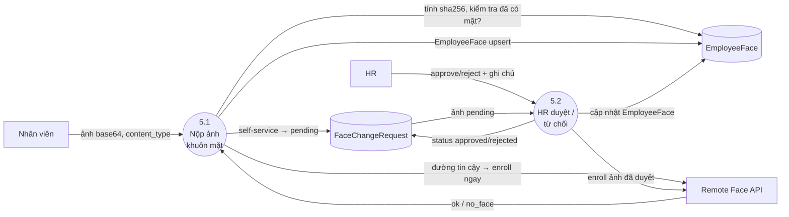

**Từ điển dữ liệu**

| Luồng | Dữ liệu | Kiểu |
|-------|---------|------|
| Đầu vào | `image_base64`, `content_type`, `ip_address` | str |
| Audit | `image_sha256`, `submitted_by`, `is_cross_user` | str, FK, bool |
| Trạng thái | `status ∈ {pending, approved, rejected}` | str |

**Thuật toán** (`face_change_service.py`, `face_service.py`)
1. Đọc ảnh → `base64`, `content_type`, `sha256(raw_bytes)`.
2. **Đường tin cậy** = người nộp là HR/Admin **HOẶC** chủ chưa có mặt (`not has_face`):
   - `apply_face_enrollment()` đẩy ảnh lên Remote API (`register_face_remote`) → upsert `EmployeeFace`.
   - Ghi `FaceChangeRequest(status=approved)` làm audit. Remote từ chối → `FaceApiError`, không ghi local.
3. **Self-service** (đã có mặt, không phải HR/Admin):
   - Xóa các `pending` cũ → tạo `FaceChangeRequest(pending)`. **Không** đổi enrollment đang dùng.
4. HR `approve_face_change()`: decode base64 → `apply_face_enrollment()` → cập nhật `EmployeeFace`, set `approved`.
5. HR `reject_face_change()`: set `rejected` + `hr_note`, enrollment giữ nguyên.

---

# 6. Yêu cầu & duyệt điều chỉnh giờ công

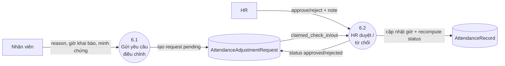

**Từ điển dữ liệu**

| Luồng | Dữ liệu | Kiểu |
|-------|---------|------|
| Đầu vào | `reason ∈ {forgot, technical, business_trip, other}`, `reason_detail`, `claimed_check_in_time`, `claimed_check_out_time`, `evidence` | str, time, file |
| Đầu ra | `record.check_in/out_time` mới, `record.status` tính lại | time, str |

**Thuật toán** (`adjustment_review_service.py`)
1. NV tạo `AttendanceAdjustmentRequest(status=pending)` gắn vào `AttendanceRecord` (1–1).
2. HR `approve_adjustment()` (transaction):
   - Nếu có `claimed_check_in_time` → ghi đè `record.check_in_time`; tương tự check_out.
   - `recompute_record_status(record)` tính lại status từ ca HĐ + OT.
   - Lưu record; set request `approved` + `reviewed_by/at` + `hr_note`.
3. HR `reject_adjustment()`: chỉ `recompute` lại status hiện có; set request `rejected`.
4. Chặn nếu request không còn `pending`.

---

# 7. Nghỉ phép — nộp đơn & duyệt 2 cấp

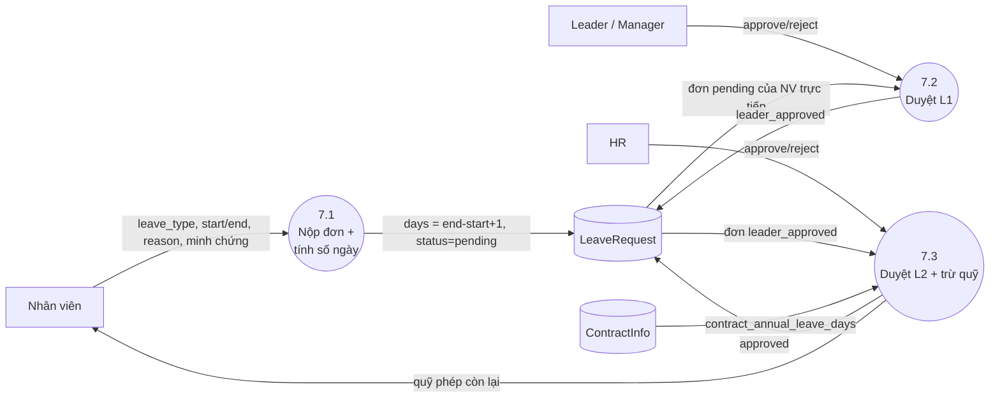

**Từ điển dữ liệu**

| Luồng | Dữ liệu | Kiểu |
|-------|---------|------|
| Đầu vào | `leave_type`, `start_date`, `end_date`, `reason`, `attachment` | str, date, file |
| Tính | `days = (end-start).days + 1` | decimal |
| Trạng thái | `pending → leader_approved → approved` / `rejected` | str |
| Quỹ phép | `total_allowed` (từ HĐ), `used_days` (Σ approved), `remaining = max(total-used,0)` | decimal |

**Thuật toán** (`leaves/services/__init__.py`)
1. `create_leave_request()`: tính `days`, set `pending`.
2. **L1** `approve_leave_request()`:
   - Chặn tự duyệt; approver phải là `leader_user`/`manager_user` của NV.
   - Nếu **người tạo có role HR** → nhảy thẳng `approved`.
   - Ngược lại → `leader_approved` (chờ HR).
3. **L2** (HR): `leader_approved → approved`. Chỉ role HR.
4. `reject_leave_request()`: từ chối ở cả 2 bước, ghi `rejected_reason`.
5. Quỹ phép `get_user_leave_stats()`: `used = Σ days (approved trong năm)`, `remaining = total_allowed - used`.
6. `bulk_approve_requests()`: duyệt hàng loạt theo quyền.

---

# 8. Tăng ca (OT) — nộp đơn & duyệt 2 cấp

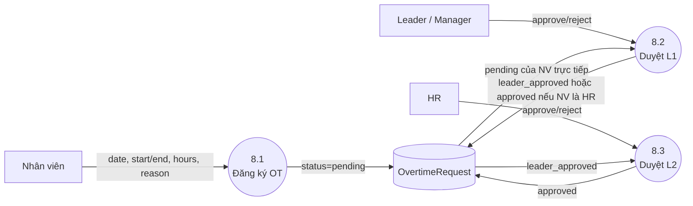

**Từ điển dữ liệu**

| Luồng | Dữ liệu | Kiểu |
|-------|---------|------|
| Đầu vào | `overtime_date`, `start_time`, `end_time`, `hours`, `reason` | date, time, decimal |
| Trạng thái | `pending → leader_approved → approved` / `rejected` | str |
| Thống kê | `total_hours` (Σ approved/tháng), `total_pay = hours × 150 000` | decimal, int |

**Thuật toán** (`overtime/services/__init__.py`) — **giống nghỉ phép**
1. `create_overtime_request()` → `pending`.
2. **L1**: quản lý trực tiếp duyệt; **ngoại lệ**: người tạo là HR → thẳng `approved` (1 bước).
3. **L2**: HR duyệt `leader_approved → approved`.
4. Từ chối ở cả 2 bước (`rejected_reason`).
5. OT đã `approved` dời giờ tan kỳ vọng (dùng ở chức năng 4 — `get_approved_overtime_end`).
6. `bulk_approve_requests()` duyệt hàng loạt.

---

# 9. Đánh giá hiệu suất

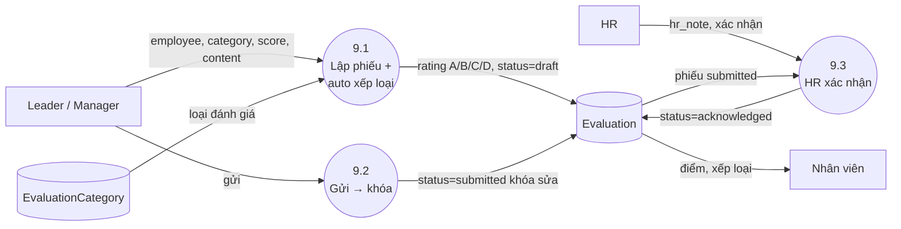

**Từ điển dữ liệu**

| Luồng | Dữ liệu | Kiểu |
|-------|---------|------|
| Đầu vào | `employee`, `reviewer`, `category`, `score (0–100)`, `content`, `evidence_reference` | FK, int, text |
| Tính | `rating ∈ {A,B,C,D}` từ `score` | str |
| Trạng thái | `draft → submitted → acknowledged` | str |

**Thuật toán** (`evaluation_model.py::save()`)
1. Leader/Manager lập phiếu `draft`: chọn NV, loại, nhập `score`, `content`.
2. `save()` **tự xếp loại**: `≥90→A`, `≥75→B`, `≥60→C`, `<60→D`.
3. Gửi → `status=submitted` → **khóa chỉnh sửa vĩnh viễn**.
4. HR thêm `hr_note`, xác nhận → `acknowledged` + `acknowledged_by/at`.
5. NV xem điểm + xếp loại.

---

# 10. Khen thưởng & Kỷ luật

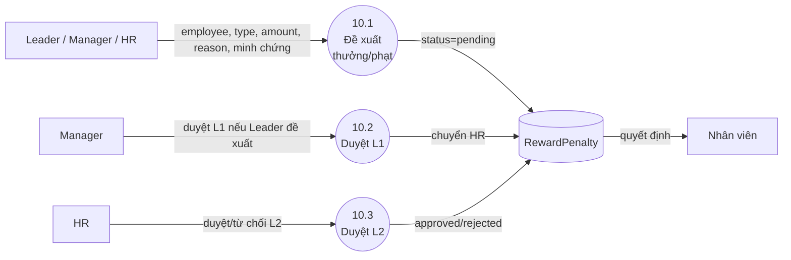

**Từ điển dữ liệu**

| Luồng | Dữ liệu | Kiểu |
|-------|---------|------|
| Đầu vào | `record_type ∈ {reward, penalty}`, `amount` (VND), `reason_title`, `reason_detail`, `evidence_file`, `application_date` | str, int, file, date |
| Trạng thái | `pending → approved` / `rejected` | str |

**Thuật toán**
1. Leader/Manager/HR lập phiếu `RewardPenalty(status=pending)`, gắn `proposer`.
2. **L1**: Manager duyệt nếu Leader đề xuất; Manager tự đề xuất → bỏ qua L1, chuyển thẳng HR.
3. **L2**: HR duyệt → `approved` (ban hành) hoặc `rejected`.
4. NV xem quyết định của mình.

---

# 11. Báo cáo công việc

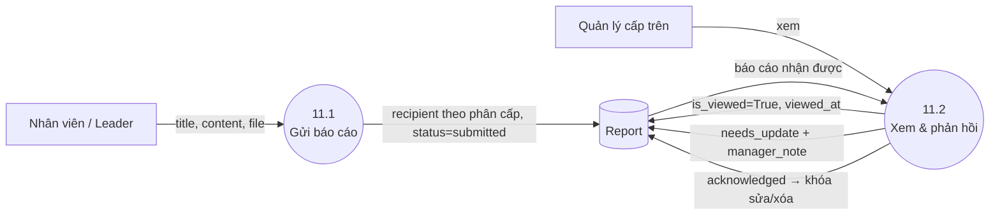

**Từ điển dữ liệu**

| Luồng | Dữ liệu | Kiểu |
|-------|---------|------|
| Đầu vào | `title`, `content`, `file_attachment`, `recipient` | str, file, FK |
| Trạng thái | `submitted → needs_update / acknowledged` | str |
| Khóa | `can_edit_or_delete = status != acknowledged` | bool |

**Thuật toán** (`report_model.py`)
1. Gửi báo cáo: Employee → Leader, Leader → Manager (`recipient` theo phân cấp), `status=submitted`.
2. Quản lý xem → `is_viewed=True`, ghi `viewed_at`.
3. `needs_update` + `manager_note`: yêu cầu NV cập nhật lại.
4. `acknowledged`: tiếp nhận → **khóa** sửa/xóa (`can_edit_or_delete=False`).

---

# 12. Ticket hỗ trợ / khiếu nại

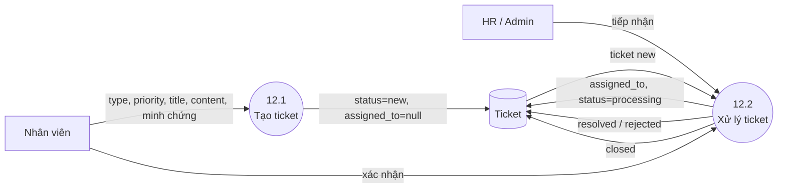

**Từ điển dữ liệu**

| Luồng | Dữ liệu | Kiểu |
|-------|---------|------|
| Đầu vào | `ticket_type ∈ {support, complaint}`, `priority ∈ {low, medium, high}`, `title`, `content`, `evidence_file` | str, file |
| Trạng thái | `new → processing → resolved → closed` / `rejected` | str |
| Người xử lý | `assigned_to` | FK User |

**Thuật toán** (`ticket_model.py`, views)
1. NV tạo `Ticket(status=new, assigned_to=null)`.
2. Người xử lý (HR/Admin) tiếp nhận → gán `assigned_to=self`, `status=processing`.
3. Giải quyết → `resolved`; sai bộ phận → forward (đổi `assigned_to`); không hợp lệ → `rejected` + `rejection_reason`.
4. NV xác nhận → `closed`.

---

# 13. Hợp đồng — cảnh báo sắp hết hạn (batch) & gia hạn

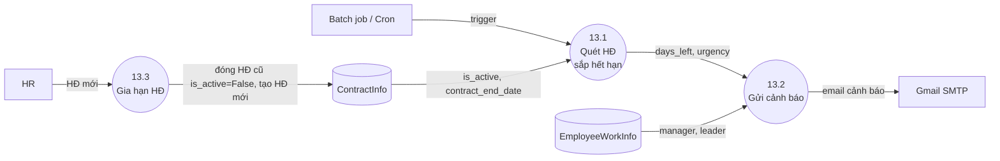

**Từ điển dữ liệu**

| Luồng | Dữ liệu | Kiểu |
|-------|---------|------|
| Quét | `contract_end_date` (DD/MM/YYYY), `is_active` | str, bool |
| Tính | `days_left = end_date - today`, `urgency = near (≤7) / far (≤30)` | int, str |
| Người nhận | email NV + manager + leader + tất cả HR (unique) | list |

**Thuật toán** (`renewal_service.py`)
1. `get_expiring_contracts()`: lọc `ContractInfo(is_active=True, end_date ≠ '')`.
2. `parse_ddmmyyyy()` → `days_left`. Giữ nếu `0 ≤ days_left ≤ 30`.
3. Phân loại `urgency`: `near` nếu ≤7 ngày, `far` nếu ≤30. Sắp xếp tăng dần.
4. `get_recipients_for_contract()`: gộp email NV + manager_user + leader_user + **mọi HR**, loại trùng/rỗng.
5. Gửi cảnh báo qua Gmail SMTP tại mốc 30/15/7 ngày.
6. Gia hạn: tạo HĐ mới, đóng HĐ cũ `is_active=False`. HĐ quá hạn chưa gia hạn → tự `is_active=False`.

---

# 14. Thống kê tổng hợp

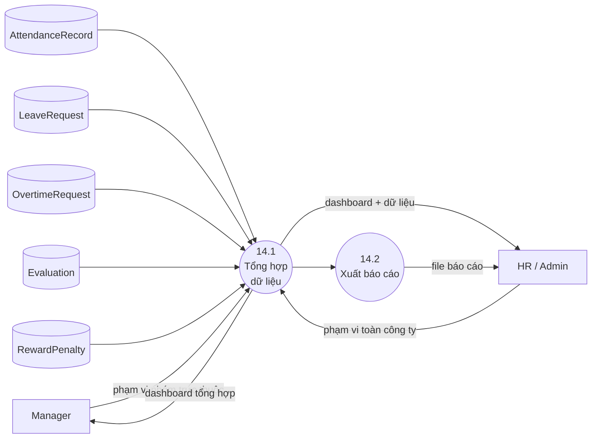

**Từ điển dữ liệu**

| Luồng | Dữ liệu | Kiểu |
|-------|---------|------|
| Nguồn | chấm công, nghỉ phép, tăng ca, đánh giá, thưởng/phạt | aggregate |
| Phạm vi | Manager → nhân viên trực thuộc; HR/Admin → toàn công ty | filter |
| Đầu ra | dashboard số liệu, file xuất | view, file |

**Thuật toán** (`stats_reports` — **không có model riêng**)
1. App thống kê **chỉ đọc** dữ liệu từ các app khác qua các builder trong `services/`.
2. Manager: lọc theo `_get_direct_report_user_ids()` (nhân viên trực thuộc).
3. HR/Admin: tổng hợp toàn công ty.
4. Tính `Sum/Count/aggregate` theo kỳ (tháng/năm) → dashboard.
5. Xuất file báo cáo (HR).

---

## Tổng hợp Data Store

| Data Store | Bảng (model) | Chức năng dùng |
|------------|--------------|----------------|
| User / UserProfile | `auth.User`, `UserProfile` | 1, 2, 3 |
| OtpCode | `OtpCode` | 2 |
| PersonalInfo / EmployeeWorkInfo | hồ sơ | 3, 7, 8, 13 |
| ContractInfo | `ContractInfo` | 4, 7, 13 |
| AttendanceRecord / AdjustmentRequest | chấm công | 4, 6 |
| EmployeeFace / FaceChangeRequest | khuôn mặt | 4, 5 |
| LeaveRequest | nghỉ phép | 7, 14 |
| OvertimeRequest | tăng ca | 4, 8, 14 |
| Evaluation / EvaluationCategory | đánh giá | 9, 14 |
| RewardPenalty | thưởng/phạt | 10, 14 |
| Report / Ticket | báo cáo, hỗ trợ | 11, 12 |

**External Entities:** Nhân viên · Leader/Manager · HR · Admin · **Gmail SMTP** (OTP, email tài khoản, cảnh báo HĐ) · **Remote Face API** (nhận diện & enroll khuôn mặt).
