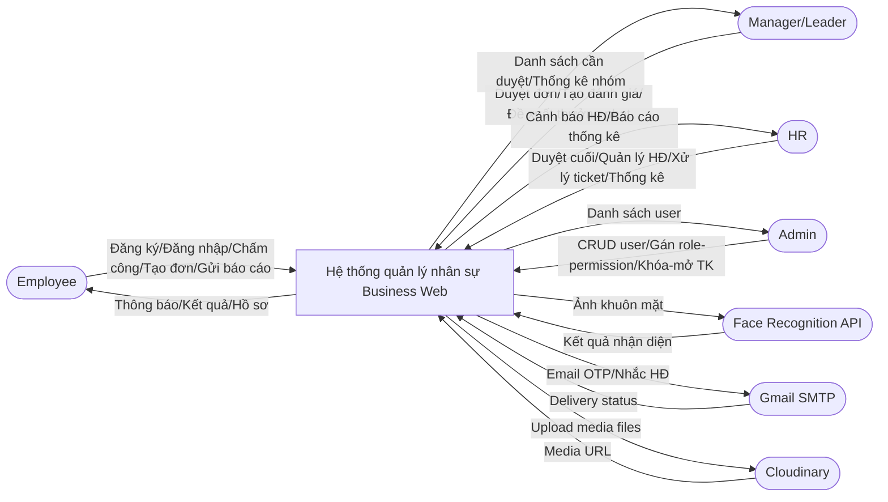
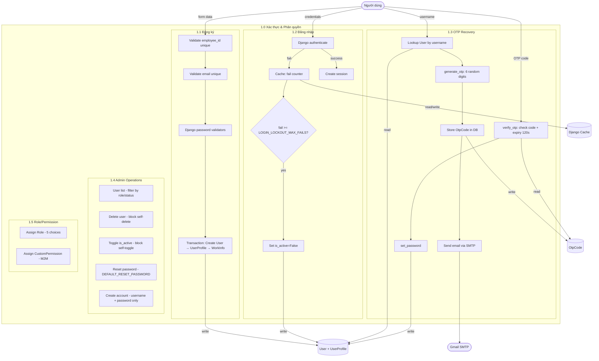
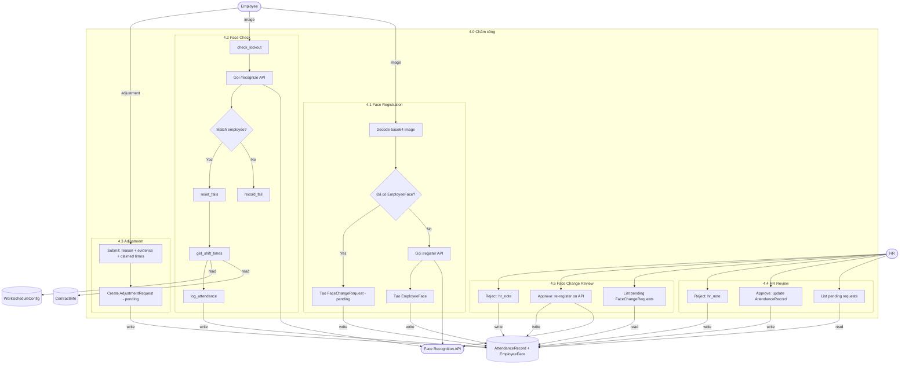
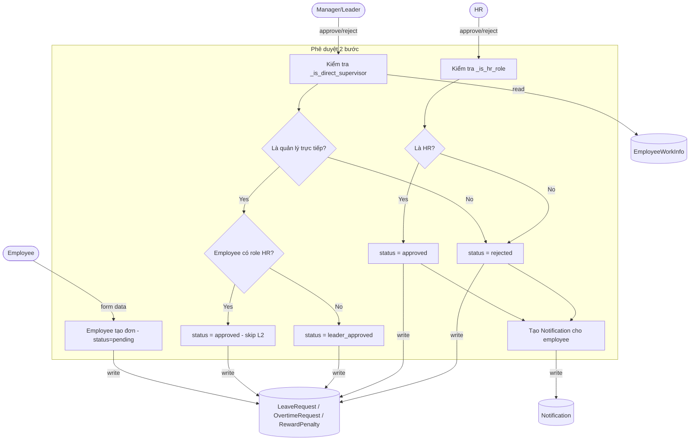
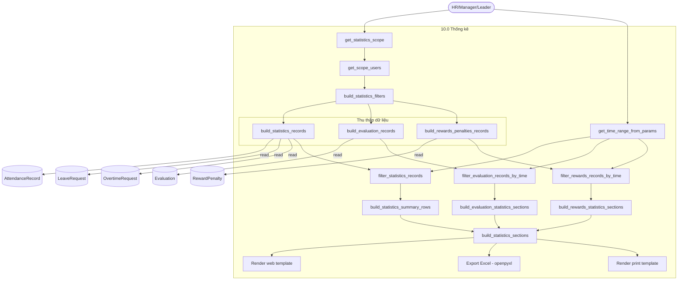

# Data Flow Diagram — Business Web Project

> **Cập nhật:** 2026-06-03 — trích xuất 100% từ code hiện tại.

---

## 1. DFD Context (Level 0)

---

## 2. DFD Level 1 — Phân rã hệ thống

```mermaid
flowchart TB
    subgraph External
        User([Người dùng])
        FaceAPI([Face Recognition API])
        EmailSvc([Gmail SMTP])
        CloudSvc([Cloudinary])
    end

    subgraph "1.0 Xác thực & Phân quyền"
        P1[1.1 Đăng ký]
        P2[1.2 Đăng nhập + Lockout]
        P3[1.3 Quên mật khẩu + OTP]
        P4[1.4 Quản lý User - Admin]
        P5[1.5 Gán Role/Permission]
        P6[1.6 Thông báo]
    end

    subgraph "2.0 Hồ sơ nhân viên"
        P7[2.1 Xem/Sửa hồ sơ cá nhân]
        P8[2.2 HR tạo hồ sơ]
        P9[2.3 Quản lý thông tin công việc]
        P10[2.4 Upload tài liệu]
    end

    subgraph "3.0 Hợp đồng"
        P11[3.1 Xem HĐ cá nhân]
        P12[3.2 HR quản lý HĐ + Versioning]
        P13[3.3 Cảnh báo HĐ sắp hết hạn]
        P14[3.4 Gửi email nhắc nhở]
    end

    subgraph "4.0 Chấm công"
        P15[4.1 Đăng ký khuôn mặt]
        P16[4.2 Nhận diện + Check-in/out]
        P17[4.3 Yêu cầu điều chỉnh]
        P18[4.4 HR duyệt điều chỉnh]
        P19[4.5 HR duyệt đổi khuôn mặt]
    end

    subgraph "5.0 Nghỉ phép"
        P20[5.1 Tạo/Hủy đơn]
        P21[5.2 Phê duyệt 2 bước]
        P22[5.3 Thống kê phép cá nhân]
    end

    subgraph "6.0 Tăng ca"
        P23[6.1 Tạo/Hủy đơn]
        P24[6.2 Phê duyệt 2 bước]
        P25[6.3 Thống kê tăng ca tháng]
    end

    subgraph "7.0 Đánh giá"
        P26[7.1 Manager/Leader tạo đánh giá]
        P27[7.2 HR xác nhận đánh giá]
    end

    subgraph "8.0 Khen thưởng & Xử phạt"
        P28[8.1 Lập phiếu thưởng/phạt]
        P29[8.2 Phê duyệt 2 cấp]
    end

    subgraph "9.0 Báo cáo & Ticket"
        P30[9.1 Gửi/Sửa/Xóa báo cáo]
        P31[9.2 Manager review báo cáo]
        P32[9.3 Tạo ticket]
        P33[9.4 HR xử lý ticket]
    end

    subgraph "10.0 Thống kê tổng hợp"
        P34[10.1 Thu thập dữ liệu các module]
        P35[10.2 Filter + Aggregate]
        P36[10.3 Export Excel / Print]
    end

    subgraph "Data Stores"
        D1[(User + UserProfile + Role)]
        D2[(PersonalInfo + WorkInfo + Education + Emergency + Document)]
        D3[(ContractInfo)]
        D4[(AttendanceRecord + EmployeeFace + AdjustmentRequest + FaceChangeRequest)]
        D5[(LeaveRequest)]
        D6[(OvertimeRequest)]
        D7[(Evaluation + EvaluationCategory)]
        D8[(RewardPenalty)]
        D9[(Report + Ticket)]
        D10[(OtpCode + Notification)]
        D11[(WorkScheduleConfig)]
    end

    %% Data flows
    User -->|credentials| P2
    User -->|username| P3
    P3 -->|OTP email| EmailSvc
    P1 -->|User+Profile+WorkInfo| D1
    P2 -->|session| User
    P4 -->|CRUD| D1
    P5 -->|role+permission| D1
    P6 -->|read/write| D10

    User -->|personal data| P7
    P7 -->|read/write| D2
    P8 -->|create| D2
    P9 -->|update| D2
    P10 -->|file upload| CloudSvc

    P11 -->|read| D3
    P12 -->|version+write| D3
    P13 -->|query expiring| D3
    P14 -->|reminder email| EmailSvc

    User -->|face image| P15
    P15 -->|register| FaceAPI
    P15 -->|write| D4
    User -->|face image| P16
    P16 -->|recognize| FaceAPI
    P16 -->|write record| D4
    P17 -->|create request| D4
    P18 -->|approve/reject| D4
    P19 -->|approve/reject| D4

    User -->|leave form| P20
    P20 -->|create/delete| D5
    P21 -->|update status| D5
    P22 -->|aggregate| D5

    User -->|overtime form| P23
    P23 -->|create/delete| D6
    P24 -->|update status| D6
    P25 -->|aggregate| D6

    P26 -->|create| D7
    P27 -->|acknowledge| D7

    P28 -->|create| D8
    P29 -->|approve/reject| D8

    User -->|report content| P30
    P30 -->|CRUD| D9
    P31 -->|review| D9
    P32 -->|create| D9
    P33 -->|process| D9

    P34 -->|read| D4
    P34 -->|read| D5
    P34 -->|read| D6
    P34 -->|read| D7
    P34 -->|read| D8
    P35 -->|filtered data| P36
```

---

## 3. DFD Level 2 — Xác thực & Phân quyền chi tiết

---

## 4. DFD Level 2 — Chấm công chi tiết

---

## 5. DFD Level 2 — Phê duyệt 2 bước (Leaves/Overtime/Rewards)

---

## 6. DFD Level 2 — Thống kê tổng hợp

