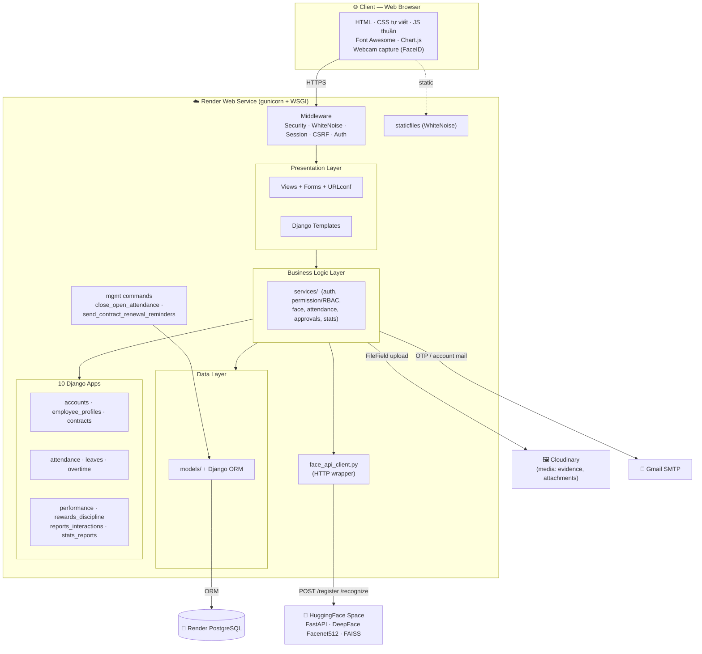
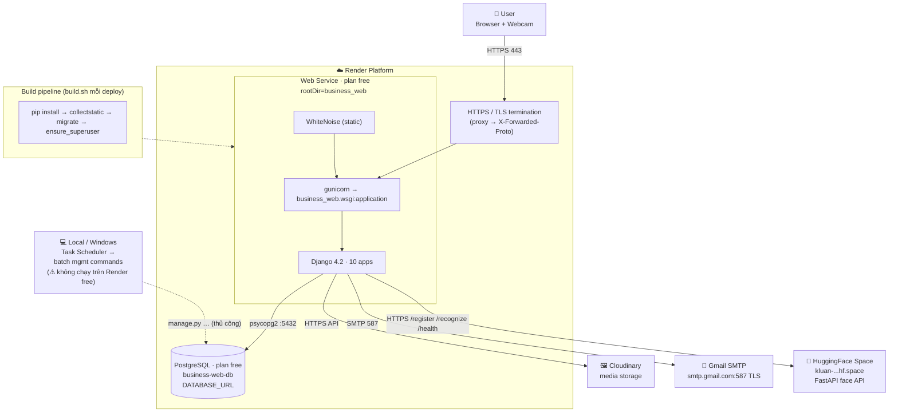

# 🏗️ HRMS — Kiến Trúc Hệ Thống & Sơ Đồ Triển Khai

> Hệ thống Quản lý Nhân sự (HRMS) — SE104, UIT.
> File này phản ánh **kiến trúc deploy thực tế lên Internet** (Render PaaS), đối chiếu trực tiếp với
> `render.yaml`, `business_web/build.sh`, `business_web/business_web/settings.py`,
> `business_web/requirements.txt`, `business_web/attendance/services/face/face_api_client.py`.

---

## 1. Tổng Quan Stack Triển Khai

| Thành phần | Công nghệ | Ghi chú |
|------------|-----------|---------|
| **Hosting** | Render Web Service (`plan: free`) | `rootDir=business_web`, healthcheck `/` |
| **App server** | gunicorn → `business_web.wsgi:application` | WSGI |
| **Framework** | Django 4.2 (Python) — MTV, 10 apps | |
| **Static** | WhiteNoise | `collectstatic` lúc build, serve trực tiếp từ web service |
| **Database (prod)** | **Render PostgreSQL** (`plan: free`) | qua `dj-database-url` + `psycopg2-binary`, `conn_max_age=600` |
| **Database (dev)** | SQLite3 | fallback khi không có `DATABASE_URL` |
| **Media** | Cloudinary (`RawMediaCloudinaryStorage`) | `USE_CLOUDINARY=True`; evidence + attachment (ảnh/PDF) |
| **Email** | Gmail SMTP `smtp.gmail.com:587` TLS | OTP reset mật khẩu, gửi tài khoản |
| **Face AI** | HuggingFace Space — FastAPI + DeepFace `Facenet512` + FAISS | Django chỉ gọi HTTP, không nạp model local |
| **TLS/HTTPS** | Render terminate SSL ở proxy | `SECURE_PROXY_SSL_HEADER`, `SECURE_SSL_REDIRECT`, HSTS khi `DEBUG=False` |

> [!NOTE]
> **Ảnh khuôn mặt** (`EmployeeFace.face_base64`, `FaceChangeRequest.image_base64`) lưu **Base64 trong PostgreSQL**,
> KHÔNG lên Cloudinary. Cloudinary chỉ giữ file `FileField` (minh chứng điều chỉnh công, đơn nghỉ/OT, báo cáo, thưởng/phạt...).

---

## 2. System Architecture Diagram (Component View)

---

## 3. Deployment Diagram

---

## 4. Biến Môi Trường (Render → `settings.py`)

| Env var | Vai trò | Nguồn |
|---------|---------|-------|
| `SECRET_KEY` | Django secret | Render auto-generate |
| `DEBUG` | `False` trên prod | render.yaml |
| `ALLOWED_HOSTS` / `CSRF_TRUSTED_ORIGINS` | host hợp lệ | render.yaml (+ `RENDER_EXTERNAL_HOSTNAME` auto) |
| `DATABASE_URL` | chuỗi kết nối Postgres | `fromDatabase` business-web-db |
| `USE_CLOUDINARY` + `CLOUDINARY_*` | bật media trên Cloudinary | render.yaml (secret `sync:false`) |
| `EMAIL_HOST_USER` / `EMAIL_HOST_PASSWORD` | Gmail SMTP | secret `sync:false` |
| `FACE_API_BASE_URL` | endpoint face service | render.yaml |
| `FACE_API_TIMEOUT_SEC` | timeout HTTP (default 30) | settings |

---

## 5. ⚠️ Khoảng Trống Triển Khai (Deployment Gaps)

1. **Batch job không tự chạy trên prod.** `close_open_attendance` và `send_contract_renewal_reminders`
   là management command, lập lịch qua `setup_task_scheduler.py` (Windows Task Scheduler) — **chỉ chạy ở
   máy local**. Render free **không có cron job**. Trên prod cần: Render Cron Job (paid), hoặc external
   scheduler (GitHub Actions, cron-job.org) gọi một endpoint trigger, hoặc Celery beat + worker.
2. **Face service cold-start.** HuggingFace Space free ngủ khi không dùng → request đầu chậm; cần
   `FACE_API_TIMEOUT_SEC` đủ lớn và fallback khi `503 service_down`.
3. **Free tier sleep.** Render free web service ngủ sau ~15 phút không traffic → request đầu chậm.
