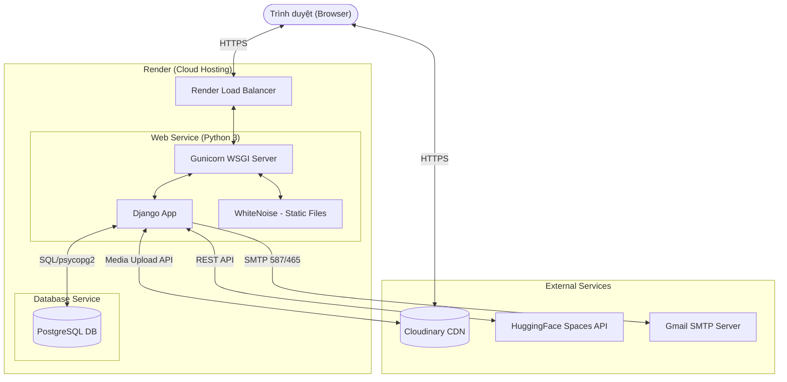

# Deployment Architecture — Business Web Project

> **Cập nhật:** 2026-06-03 — trích xuất 100% từ cấu hình `render.yaml` và `build.sh` hiện tại.

---

## 1. Tổng quan Kiến trúc Deployment

Dự án được triển khai trên nền tảng **Render** dưới dạng *Blueprint* (Infrastructure as Code). Kiến trúc bao gồm hai thành phần chính:
1. **Web Service (Django)**: Xử lý logic nghiệp vụ, giao tiếp với bên ngoài.
2. **PostgreSQL Database**: Lưu trữ dữ liệu hệ thống (PostgreSQL).

Ngoài ra, hệ thống tích hợp với các dịch vụ bên thứ 3:
- **Cloudinary**: Lưu trữ và CDN cho media/static files (ảnh chân dung, minh chứng, đính kèm).
- **HuggingFace Spaces**: Nhận diện khuôn mặt (Remote API).
- **Gmail SMTP**: Gửi email thông báo (quên mật khẩu, nhắc nhở hợp đồng).

---

## 2. Sơ đồ Kiến trúc Deployment



---

## 3. Render Blueprint (`render.yaml`)

Dự án sử dụng cơ chế Blueprint của Render để tự động hóa toàn bộ quá trình cấp phát và kết nối Web Service với Database.

### 3.1 Cấu hình Web Service
- **Type**: Web Service (`type: web`)
- **Name**: `business-web`
- **Runtime**: Python (`runtime: python`)
- **Plan**: Free (`plan: free`)
- **Root Directory**: `business_web`
- **Build Command**: `./build.sh`
- **Start Command**: `gunicorn business_web.wsgi:application`
- **Health Check**: `/`

### 3.2 Cấu hình Database
- **Name**: `business-web-db`
- **Plan**: Free (`plan: free`)

---

## 4. Quá trình Build & Khởi động

### 4.1 Build Script (`build.sh`)
Tự động chạy mỗi khi có thay đổi được push lên Git repository:
1. Cài đặt thư viện: `pip install -r requirements.txt`
2. Gom static files: `python manage.py collectstatic --no-input` (sử dụng WhiteNoise để phục vụ static files).
3. Cập nhật schema DB: `python manage.py migrate`
4. Tạo tài khoản Superuser từ biến môi trường (Idempotent): `python manage.py ensure_superuser` (thay vì phải mở Render Shell).

### 4.2 Start Command
Sử dụng **Gunicorn** làm production WSGI server để phục vụ ứng dụng:
```bash
gunicorn business_web.wsgi:application
```

---

## 5. Cấu hình Môi trường (Environment Variables)

Các biến môi trường được cấu hình tại Render để kiểm soát ứng dụng:

| Biến môi trường | Mục đích | Nguồn cung cấp / Cấu hình |
|---|---|---|
| `SECRET_KEY` | Bảo mật session/CSRF của Django | `generateValue: true` (Render tự sinh) |
| `DEBUG` | Chế độ chạy | `False` (bắt buộc trên production) |
| `ALLOWED_HOSTS` | Domain được phép truy cập | `business-web.onrender.com` |
| `CSRF_TRUSTED_ORIGINS` | Domain tin cậy cho CSRF | `https://business-web.onrender.com` |
| `DATABASE_URL` | Chuỗi kết nối đến PostgreSQL | `fromDatabase` (tự động lấy từ db `business-web-db`) |
| `USE_CLOUDINARY` | Bật tính năng lưu trữ Cloudinary | `True` |
| `CLOUDINARY_CLOUD_NAME` | Cloudinary config | Nhập tay trên Dashboard (`sync: false`) |
| `CLOUDINARY_API_KEY` | Cloudinary config | Nhập tay trên Dashboard (`sync: false`) |
| `CLOUDINARY_API_SECRET`| Cloudinary config | Nhập tay trên Dashboard (`sync: false`) |
| `EMAIL_HOST_USER` | Email gửi thông báo | Nhập tay trên Dashboard (`sync: false`) |
| `EMAIL_HOST_PASSWORD`| App Password của Email | Nhập tay trên Dashboard (`sync: false`) |
| `FACE_API_BASE_URL` | Endpoint của Face API (HuggingFace) | `https://kluan-facial-recognition-for-attendance-tracking.hf.space` |
| `DJANGO_SUPERUSER_USERNAME` | Username cho lệnh `ensure_superuser` | (Tùy chọn) Không lưu trong source |
| `DJANGO_SUPERUSER_EMAIL` | Email cho lệnh `ensure_superuser` | (Tùy chọn) |
| `DJANGO_SUPERUSER_PASSWORD` | Mật khẩu cho lệnh `ensure_superuser` | (Tùy chọn) |

*(Ghi chú: Các biến `sync: false` được loại trừ khỏi render.yaml để tránh lộ thông tin nhạy cảm, admin phải vào Dashboard của Render để bổ sung bằng tay sau khi deploy)*.
