# ERD — PostgreSQL LIVE trên Render

> **Ảnh báo cáo (SVG nền trắng)**: xem `docs/diagrams/svg/erd-*.svg` — đã tách theo module cho dễ đọc:
> `erd-01-accounts` · `erd-02-profiles` · `erd-03-attendance` ·
> `erd-04-contracts-leave-ot` · `erd-05-performance-rewards-reports`. Index: `docs/diagrams/README.md`.
> (Sơ đồ ERD tổng quan bỏ ảnh — quá rộng; dùng phần "Toàn cảnh" văn bản bên dưới.)

> Introspect trực tiếp instance: `cs114_web_demo` @ `dpg-d866jlugvqtc73ee12i0-a.singapore-postgres.render.com`
> 34 bảng. Type lấy thật từ `information_schema` (không suy đoán).
> Quy ước: app-table PK = `bigint` (BigAutoField); Django core (`auth_*`, `content_type`, `admin_log`) PK = `integer`.
> `timestamptz` = `timestamp with time zone`, `time` = `time without time zone`.

## Toàn cảnh

```mermaid
erDiagram
    %% ===== Django auth core =====
    auth_user {
        integer id PK
        varchar(150) username
        varchar(128) password
        varchar(254) email
        varchar(150) first_name
        varchar(150) last_name
        boolean is_superuser
        boolean is_staff
        boolean is_active
        timestamptz last_login
        timestamptz date_joined
    }
    auth_group {
        integer id PK
        varchar(150) name
    }
    auth_permission {
        integer id PK
        integer content_type_id FK
        varchar(100) codename
        varchar(255) name
    }
    auth_user_groups {
        bigint id PK
        integer user_id FK
        integer group_id FK
    }
    auth_user_user_permissions {
        bigint id PK
        integer user_id FK
        integer permission_id FK
    }
    auth_group_permissions {
        bigint id PK
        integer group_id FK
        integer permission_id FK
    }
    django_content_type {
        integer id PK
        varchar(100) app_label
        varchar(100) model
    }
    django_admin_log {
        integer id PK
        integer user_id FK
        integer content_type_id FK
        text object_id
        smallint action_flag
        timestamptz action_time
    }
    django_session {
        varchar(40) session_key PK
        text session_data
        timestamptz expire_date
    }
    django_migrations {
        bigint id PK
        varchar(255) app
        varchar(255) name
        timestamptz applied
    }

    %% ===== accounts =====
    accounts_role {
        bigint id PK
        varchar(50) name
        text description
    }
    accounts_custompermission {
        bigint id PK
        varchar(100) codename
        varchar(255) name
        text description
    }
    accounts_userprofile {
        bigint id PK
        varchar(50) employee_id
        varchar(255) full_name
        bigint role_id FK
        integer user_id FK
    }
    accounts_userprofile_permissions {
        bigint id PK
        bigint userprofile_id FK
        bigint custompermission_id FK
    }
    accounts_notification {
        bigint id PK
        varchar(255) title
        text message
        varchar(255) link
        boolean is_read
        timestamptz created_at
        integer user_id FK
    }
    accounts_otpcode {
        bigint id PK
        varchar(6) code
        timestamptz created_at
        integer user_id FK
    }

    %% ===== employee_profiles =====
    employee_profiles_personalinfo {
        bigint id PK
        integer user_id FK
        varchar(20) phone_number
        varchar(10) date_of_birth
        varchar(20) gender
        varchar(50) id_card_number
        varchar(10) id_card_issue_date
        varchar(255) id_card_issue_place
        varchar(50) marital_status
        varchar(100) nationality
        text permanent_address
        text temporary_address
    }
    employee_profiles_employeeworkinfo {
        bigint id PK
        integer user_id FK
        varchar(100) employee_type
        varchar(100) department
        varchar(100) position
        varchar(100) workplace
        varchar(10) probation_start
        varchar(10) official_start_date
        varchar(30) work_status
        integer leader_user_id FK
        integer manager_user_id FK
    }
    employee_profiles_educationandskills {
        bigint id PK
        integer user_id FK
        varchar(100) education_level
        varchar(255) degree
        varchar(255) major
        text certificates
        text foreign_languages
        text professional_skills
    }
    employee_profiles_emergencycontact {
        bigint id PK
        integer user_id FK
        varchar(255) contact_name
        varchar(20) contact_phone
        varchar(100) relation
        text contact_address
    }
    employee_profiles_employeedocument {
        bigint id PK
        integer user_id FK
        varchar(255) title
        varchar(100) document_type
        varchar(100) file
        timestamptz uploaded_at
    }

    %% ===== contracts =====
    contracts_contractinfo {
        bigint id PK
        integer user_id FK
        varchar(100) contract_number
        varchar(100) contract_type
        varchar(10) contract_signed_date
        varchar(10) contract_start_date
        varchar(10) contract_end_date
        integer contract_annual_leave_days
        varchar(100) contract_standard_shift
        varchar(255) contract_attachment_reference
        time shift_start_time
        time shift_end_time
        boolean is_active
        timestamptz created_at
    }

    %% ===== attendance =====
    attendance_attendancerecord {
        bigint id PK
        integer user_id FK
        date record_date
        time check_in_time
        time check_out_time
        varchar(20) status
    }
    attendance_attendanceadjustmentrequest {
        bigint id PK
        bigint record_id FK
        integer submitted_by_id FK
        integer reviewed_by_id FK
        varchar(20) reason
        text reason_detail
        time claimed_check_in_time
        time claimed_check_out_time
        varchar(100) evidence
        varchar(20) status
        text hr_note
        timestamptz submitted_at
        timestamptz reviewed_at
    }
    attendance_employeeface {
        bigint id PK
        integer user_id FK
        smallint slot_id
        timestamptz created_at
        timestamptz updated_at
    }
    attendance_facechangerequest {
        bigint id PK
        integer user_id FK
        integer submitted_by_id FK
        integer reviewed_by_id FK
        varchar(64) image_sha256
        varchar(100) image
        inet ip_address
        varchar(20) status
        text hr_note
        timestamptz created_at
    }
    attendance_workscheduleconfig {
        bigint id PK
        time shift_start
        time shift_end
        integer late_grace_minutes
    }

    %% ===== leaves / overtime =====
    leaves_leaverequest {
        bigint id PK
        integer user_id FK
        integer leader_approved_by_id FK
        integer approved_by_id FK
        varchar(50) leave_type
        date start_date
        date end_date
        numeric days
        text reason
        varchar(20) status
        text rejected_reason
        varchar(100) attachment
        timestamptz leader_approved_at
        timestamptz created_at
    }
    overtime_overtimerequest {
        bigint id PK
        integer user_id FK
        integer leader_approved_by_id FK
        integer approved_by_id FK
        date overtime_date
        time start_time
        time end_time
        numeric hours
        text reason
        varchar(20) status
        text rejected_reason
        varchar(100) attachment
        timestamptz leader_approved_at
        timestamptz created_at
    }

    %% ===== performance =====
    performance_evaluationcategory {
        bigint id PK
        varchar(100) name
        text description
        timestamptz created_at
    }
    performance_evaluation {
        bigint id PK
        integer employee_id FK
        integer reviewer_id FK
        integer acknowledged_by_id FK
        bigint category_id FK
        date evaluation_date
        text content
        varchar(255) evidence_reference
        varchar(5) rating
        smallint score
        varchar(20) status
        text hr_note
        timestamptz acknowledged_at
        timestamptz created_at
    }

    %% ===== reports_interactions =====
    reports_interactions_report {
        bigint id PK
        integer author_id FK
        integer recipient_id FK
        varchar(255) title
        text content
        varchar(20) status
        boolean is_viewed
        varchar(100) file_attachment
        text manager_note
        timestamptz viewed_at
        timestamptz created_at
        timestamptz updated_at
    }
    reports_interactions_ticket {
        bigint id PK
        integer author_id FK
        integer assigned_to_id FK
        varchar(20) ticket_type
        varchar(255) title
        text content
        varchar(20) priority
        varchar(20) status
        varchar(100) evidence_file
        text rejection_reason
        timestamptz created_at
        timestamptz updated_at
    }

    %% ===== rewards_discipline =====
    rewards_discipline_rewardpenalty {
        bigint id PK
        integer employee_id FK
        integer proposer_id FK
        integer leader_approved_by_id FK
        integer approved_by_id FK
        varchar(10) record_type
        integer amount
        varchar(255) reason_title
        text reason_detail
        varchar(20) status
        date application_date
        varchar(100) evidence_file
        timestamptz leader_approved_at
        timestamptz created_at
    }

    %% ===== Relationships (FK thật) =====
    django_content_type ||--o{ auth_permission : ""
    auth_user ||--o{ auth_user_groups : ""
    auth_group ||--o{ auth_user_groups : ""
    auth_user ||--o{ auth_user_user_permissions : ""
    auth_permission ||--o{ auth_user_user_permissions : ""
    auth_group ||--o{ auth_group_permissions : ""
    auth_permission ||--o{ auth_group_permissions : ""
    auth_user ||--o{ django_admin_log : ""
    django_content_type ||--o{ django_admin_log : ""

    accounts_role ||--o{ accounts_userprofile : ""
    auth_user ||--|| accounts_userprofile : ""
    accounts_userprofile ||--o{ accounts_userprofile_permissions : ""
    accounts_custompermission ||--o{ accounts_userprofile_permissions : ""
    auth_user ||--o{ accounts_notification : ""
    auth_user ||--o{ accounts_otpcode : ""

    auth_user ||--|| employee_profiles_personalinfo : ""
    auth_user ||--|| employee_profiles_employeeworkinfo : "user"
    auth_user ||--o{ employee_profiles_employeeworkinfo : "leader"
    auth_user ||--o{ employee_profiles_employeeworkinfo : "manager"
    auth_user ||--|| employee_profiles_educationandskills : ""
    auth_user ||--|| employee_profiles_emergencycontact : ""
    auth_user ||--o{ employee_profiles_employeedocument : ""

    auth_user ||--o{ contracts_contractinfo : ""

    auth_user ||--o{ attendance_attendancerecord : ""
    attendance_attendancerecord ||--o{ attendance_attendanceadjustmentrequest : ""
    auth_user ||--o{ attendance_attendanceadjustmentrequest : "submitted_by"
    auth_user ||--o{ attendance_attendanceadjustmentrequest : "reviewed_by"
    auth_user ||--o{ attendance_employeeface : ""
    auth_user ||--o{ attendance_facechangerequest : "user/submitted/reviewed"

    auth_user ||--o{ leaves_leaverequest : "user/leader/approver"
    auth_user ||--o{ overtime_overtimerequest : "user/leader/approver"

    performance_evaluationcategory ||--o{ performance_evaluation : ""
    auth_user ||--o{ performance_evaluation : "employee/reviewer/ack"

    auth_user ||--o{ reports_interactions_report : "author/recipient"
    auth_user ||--o{ reports_interactions_ticket : "author/assignee"

    auth_user ||--o{ rewards_discipline_rewardpenalty : "employee/proposer/leader/approver"
```

## Ghi chú (xác nhận từ DB live)

- **`auth_user` = hub trung tâm.** Mọi bảng nghiệp vụ FK về `auth_user`. Nhiều FK cùng trỏ `auth_user` trong một bảng (workflow approve nhiều cấp: `user` / `leader_approved_by` / `approved_by`).
- **PK**: app-table dùng `bigint` (BigAutoField mặc định Django 4+). Bảng Django core cũ (`auth_user`, `auth_group`, `auth_permission`, `django_content_type`, `django_admin_log`) vẫn `integer` → vì vậy mọi cột `*_user_id` FK là `integer`.
- **1-1 profile** (OneToOne): `personalinfo`, `employeeworkinfo`, `educationandskills`, `emergencycontact`, `userprofile`.
- **M2M qua bảng nối**: `accounts_userprofile_permissions`, `auth_user_groups`, `auth_user_user_permissions`, `auth_group_permissions`.
- **Cây phân cấp nhân sự**: `employeeworkinfo.leader_user_id` + `manager_user_id` → self-ref qua `auth_user`.
- **Schema thật cần lưu ý**: cột ngày trong `contractinfo`, `personalinfo`, `employeeworkinfo` lưu `varchar(10)` (vd `contract_start_date`, `date_of_birth`, `probation_start`) — KHÔNG phải kiểu `date`. Trong khi `attendancerecord`, `leaverequest`, `overtimerequest` dùng `date` đúng kiểu. Không đồng nhất.
- **`ip_address`** trong `facechangerequest` = `inet` (Postgres native).
- `days` (leave), `hours` (overtime) = `numeric`. `score` (evaluation), `slot_id` (face), `action_flag` (admin_log) = `smallint`.
