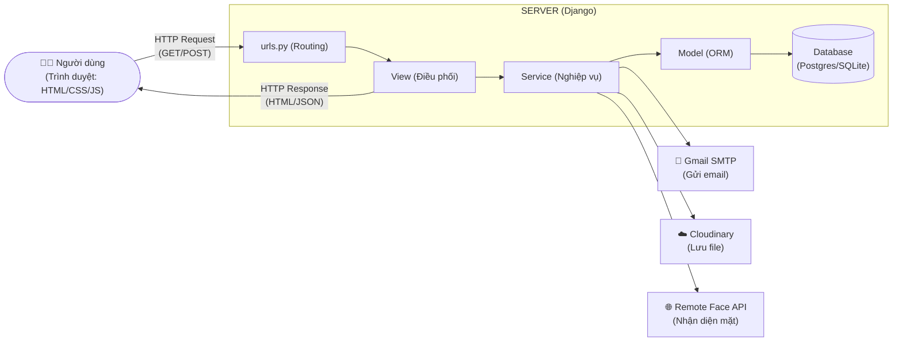

# 🧠 HRMS Hoạt Động Như Thế Nào — Giải Thích Cho Người Mới

> Tài liệu này dành cho người **chưa biết gì về Django** (hoặc lập trình web nói chung).
> Mục tiêu: hiểu được **một request đi từ trình duyệt → server → database → quay về màn hình như thế nào**,
> và **từng chức năng trong project được lắp ráp từ những hàm nào**.
>
> Mọi đường dẫn file, tên hàm, con số trong tài liệu này đều **lấy trực tiếp từ code thật** trong `business_web/`
> (đối chiếu ngày 03/06/2026). Không có chỗ nào suy diễn.
>
> Đọc kèm: `walkthrough.md` (mô tả nghiệp vụ + sơ đồ), `class_diagram.md`, `data_flow_diagram.md`, `activity_diagrams.md`, `deployment_architecture.md`.

---

## Mục lục

1. [Django là gì — mô hình MTV](#1-django-là-gì--mô-hình-mtv)
2. [Bức tranh tổng thể: các mảnh ghép của hệ thống](#2-bức-tranh-tổng-thể-các-mảnh-ghép-của-hệ-thống)
3. [Vòng đời một request (request lifecycle)](#3-vòng-đời-một-request-request-lifecycle)
4. [Cách tổ chức code: một "app" Django trông như thế nào](#4-cách-tổ-chức-code-một-app-django-trông-như-thế-nào)
5. [Django nói chuyện với Database như thế nào (ORM)](#5-django-nói-chuyện-với-database-như-thế-nào-orm)
6. [Migrations: vì sao sửa model phải "makemigrations"](#6-migrations-vì-sao-sửa-model-phải-makemigrations)
7. [Frontend ↔ Backend: template, CSRF, và AJAX](#7-frontend--backend-template-csrf-và-ajax)
8. [Đi sâu từng chức năng (trace hàm thật)](#8-đi-sâu-từng-chức-năng-trace-hàm-thật)
   - [8.1 Đăng nhập + khóa tài khoản](#81-đăng-nhập--khóa-tài-khoản-sau-3-lần-sai)
   - [8.2 Phân quyền (RBAC) chạy ra sao](#82-phân-quyền-rbac-chạy-ra-sao)
   - [8.3 Chấm công bằng khuôn mặt — chức năng phức tạp nhất](#83-chấm-công-bằng-khuôn-mặt--chức-năng-phức-tạp-nhất)
   - [8.4 Nghỉ phép — phê duyệt 2 cấp](#84-nghỉ-phép--phê-duyệt-2-cấp)
   - [8.5 Thông báo tự động hiện trên mọi trang](#85-thông-báo-tự-động-hiện-trên-mọi-trang)
   - [8.6 Quên mật khẩu bằng OTP qua email](#86-quên-mật-khẩu-bằng-otp-qua-email)
9. [Các "server" ngoài mà hệ thống phụ thuộc](#9-các-server-ngoài-mà-hệ-thống-phụ-thuộc)
10. [Triển khai (deploy) lên Render](#10-triển-khai-deploy-lên-render)
11. [Bảng tra cứu nhanh: chức năng → file](#11-bảng-tra-cứu-nhanh-chức-năng--file)

---

## 1. Django là gì — mô hình MTV

**Django** là một *web framework* viết bằng Python. "Framework" nghĩa là một bộ khung dựng sẵn:
nó lo phần khó (nhận request HTTP, phân tích URL, nói chuyện với database, render HTML, quản lý session/đăng nhập)
để bạn chỉ phải viết phần nghiệp vụ.

Django tổ chức theo mô hình **MTV** (Model – Template – View). Đây là biến thể của MVC:

| Lớp | Vai trò | Trong project này nằm ở đâu |
|-----|---------|------------------------------|
| **Model** | Định nghĩa **dữ liệu** + ánh xạ sang bảng database | `*/models/*.py` (mỗi model 1 file) |
| **View** | Nhận request, gọi nghiệp vụ, trả response | `*/views/**.py` |
| **Template** | File HTML để render ra màn hình | `*/templates/**.html` |

Project này tách thêm một lớp thứ tư **không phải chuẩn Django nhưng rất quan trọng**:

| Lớp | Vai trò | Nằm ở đâu |
|-----|---------|-----------|
| **Service** | Toàn bộ **logic nghiệp vụ** (validate, quy tắc duyệt, gọi API ngoài) | `*/services/**.py` |

Triết lý: **View mỏng, Service dày**. View chỉ điều phối; mọi quy tắc ("ai được duyệt đơn?", "đi trễ tính sao?")
nằm trong service để dễ test và tái sử dụng. Bạn sẽ thấy pattern này lặp lại khắp project.

---

## 2. Bức tranh tổng thể: các mảnh ghép của hệ thống



**Giải thích chi tiết quy trình (Luồng đi của dữ liệu):**

1. **Người dùng (Trình duyệt):** Thao tác trên giao diện (nhấn nút, điền form, chụp ảnh khuôn mặt) và trình duyệt sẽ đóng gói dữ liệu thành một **HTTP Request (GET/POST)** gửi lên Server.
2. **urls.py (Routing):** Đóng vai trò như "người gác cổng" hoặc tổng đài viên. Dựa vào đường dẫn (ví dụ `/login/`), nó sẽ chỉ đường cho Request đi đến đúng hàm xử lý bên trong View.
3. **View (Điều phối):** Tiếp nhận Request từ `urls.py`. Nó KHÔNG xử lý nghiệp vụ hay tính toán gì cả. Nó chỉ làm nhiệm vụ lấy dữ liệu từ Request (ví dụ lấy ID nhân viên) rồi chuyển giao cho tầng **Service** xử lý. Cuối cùng, View sẽ nhận kết quả từ Service để gói lại thành **HTTP Response (HTML hoặc JSON)** và trả ngược về cho Trình duyệt.
4. **Service (Nghiệp vụ):** Đây là "bộ não" thực sự của ứng dụng. Mọi tính toán phức tạp, quy tắc kinh doanh (ai được duyệt phép, check in muộn bị phạt thế nào...) đều nằm ở đây.
   - Nếu cần lưu/lấy dữ liệu, Service sẽ ra lệnh cho **ORM**.
   - Nếu cần xử lý tính năng bên ngoài, chính **Service** sẽ trực tiếp giao tiếp qua API với:
     - **Gmail SMTP** để gửi email OTP/cảnh báo.
     - **Cloudinary** để đẩy file/ảnh lên cloud.
     - **Remote Face API** để kiểm tra khuôn mặt.
5. **Model (ORM):** Đóng vai trò như "người phiên dịch". Nó dịch các lệnh Python (từ Service) thành câu lệnh SQL để nói chuyện với **Database**. Model là tầng duy nhất được phép giao tiếp trực tiếp với Database.
6. **Database (Postgres/SQLite):** Nơi lưu trữ thực tế mọi dữ liệu bền vững của hệ thống.

Django **không** tự làm nhận diện khuôn mặt, **không** tự gửi email, **không** tự lưu file ảnh lâu dài. Nó phân tách rõ ràng lớp **Service** để **điều phối** và gọi các dịch vụ chuyên biệt bên ngoài. Hiểu kiến trúc phân tầng này là chìa khóa để hiểu project.

Cấu hình tất cả những kết nối trên nằm trong **một file duy nhất**: [business_web/business_web/settings.py](business_web/business_web/settings.py).

---

## 3. Vòng đời một request (request lifecycle)

Đây là phần quan trọng nhất. Ví dụ người dùng mở `/dashboard/`. Chuyện gì xảy ra, theo thứ tự:

```
1. Trình duyệt gửi:  GET /dashboard/   (kèm cookie sessionid)
        │
2. WSGI server (gunicorn ở prod) nhận, đưa cho Django
        │
3. MIDDLEWARE chạy lần lượt (xem settings.py MIDDLEWARE):
     - SecurityMiddleware      → ép HTTPS (khi prod)
     - WhiteNoiseMiddleware    → nếu là file tĩnh (.css/.js) thì trả luôn, không vào view
     - SessionMiddleware       → đọc cookie sessionid → nạp request.session
     - AuthenticationMiddleware→ từ session xác định request.user (ai đang đăng nhập)
     - CsrfViewMiddleware      → kiểm tra token chống giả mạo (với POST)
        │
4. URL ROUTING: Django so khớp "/dashboard/" với các path trong urls.py
     business_web/urls.py  →  include('accounts.urls')  →  path('dashboard/', dashboard_view)
        │
5. VIEW chạy: dashboard_view(request)   [accounts/views/account/account_info_view.py]
     - decorator @login_required đã kiểm: chưa đăng nhập → đá về /login/
     - gọi service: can_access_statistics(request.user), can_manage_work_info(...)...
     - các service này hỏi Database qua ORM: user này role gì?
        │
6. RENDER TEMPLATE: render(request, "dashboard.html", {các biến/flags})
     - Django ráp dữ liệu vào HTML
     - context_processor "notifications" tự chèn thêm số thông báo chưa đọc (mục 8.5)
        │
7. RESPONSE: HTML đi ngược qua middleware → gunicorn → trình duyệt hiển thị
```

**Điểm mấu chốt cho người mới:**
- `request` là một object chứa **mọi thứ** về lần gọi này: `request.user` (ai), `request.POST` (dữ liệu form),
  `request.FILES` (file upload), `request.session` (bộ nhớ tạm theo phiên).
- **Middleware** = chuỗi "trạm gác" mọi request đều đi qua. Thứ tự trong `MIDDLEWARE` **có ý nghĩa**:
  ví dụ `AuthenticationMiddleware` phải đứng sau `SessionMiddleware` vì nó cần session để biết bạn là ai.
- Một URL **chỉ** map tới **một** view. View là "người điều phối".

### URL routing cụ thể trong project

[business_web/business_web/urls.py](business_web/business_web/urls.py) (file gốc) gom URL của cả **10 app**,
tất cả cùng tiền tố rỗng `''`:

```python
urlpatterns = [
    path('admin/', admin.site.urls),
    path('', include('accounts.urls')),         # /login/, /dashboard/, /users/...
    path('', include('attendance.urls')),       # /attendance/check/, ...
    path('', include('leaves.urls')),           # /leaves/...
    ... (7 app còn lại)
]
```

Mỗi app tự khai báo tiền tố riêng bên trong. Ví dụ [attendance/urls.py](business_web/attendance/urls.py):

```python
path('attendance/check/', face_check_view, name='face_check'),
```

`name='face_check'` là **tên định danh** của URL. Trong template hay JS, ta gọi ``
thay vì gõ cứng `/attendance/check/`. Đổi đường dẫn sau này không vỡ chỗ khác.

---

## 4. Cách tổ chức code: một "app" Django trông như thế nào

Django chia hệ thống thành nhiều **app** (mô-đun nghiệp vụ). Project này có **10 app**
(khai báo trong `INSTALLED_APPS` của settings.py): `accounts`, `employee_profiles`, `contracts`,
`attendance`, `leaves`, `overtime`, `performance`, `rewards_discipline`, `reports_interactions`, `stats_reports`.

Mỗi app theo cùng một khuôn mẫu **"package hóa"** — mỗi loại 1 thư mục, mỗi model/view/service 1 file:

```
attendance/
├── models/                  ← Định nghĩa bảng dữ liệu
│   ├── attendance_record_model.py
│   ├── employee_face_model.py
│   └── face_change_request_model.py
├── views/                   ← Nhận request, trả response
│   └── face/face_attendance_view.py
├── services/                ← Logic nghiệp vụ (phần "não")
│   ├── face/                  → gọi API nhận diện, đếm khóa
│   └── record/                → ghi giờ, phân loại đi trễ/về sớm
├── forms/                   ← Định nghĩa & validate form nhập liệu
├── templates/attendance/    ← File HTML
├── migrations/              ← Lịch sử thay đổi cấu trúc DB (mục 6)
├── management/commands/     ← Lệnh chạy tay/định kỳ (vd close_open_attendance)
└── urls.py                  ← Bảng định tuyến của app
```

Khi đọc một chức năng lạ, cứ đi theo thứ tự: **`urls.py` → `views/` → `services/` → `models/` → `templates/`**.
Đó chính là chiều dữ liệu chảy.

---

## 5. Django nói chuyện với Database như thế nào (ORM)

Đây là phần "ảo diệu" nhất với người mới. **Bạn gần như không bao giờ viết SQL.**

Django có **ORM** (Object-Relational Mapper): bạn viết Python, Django dịch sang SQL, chạy trên DB, rồi trả về object Python.

### 5.1 Model = một bảng

Ví dụ [attendance/models/attendance_record_model.py](business_web/attendance/models/attendance_record_model.py):

```python
class AttendanceRecord(models.Model):
    user = models.ForeignKey(User, on_delete=models.CASCADE, related_name='attendance_records')
    record_date = models.DateField()
    check_in_time = models.TimeField(null=True, blank=True)
    check_out_time = models.TimeField(null=True, blank=True)
    status = models.CharField(max_length=20, blank=True, default='')

    class Meta:
        unique_together = ['user', 'record_date']   # mỗi user 1 bản ghi/ngày
```

- Mỗi `class ... (models.Model)` → **một bảng** trong DB.
- Mỗi thuộc tính (`record_date = ...`) → **một cột**.
- `ForeignKey(User)` → cột khóa ngoại trỏ sang bảng `auth_user` của Django. `related_name='attendance_records'`
  cho phép đi ngược: `some_user.attendance_records.all()` lấy mọi bản ghi chấm công của user đó.
- `unique_together` → ràng buộc DB: không thể có 2 dòng cùng (user, ngày).

### 5.2 QuerySet = câu truy vấn (lười)

Bạn thao tác DB qua `Model.objects`:

```python
# LỌC: SELECT * FROM attendance_record WHERE user=X AND record_date < today
AttendanceRecord.objects.filter(user=user, record_date__lt=today)

# LẤY HOẶC TẠO: tìm bản ghi hôm nay, chưa có thì tạo mới
record, created = AttendanceRecord.objects.get_or_create(user=user, record_date=today)

# ĐẾM / TỔNG HỢP: tính tổng số ngày nghỉ đã duyệt (dùng trong leaves)
LeaveRequest.objects.filter(status='approved').aggregate(total=Sum('days'))

# LẤY 1 CỘT: danh sách user_id mà 1 quản lý phụ trách
EmployeeWorkInfo.objects.filter(leader_user=boss).values_list('user_id', flat=True)
```

QuerySet **"lười" (lazy)**: viết `.filter(...)` chưa chạm DB. DB chỉ bị query khi bạn **thực sự dùng** kết quả
(lặp `for`, ép `list()`, `.count()`, `.first()`...). Nhờ vậy có thể nối nhiều `.filter().exclude().order_by()`
rồi mới bắn **một** câu SQL.

Cú pháp `record_date__lt` (hai gạch dưới) = "field LOOKUP": `__lt` = less than, `__gte` = ≥, `__in` = trong danh sách,
`__year` = lọc theo năm, `__isnull=True` = IS NULL. Đây là cách ORM diễn đạt mệnh đề WHERE.

### 5.3 Hai kỹ thuật "nâng cao" project dùng (và vì sao)

**a) `select_related` — chống N+1 query.** Trong [leaves/services/__init__.py](business_web/leaves/services/__init__.py):

```python
LeaveRequest.objects.filter(...).select_related('user', 'user__profile')
```

Bình thường, khi lặp 100 đơn rồi gọi `don.user.profile.full_name`, Django sẽ bắn thêm 1 query mỗi đơn → 100+ query.
`select_related` bảo Django **JOIN sẵn** các bảng liên quan trong 1 query duy nhất. Tăng tốc rõ rệt.

**b) `transaction.atomic` + `select_for_update` — chống tranh chấp (race condition).**
Trong [face_attendance_view.py](business_web/attendance/views/face/face_attendance_view.py):

```python
with transaction.atomic():
    record = (AttendanceRecord.objects
              .select_for_update()                 # KHÓA dòng này trong DB
              .get_or_create(user=request.user, record_date=timezone.localdate()))[0]
    action = decide_next_action(record)            # check_in? check_out? done?
    ...
```

- `transaction.atomic()`: mọi lệnh DB bên trong khối **hoặc thành công hết, hoặc rollback hết**. Không có nửa vời.
- `select_for_update()`: **khóa** dòng bản ghi đó cho tới khi giao dịch xong. Nếu người dùng bấm chấm công 2 lần
  thật nhanh (2 request song song), request thứ hai phải **đợi** → tránh ghi đè lung tung (cả hai cùng thấy "chưa check-in" rồi cùng ghi).

### 5.4 Cấu hình kết nối DB ở đâu?

[settings.py](business_web/business_web/settings.py) dòng ~136:

```python
DATABASES = {
    'default': dj_database_url.config(
        default=f'sqlite:///{BASE_DIR / "db.sqlite3"}',   # mặc định: SQLite (file, cho dev)
        conn_max_age=600,
    )
}
```

`dj_database_url` đọc biến môi trường `DATABASE_URL`. Trên Render (production), biến này trỏ tới **PostgreSQL**;
ở máy bạn (dev) không có biến đó → tự dùng **SQLite** (một file `db.sqlite3`). **Cùng một code, hai DB khác nhau** —
nhờ ORM, bạn không phải đổi gì. Đó là sức mạnh của lớp trừu tượng.

---

## 6. Migrations: vì sao sửa model phải "makemigrations"

DB là bảng cứng; model là code Python. Hai thứ phải **đồng bộ**. **Migration** là cầu nối.

Quy trình:

```
Sửa file model (thêm/xóa cột)
        │
python manage.py makemigrations    → Django sinh file mô tả thay đổi
        │                             vd: attendance/migrations/0009_facechangerequest.py
        │
python manage.py migrate           → Django đọc file đó, chạy ALTER/CREATE TABLE lên DB thật
```

Thư mục `*/migrations/` là **lịch sử tiến hóa** của database, được commit vào git. Nhìn tên file là biết DB từng đổi gì.
Ví dụ trong project: `attendance/migrations/0008_remove_employeeface_embedding` cho thấy cột `embedding` (vector khuôn mặt)
**từng tồn tại rồi bị xóa** — vì việc nhận diện đã chuyển sang server ngoài (mục 8.3).

Trên Render, lệnh `migrate` chạy **tự động mỗi lần deploy** qua [business_web/build.sh](business_web/build.sh):

```bash
pip install -r requirements.txt
python manage.py collectstatic --no-input   # gom file tĩnh
python manage.py migrate                     # cập nhật cấu trúc DB
python manage.py ensure_superuser            # tạo tài khoản admin từ biến môi trường
```

---

## 7. Frontend ↔ Backend: template, CSRF, và AJAX

Project dùng **2 kiểu** giao tiếp frontend–backend. Hiểu cả hai là hiểu toàn bộ phần "giao diện".

### 7.1 Kiểu cổ điển: Template render server-side

Đa số trang (dashboard, danh sách đơn, hồ sơ) đi theo lối kinh điển:
**server dựng sẵn HTML rồi gửi nguyên trang về**.

- View gọi `render(request, "template.html", context)`. `context` là một `dict` các biến.
- Template là HTML + **Django Template Language (DTL)**: `{{ bien }}` để in giá trị, ``/`` để rẽ nhánh/lặp,
  `` để sinh link, `` để chèn token bảo mật.
- Template **kế thừa** nhau: hầu hết trang đều `` để dùng chung
  thanh điều hướng, chuông thông báo... rồi chỉ điền phần nội dung riêng.

**CSRF là gì?** Khi bạn submit form (POST), Django bắt buộc kèm một **token bí mật** (``).
`CsrfViewMiddleware` kiểm token này để bảo đảm form thật sự đến từ trang của ta, không phải web độc hại giả mạo.
Thiếu token → Django chặn (lỗi 403).

### 7.2 Kiểu hiện đại: AJAX trả JSON (dùng ở chấm công)

Trang chấm công không reload cả trang — nó gửi ảnh ngầm rồi nhận kết quả dạng **JSON**.
Đây là đoạn JS thật trong [attendance/templates/attendance/record/attendance.html](business_web/attendance/templates/attendance/record/attendance.html):

```javascript
const ctx = canvas.getContext('2d');
ctx.drawImage(video, 0, 0, canvas.width, canvas.height);   // chụp 1 khung hình từ webcam
canvas.toBlob(async (blob) => {
    const form = new FormData();
    form.append('image', blob, 'check.jpg');               // đóng gói ảnh
    const csrf = document.querySelector('[name=csrfmiddlewaretoken]').value;
    const resp = await fetch('', {   // gửi ngầm tới server
        method: 'POST',
        headers: { 'X-CSRFToken': csrf },                  // token CSRF qua header
        body: form,
    });
    const body = await resp.json();                        // server trả JSON
    if (resp.status === 200)      showToast('Chấm công lúc ' + body.time);
    else if (resp.status === 403) showToast('Mặt không khớp. Còn ' + body.fails_left + ' lần');
    else if (resp.status === 423) showToast('Đã khóa. Thử lại sau ' + body.retry_after + ' giây');
    // ... mỗi mã trạng thái HTTP = một tình huống
}, 'image/jpeg', 0.80);
```

Phía server, view trả về `JsonResponse({...}, status=...)` thay vì HTML. **Mã trạng thái HTTP** chính là "ngôn ngữ"
giữa JS và view: `200` = thành công, `401` = không nhận ra ai, `403` = sai người, `423` = đang bị khóa, `503` = dịch vụ chết.
JS đọc mã đó để hiện thông báo phù hợp. Không có lần reload nào — trải nghiệm mượt.

> **Frontend dùng gì?** Không có framework JS nặng. Cụ thể: **CSS tự viết** (`accounts/static/accounts/css/style.css`),
> **JavaScript thuần** (`accounts/static/accounts/js/accounts.js`) cho tương tác (modal, toast, dropdown),
> **Font Awesome** (icon, qua CDN) và **Chart.js** (qua CDN, chỉ ở trang thống kê để vẽ biểu đồ). Font chữ Inter từ Google Fonts.
> Tất cả nạp trong template gốc [accounts/templates/accounts/base_dashboard.html](business_web/accounts/templates/accounts/base_dashboard.html).

---

## 8. Đi sâu từng chức năng (trace hàm thật)

Từ đây ta lần theo **đúng các hàm trong code**, từ lúc người dùng bấm tới lúc DB đổi.

### 8.1 Đăng nhập + khóa tài khoản sau 3 lần sai

**File liên quan:**
- View: [accounts/views/auth/login_view.py](business_web/accounts/views/auth/login_view.py) — class `AccountsLoginView`
- Đếm khóa: [accounts/services/auth/login_lockout_service.py](business_web/accounts/services/auth/login_lockout_service.py)
- Cấu hình: `settings.py` (`LOGIN_LOCKOUT_MAX_FAILS=3`, `LOGIN_LOCKOUT_WINDOW_SEC=900`)

`AccountsLoginView` **kế thừa** `LoginView` có sẵn của Django — nghĩa là Django đã lo phần kiểm mật khẩu;
project chỉ "chèn thêm" logic khóa vào 2 điểm:

```python
class AccountsLoginView(LoginView):
    authentication_form = LoginForm
    template_name = "accounts/auth/login.html"

    def form_valid(self, form):                 # ĐÚNG mật khẩu
        clear_failures(form.get_user().get_username())   # xóa bộ đếm sai
        return super().form_valid(form)         # Django tạo session, redirect dashboard

    def form_invalid(self, form):               # SAI mật khẩu
        username = (self.request.POST.get('username') or '').strip()
        if username:
            count = register_failure(username)  # tăng bộ đếm
            if reached_limit(count):            # đạt 3?
                self._lock_account(username)    # set is_active=False
        return super().form_invalid(form)
```

**Bộ đếm sai lưu ở đâu?** Không phải DB, mà ở **cache** (bộ nhớ tạm). Xem `login_lockout_service.py`:

```python
def register_failure(username):
    key = _fails_key(username)                  # 'login_lockout:fails:<hash-username>'
    if cache.add(key, 1, timeout=ttl):          # lần đầu → đặt = 1, hết hạn sau 900s
        return 1
    return cache.incr(key)                       # các lần sau → +1
```

- Vì sao dùng cache chứ không thêm bảng DB? Vì đây là dữ liệu **tạm**, tự hết hạn sau 900 giây (`timeout=ttl`).
  Ngừng thử 15 phút → bộ đếm tự xóa. Không cần model, không rác DB.
- `_fails_key` băm username bằng SHA-256 để cache key luôn hợp lệ (username có dấu cách/ký tự lạ vẫn ổn).

**Khi đạt ngưỡng**, `_lock_account` đặt `user.is_active = False` và **lưu xuống DB**:

```python
user.is_active = False
user.save(update_fields=['is_active'])    # chỉ UPDATE đúng 1 cột → nhanh, an toàn
```

Từ đó, dù gõ đúng mật khẩu user vẫn không vào được (Django chặn tài khoản `is_active=False`).
Chỉ HR/Admin mở lại được (qua `toggle_user_active_view`).

> ⚠️ **Lưu ý kỹ thuật (cho prod):** project **không cấu hình** `CACHES` riêng → Django dùng `LocMemCache` (cache trong RAM của
> tiến trình). Trên Render nếu chạy nhiều worker gunicorn, mỗi worker có cache riêng → bộ đếm có thể phân tán.
> Với quy mô môn học thì chấp nhận được; muốn chắc chắn nên chuyển sang Redis.

**Session timeout:** sau khi đăng nhập, `settings.py` đặt `SESSION_COOKIE_AGE = 1800` (30 phút) và
`SESSION_SAVE_EVERY_REQUEST = True`. Cái thứ hai khiến **mỗi request làm mới hạn cookie** → 30 phút được tính từ
*lần hoạt động cuối*, không phải từ lúc đăng nhập. Ngồi yên 30 phút → tự đăng xuất.

---

### 8.2 Phân quyền (RBAC) chạy ra sao

Hệ thống có **5 vai trò**: `admin`, `hr`, `manager`, `leader`, `employee` (định nghĩa trong
[accounts/models/role_model.py](business_web/accounts/models/role_model.py)).

Liên kết: `User` (của Django) ——1-1—— `UserProfile` ——FK—— `Role`. Tức mỗi người đăng nhập có 1 hồ sơ, hồ sơ trỏ tới 1 vai trò.

Việc kiểm quyền **không** rải rác `if role == ...` khắp nơi. Nó gom vào các **hàm helper** ở
[accounts/services/permission/access_control_service.py](business_web/accounts/services/permission/access_control_service.py):

```python
def can_manage_work_info(user):     # ai sửa được hồ sơ NV
    return has_admin_business_access(user) or user_has_role(user, Role.HR)

def can_access_statistics(user):    # ai xem được thống kê (Admin KHÔNG được)
    return user_has_role(user, Role.HR, Role.MANAGER, Role.LEADER)
```

Hai cách dùng các helper này:

1. **Chặn ở cửa view** bằng **decorator**. Decorator là hàm "bọc" view, chạy *trước* view:
   ```python
   @login_required                              # chưa đăng nhập → đá về /login/
   @user_passes_test(is_admin_user)             # không phải admin → chặn
   def delete_user_view(request, user_id): ...
   ```
   Còn [accounts/decorators.py](business_web/accounts/decorators.py) có `@deny_admin` để **cấm Admin**
   đụng vào chức năng nghiệp vụ (Admin chỉ quản trị hệ thống).

2. **Điều khiển giao diện**: view truyền các flag xuống template để **ẩn/hiện nút**. Ví dụ `dashboard_view`
   truyền `can_access_statistics`, `can_manage_work_info`... và template chỉ vẽ menu tương ứng.

> **Quan trọng — chỉ có MỘT dashboard.** Sau đăng nhập, Django luôn redirect tới `LOGIN_REDIRECT_URL='dashboard'`
> (một URL `/dashboard/`). `dashboard_view` đọc role rồi bật/tắt các phần nội dung. **Không** có chuyện mỗi role
> một URL riêng — chỉ là **cùng một trang, nội dung khác nhau**.

**Quy tắc duyệt 2 cấp (L1/L2)** cũng là logic phân quyền, nằm trong service từng app (mục 8.4).
Cốt lõi: "ai là quản lý trực tiếp của nhân viên?" được trả lời bằng cách so `approver` với
`employee.work_info.leader_user` và `.manager_user`.

---

### 8.3 Chấm công bằng khuôn mặt — chức năng phức tạp nhất

Đây là ví dụ đẹp nhất cho thấy Django **điều phối** nhiều mảnh. Hãy đi từ ngoài vào.

**Các file tham gia:**
| Vai trò | File |
|---------|------|
| View (điều phối) | [attendance/views/face/face_attendance_view.py](business_web/attendance/views/face/face_attendance_view.py) |
| Đếm khóa | [attendance/services/face/face_lockout_service.py](business_web/attendance/services/face/face_lockout_service.py) |
| Quy tắc 1:1 | [attendance/services/face/face_verification_service.py](business_web/attendance/services/face/face_verification_service.py) |
| Gọi API ngoài | [attendance/services/face/face_api_client.py](business_web/attendance/services/face/face_api_client.py) |
| Ghi giờ + phân loại | [attendance/services/record/attendance_logging_service.py](business_web/attendance/services/record/attendance_logging_service.py) |

#### Bước 0 — Frontend chụp ảnh
JS mở webcam, vẽ 1 khung hình lên `<canvas>`, biến thành ảnh JPEG, gửi `POST /attendance/check/` (mục 7.2).

#### Bước 1 — View nhận, kiểm khóa trước
```python
@login_required
@require_POST                                   # chỉ chấp nhận POST
def face_check_view(request):
    request_time = timezone.localtime()         # ❶ chốt GIỜ ngay đầu, tránh độ trễ API làm sai giờ chấm

    locked, retry_after = is_locked(request.user)   # ❷ đang bị khóa?
    if locked:
        return JsonResponse({'locked': True, 'retry_after': retry_after}, status=423)
```
Lý do `request_time` lấy ngay từ đầu: gọi API nhận diện có thể mất vài giây; nếu lấy giờ *sau* khi gọi xong,
giờ check-in sẽ bị lệch. Chi tiết nhỏ nhưng đúng.

#### Bước 2 — Lấy bytes ảnh, có chặn dung lượng
`_extract_image_bytes` đọc `request.FILES['image']`, chặn nếu > 2MB (`MAX_IMAGE_BYTES`), trả lỗi JSON nếu thiếu ảnh.

#### Bước 3 — Xác minh khuôn mặt (gọi server ngoài)
```python
result = verify_face_for_user(request.user, image_bytes)
```
Hàm này (`face_verification_service.py`) gọi tiếp `face_api_client.recognize_face_remote(image_bytes)`,
hàm đó dùng thư viện `requests` bắn HTTP thật tới server nhận diện:

```python
# face_api_client.py
resp = requests.post(f'{FACE_API_BASE_URL}/recognize', files={'file': (...)}, timeout=30)
return resp.json()   # {"status":"success","employee_id":"42","confidence":0.93,...}
```

`FACE_API_BASE_URL` mặc định trỏ tới một **HuggingFace Space** (server FastAPI + DeepFace + FAISS).
**Toàn bộ AI nằm ở đó** — Django không nạp model, không tính vector. Nó chỉ gửi ảnh, nhận lại "đây là nhân viên id mấy".

**Quy tắc cốt lõi 1:1** nằm đúng 1 chỗ trong `verify_face_for_user`:
```python
matched = str(body.get('employee_id'))
if matched != str(user.id):
    return VerifyResult(False, ..., reason='wrong_person')   # nhận ra người KHÁC → chống chấm hộ
```
Tức: server có thể nhận ra *ai đó*, nhưng nếu người đó **không phải** chính chủ đang đăng nhập → từ chối.
Đây là lá chắn chống "chấm công hộ".

Các tình huống lỗi được map thành `reason`: `no_face` (không thấy mặt), `no_match` (server không khớp ai),
`wrong_person` (khớp nhầm người), `service_down` (server chết/timeout). View dịch mỗi `reason` thành một mã HTTP:

```python
if result.reason == 'wrong_person':
    register_failure(request.user)              # ❸ tăng đếm khóa (3 lần → khóa 300s)
    return JsonResponse({'error':'wrong_person','fails_left': _fails_left(...)}, status=403)
if result.reason == 'no_match':   return JsonResponse({'error':'no_match'}, status=401)
if result.reason == 'no_face':    return JsonResponse({'error':'no_face_detected'}, status=400)
return JsonResponse({'error':'face_service_unavailable'}, status=503)   # service_down
```

Khóa chấm công (`face_lockout_service.py`) dùng **cache** y như khóa đăng nhập, nhưng tham số riêng:
`FACE_LOCKOUT_MAX_FAILS=3`, `FACE_LOCKOUT_DURATION_SEC=300` (khóa 5 phút). Nó còn lưu thêm key `...:until:<id>`
ghi mốc thời gian hết khóa để `is_locked` tính `retry_after`.

#### Bước 4 — Nhận đúng người → ghi giờ (an toàn tranh chấp)
```python
with transaction.atomic():
    record = AttendanceRecord.objects.select_for_update().get_or_create(
        user=request.user, record_date=timezone.localdate())[0]
    action = decide_next_action(record)         # 'check_in' | 'check_out' | 'done'
    if action == 'check_in':   record_check_in(request.user, now=request_time)
    elif action == 'check_out': record_check_out(request.user, now=request_time)
clear_failures(request.user)                    # thành công → xóa bộ đếm khóa
```

`decide_next_action` (trong `attendance_logging_service.py`) quyết định đơn giản:
- chưa có `check_in_time` → **check_in**;
- có check_in, chưa có `check_out_time` → **check_out**;
- có cả hai → **done** (hôm nay xong rồi).

#### Bước 5 — Phân loại đi trễ / về sớm
`record_check_in`/`record_check_out` gọi `classify_status`:
```python
def classify_status(check_in_time, check_out_time, shift_start, shift_end):
    grace = timedelta(minutes=settings.WORK_LATE_GRACE_MIN)   # ân hạn 5 phút
    in_limit = (datetime.combine(today, shift_start) + grace).time()
    status = 'late' if check_in_time > in_limit else 'on_time'
    if check_out_time and check_out_time < shift_end:
        status = 'early_leave'
    return status
```
Giờ ca lấy ở đâu? `get_shift_times(user)` (trong `contracts/services`) đọc **hợp đồng đang hiệu lực** của user;
nếu HĐ không ghi giờ ca thì **fallback** về mặc định công ty `WORK_START_TIME=08:30`, `WORK_END_TIME=17:30` (settings).

Tinh tế hơn: nếu nhân viên có **tăng ca đã duyệt** hôm đó, `effective_shift_end` dời giờ tan kỳ vọng tới giờ OT (`max(shift_end, ot_end)`). Nghĩa là dù đã qua giờ làm việc chuẩn (ví dụ 17:30), nhưng nếu họ về trước khi kết thúc ca OT (ví dụ 19:00), hệ thống **vẫn sẽ đánh dấu là về sớm (early_leave)**. Điều này giúp nhân sự kiểm soát được việc nhân viên đăng ký tăng ca nhưng lại bỏ về giữa chừng! Hàm này gọi sang `overtime.services.get_approved_overtime_end` → đây là ví dụ một app (attendance) **đọc dữ liệu app khác** (overtime).

#### Bước 6 — Trả JSON, JS hiện toast
View đóng gói `{success, action, time, status, confidence}` thành `JsonResponse(status=200)`.
JS đọc và hiện "Chấm vào lúc 08:27" rồi reload nhẹ trang.

> **Tóm lại luồng:** `JS webcam → POST → view (khóa? ảnh?) → service xác minh → HTTP tới HuggingFace →
> kiểm 1:1 → transaction ghi DB → phân loại theo HĐ+OT → JSON về JS`. Mỗi mắt xích một file, một trách nhiệm.

---

### 8.4 Nghỉ phép — phê duyệt 2 cấp

**File:** [leaves/services/__init__.py](business_web/leaves/services/__init__.py) (toàn bộ logic), model `LeaveRequest`.

#### Nộp đơn
```python
def create_leave_request(user, form):
    obj = form.save(commit=False)               # tạo object từ form NHƯNG chưa lưu DB
    obj.user = user
    obj.status = LeaveRequest.PENDING
    obj.days = Decimal(str((obj.end_date - obj.start_date).days + 1))   # tự tính số ngày
    obj.save()                                   # giờ mới INSERT vào DB
    return obj
```
`form.save(commit=False)` là mẹo hay: lấy được object đã validate nhưng **hoãn lưu** để gán thêm `user`, `status`, `days` rồi mới `.save()`.

#### Duyệt — một hàm, hai cấp
`approve_leave_request(approver, request_id)` xử lý **cả L1 lẫn L2** tùy trạng thái hiện tại của đơn:

```python
if obj.user == approver:
    return False, 'Không thể tự duyệt đơn của chính mình.'

# ----- Cấp 1: đơn đang PENDING -----
if obj.status == LeaveRequest.PENDING:
    if not _is_direct_supervisor(approver, obj.user):       # phải là leader/manager của NV
        return False, 'Bạn không phải quản lý trực tiếp...'
    obj.leader_approved_by = approver
    obj.leader_approved_at = now
    if _is_hr_role(obj.user):                               # NGOẠI LỆ: người xin là HR
        obj.status = LeaveRequest.APPROVED                  # → duyệt thẳng, bỏ qua L2
        obj.approved_by = approver
    else:
        obj.status = LeaveRequest.LEADER_APPROVED           # → chờ HR duyệt cấp 2
    obj.save(...)

# ----- Cấp 2: đơn đã LEADER_APPROVED -----
if obj.status == LeaveRequest.LEADER_APPROVED:
    if not _is_hr_role(approver):
        return False, 'Chỉ HR mới được duyệt bước cuối.'
    obj.status = LeaveRequest.APPROVED
    obj.approved_by = approver
    obj.save(...)
    create_notification(obj.user, 'Đơn nghỉ phép đã được duyệt', '...')   # bắn thông báo
```

Ai duyệt được L1? `_is_direct_supervisor` kiểm `approver in (work_info.leader_user, work_info.manager_user)`.
Hàng đợi "đơn chờ tôi duyệt" do `get_pending_requests_for_approver` dựng: leader/manager thấy đơn PENDING của
nhân viên mình phụ trách; HR thấy mọi đơn LEADER_APPROVED.

#### Quỹ phép là số **suy ra**, không trừ dần
Điểm dễ hiểu lầm: hệ thống **không** có cột "số phép còn lại" để trừ mỗi lần duyệt. Nó **tính lại** mỗi lần xem,
trong `get_user_leave_stats`:
```python
used_days   = approved_qs.aggregate(total=Sum('days'))['total'] or 0   # tổng ngày đã duyệt trong năm
total_allowed = active_contract.contract_annual_leave_days              # hạn mức từ HĐ
remaining = max(total_allowed - used_days, 0)
```
Cách này tránh sai lệch do trừ/cộng tay; "còn lại" luôn = hạn mức − tổng đơn approved. Đây là một quyết định thiết kế tốt.

---

### 8.5 Thông báo tự động hiện trên mọi trang

Bạn thấy cái **chuông + số đỏ** ở góc mọi trang. Nó hoạt động nhờ một cơ chế Django gọn đẹp: **context processor**.

**Model:** [accounts/models/notification_model.py](business_web/accounts/models/notification_model.py) — `Notification(user, title, message, link, is_read, created_at)`.

**Tạo thông báo:** ở bất kỳ đâu có sự kiện, service gọi `create_notification(user, title, message)`
([notification_service.py](business_web/accounts/services/notification_service.py)). Ta đã thấy nó trong
duyệt nghỉ phép (8.4); nó còn được gọi khi duyệt OT, duyệt thưởng/phạt, đổi vai trò...

**Hiện lên MỌI trang — không cần lặp code ở từng view.** Bí quyết là
[accounts/context_processors.py](business_web/accounts/context_processors.py):
```python
def notifications(request):
    if request.user.is_authenticated:
        unread_notifications = Notification.objects.filter(user=request.user, is_read=False).order_by('-created_at')[:5]
        unread_count = Notification.objects.filter(user=request.user, is_read=False).count()
    else:
        unread_notifications, unread_count = [], 0
    return {'unread_notifications': unread_notifications, 'unread_count': unread_count}
```

Hàm này được đăng ký trong `settings.py → TEMPLATES → context_processors`. **Context processor** là hàm chạy
**tự động trước khi render *bất kỳ* template nào**, và những gì nó `return` được **trộn thẳng vào context của mọi trang**.
Nhờ vậy `{{ unread_count }}` và `{{ unread_notifications }}` dùng được ở khắp nơi mà không view nào phải tự truyền.

Khi người dùng mở trang thông báo hoặc bấm chuông, view `mark_notifications_read_view` chạy một UPDATE:
`Notification.objects.filter(user=..., is_read=False).update(is_read=True)` → số đỏ về 0.

---

### 8.6 Quên mật khẩu bằng OTP qua email

**File:** view `forgot_password_view`, service [forgot_password_service.py](business_web/accounts/services/auth/forgot_password_service.py),
model `OtpCode`.

Luồng:
1. Người dùng nhập email → service tìm `User`. Không thấy → báo lỗi chung chung (**không** tiết lộ email có tồn tại không — chống dò tài khoản).
2. `create_otp_for_user`: **xóa hết OTP cũ** của user, sinh mã 6 số ngẫu nhiên, lưu `OtpCode(user, code, created_at)`.
3. `send_otp_email`: Django gọi `send_mail(...)`, đi qua cấu hình `EMAIL_BACKEND = smtp` + `EMAIL_HOST = smtp.gmail.com`
   trong settings → **Gmail SMTP** gửi email thật.
4. Người dùng nhập mã. `verify_otp` kiểm:
   - `is_expired()` — quá **120 giây** (`OTP_EXPIRY_SECONDS=120`)? → xóa, báo hết hạn.
   - sai mã → báo sai.
   - đúng & còn hạn → **xóa OTP** (dùng 1 lần) → cho đổi mật khẩu.
5. `set_password(new) + save()` cập nhật mật khẩu (Django tự băm, không lưu plaintext).

`is_expired()` nằm ngay trong model (`otp_code_model.py`):
```python
def is_expired(self):
    return (timezone.now() - self.created_at).total_seconds() > self.OTP_EXPIRY_SECONDS
```
Đây là ví dụ "logic nhỏ thuộc về dữ liệu thì đặt ngay trong model".

---

## 9. Các "server" ngoài mà hệ thống phụ thuộc

Django ở giữa, gọi ra 4 dịch vụ. Cấu hình tất cả trong `settings.py`:

| Dịch vụ | Dùng để làm gì | Giao tiếp kiểu gì | Cấu hình |
|---------|----------------|-------------------|----------|
| **PostgreSQL / SQLite** | Lưu mọi dữ liệu (user, đơn, chấm công...) | Qua ORM (Django sinh SQL) | `DATABASES` / biến `DATABASE_URL` |
| **Remote Face API** (HuggingFace Space) | Nhận diện khuôn mặt (AI) | HTTP POST `/register`, `/recognize` qua `requests` | `FACE_API_BASE_URL`, `FACE_API_TIMEOUT_SEC=30` |
| **Gmail SMTP** | Gửi email OTP, email tài khoản, cảnh báo HĐ | Giao thức SMTP (Django `send_mail`) | `EMAIL_*` |
| **Cloudinary** | Lưu file upload (ảnh, PDF minh chứng) bền qua mỗi lần deploy | API của thư viện `cloudinary_storage` | `USE_CLOUDINARY`, `CLOUDINARY_*` |

**Vì sao cần Cloudinary?** Render xóa sạch ổ đĩa mỗi lần deploy lại. File người dùng upload (minh chứng nghỉ phép...)
lưu trên đĩa sẽ **mất**. Bật `USE_CLOUDINARY=True` → Django chuyển `STORAGES['default']` sang Cloudinary (đám mây),
file sống sót. Ở dev (`USE_CLOUDINARY=False`) thì lưu thư mục `media/` cho tiện.

**Tại sao tách AI ra server riêng?** Model nhận diện (DeepFace/Facenet512) **nặng** (RAM, thời gian khởi động).
Nhét vào web server thì mỗi request chấm công sẽ rất chậm và tốn tài nguyên. Tách ra service chuyên dụng:
Django gọn nhẹ, AI scale độc lập. Cái giá: phải xử lý tình huống service đó **chết/chậm** (mã 503, `FACE_API_TIMEOUT_SEC`).

---

## 10. Triển khai (deploy) lên Render

"Chạy trên máy bạn" và "chạy thật cho mọi người" khác nhau. Khi deploy:

```
                        Internet (HTTPS)
                              │
                    ┌─────────▼──────────┐
                    │   Render Web Svc   │
                    │  ┌──────────────┐  │
   request ────────►│  │  gunicorn    │  │  ← WSGI server: nhận HTTP, gọi Django
                    │  │   ↕ Django   │  │
                    │  │  WhiteNoise  │  │  ← serve CSS/JS đã nén
                    │  └──────────────┘  │
                    └──┬────────┬────┬───┘
                       │        │    │
                  PostgreSQL  Cloud  HuggingFace
                  (Render)    inary  (Face API)
```

- **WSGI / gunicorn:** Django bản thân **không** phải web server thực thụ. Chuẩn **WSGI** (file `business_web/wsgi.py`)
  là cầu nối; **gunicorn** là chương trình thực sự lắng nghe cổng, nhận HTTP rồi gọi Django xử lý. Ở dev bạn dùng
  `manage.py runserver` (server đồ chơi, chỉ để test); prod dùng gunicorn (chịu tải).
- **WhiteNoise:** middleware serve file tĩnh (CSS/JS) trực tiếp từ web service, đã nén — khỏi cần server tĩnh riêng.
- **Build mỗi lần deploy:** [build.sh](business_web/build.sh) chạy `pip install` → `collectstatic` (gom file tĩnh) →
  `migrate` (đồng bộ DB) → `ensure_superuser` (tạo admin từ biến môi trường).
- **Biến môi trường (`.env`)**: bí mật (SECRET_KEY, mật khẩu DB/Gmail/Cloudinary) **không** nằm trong code — đọc qua
  `config(...)` của thư viện `python-decouple`. Ở dev đọc từ file `.env`; ở prod đọc từ cấu hình Render. Code công khai, bí mật giấu kín.
- **Bảo mật bật khi `DEBUG=False`:** ép HTTPS (`SECURE_SSL_REDIRECT`), HSTS, cookie `Secure`, và **chặn khởi động**
  nếu `SECRET_KEY` yếu (xem đoạn `if not DEBUG` đầu settings.py).

> Chi tiết hơn (bảng biến môi trường đầy đủ, các "gap" còn thiếu như cron trên Render free): xem `deployment_architecture.md`.

---

## 11. Bảng tra cứu nhanh: chức năng → file

| Muốn hiểu... | Bắt đầu đọc từ |
|--------------|-----------------|
| Cấu hình toàn hệ thống | `business_web/business_web/settings.py` |
| Bản đồ URL gốc | `business_web/business_web/urls.py` |
| Đăng nhập + khóa | `accounts/views/auth/login_view.py` + `services/auth/login_lockout_service.py` |
| Phân quyền (helper) | `accounts/services/permission/access_control_service.py` |
| Dashboard | `accounts/views/account/account_info_view.py` (`dashboard_view`) |
| Chấm công khuôn mặt | `attendance/views/face/face_attendance_view.py` (+ `services/face/*`, `services/record/*`) |
| Gọi server nhận diện | `attendance/services/face/face_api_client.py` |
| Nghỉ phép (duyệt 2 cấp) | `leaves/services/__init__.py` |
| Tăng ca | `overtime/services/__init__.py` |
| Thưởng/phạt (duyệt 2 cấp) | `rewards_discipline/services/__init__.py` |
| Thông báo (chuông) | `accounts/context_processors.py` + `services/notification_service.py` |
| Quên mật khẩu (OTP) | `accounts/services/auth/forgot_password_service.py` |
| Cảnh báo hợp đồng hết hạn | `contracts/services/renewal_service.py` + `management/commands` |
| Thống kê | `stats_reports/services/statistics_data.py` (không có model riêng) |

---

### Ba ý cần nhớ nhất

1. **Mọi request đi cùng một đường:** `URL → middleware → view → service → model(ORM) → template/JSON → về`.
   Lạc ở đâu, cứ bám trục này.
2. **Django không tự làm việc nặng:** AI, email, lưu file, DB đều là dịch vụ ngoài; Django **điều phối** qua `settings.py`.
3. **Logic nằm ở `services/`, không ở `views/`:** muốn hiểu một quy tắc nghiệp vụ, mở thư mục `services/` của app đó.

> 📌 Tài liệu đối chiếu code ngày **03/06/2026**. Mọi tên hàm/đường dẫn/con số đều trích trực tiếp từ `business_web/`.
