# Sơ Đồ Tuần Tự (Sequence Diagrams)

> **Per-function** — mỗi chức năng 1 sequence diagram theo **kiến trúc phân lớp**:
> `Người dùng → Giao diện → Hệ Thống → Cơ sở dữ liệu → Mở rộng (tùy chọn)`.
>
> | Lớp | Vai trò | Hiện thực trong code |
> |---|---|---|
> | **Người dùng** | Actor thao tác | nhân viên / HR / quản lý / Admin / Cron |
> | **Giao diện** | Trang web · template · form (browser) | `*.html`, `Form` |
> | **Hệ Thống** | Xử lý nghiệp vụ (View + Service gộp) | `*_view`, `services/*` |
> | **Cơ sở dữ liệu** | ORM · model | `Model.objects…` |
> | **Mở rộng** | Dịch vụ ngoài (tùy chọn) | Face API · Email SMTP · Cache · Notification |
>
> Thứ tự block = thứ tự chức năng 1.1 → 10.6 ⇒ `svg/sequence-diagrams-NN.svg`.
> Ma trận phủ: `docs/diagrams/COVERAGE.md`. Đã đối chiếu code thật (view/service/model).

---

## 1. Quản lý tài khoản & phân quyền

### 1.1 Đăng nhập

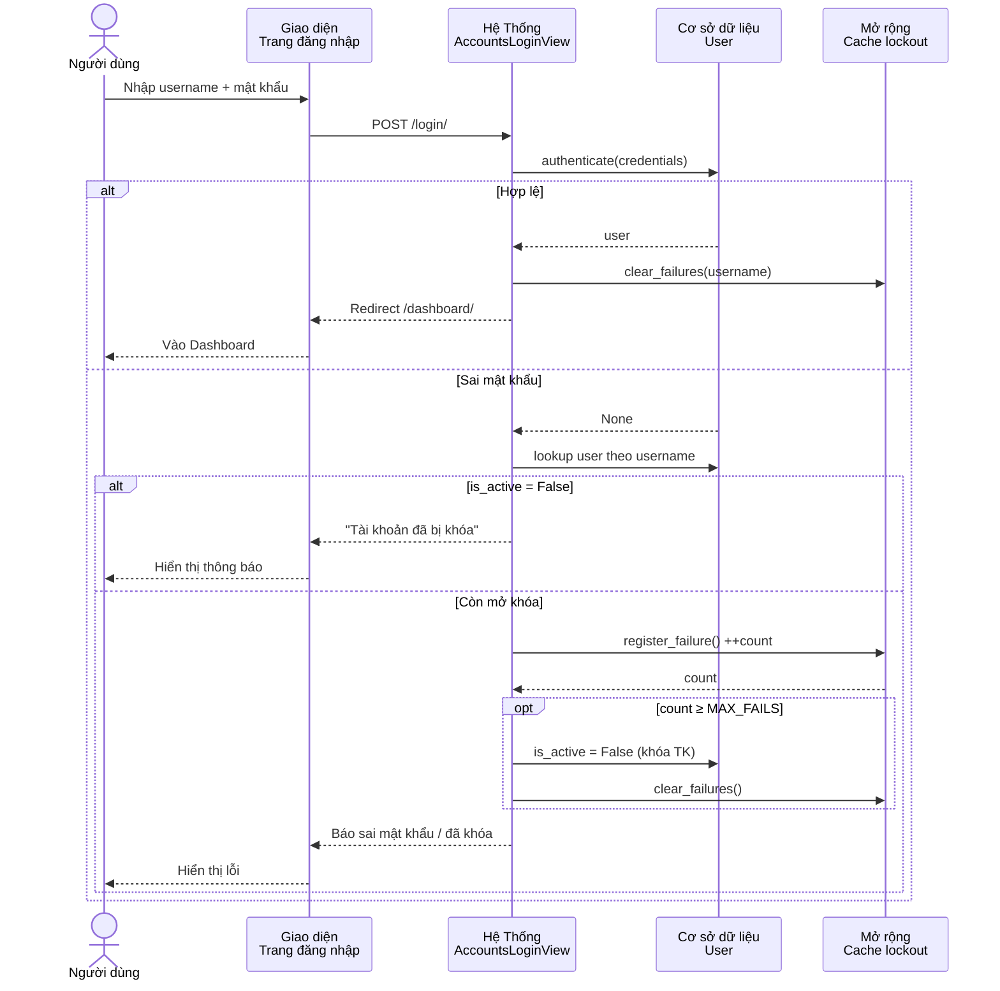
```mermaid
sequenceDiagram
  actor ND as Người dùng
  participant GD as Giao diện<br/>Trang đăng nhập
  participant HT as Hệ Thống<br/>AccountsLoginView
  participant DB as Cơ sở dữ liệu<br/>User
  participant EX as Mở rộng<br/>Cache lockout
  ND->>GD: Nhập username + mật khẩu
  GD->>HT: POST /login/
  HT->>DB: authenticate(credentials)
  alt Hợp lệ
    DB-->>HT: user
    HT->>EX: clear_failures(username)
    HT-->>GD: Redirect /dashboard/
    GD-->>ND: Vào Dashboard
  else Sai mật khẩu
    DB-->>HT: None
    HT->>DB: lookup user theo username
    alt is_active = False
      HT-->>GD: "Tài khoản đã bị khóa"
      GD-->>ND: Hiển thị thông báo
    else Còn mở khóa
      HT->>EX: register_failure() ++count
      EX-->>HT: count
      opt count ≥ MAX_FAILS
        HT->>DB: is_active = False (khóa TK)
        HT->>EX: clear_failures()
      end
      HT-->>GD: Báo sai mật khẩu / đã khóa
      GD-->>ND: Hiển thị lỗi
    end
  end
```

### 1.2 Đăng xuất

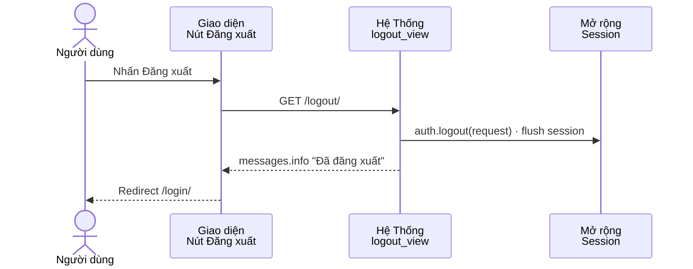
```mermaid
sequenceDiagram
  actor ND as Người dùng
  participant GD as Giao diện<br/>Nút Đăng xuất
  participant HT as Hệ Thống<br/>logout_view
  participant EX as Mở rộng<br/>Session
  ND->>GD: Nhấn Đăng xuất
  GD->>HT: GET /logout/
  HT->>EX: auth.logout(request) · flush session
  HT-->>GD: messages.info "Đã đăng xuất"
  GD-->>ND: Redirect /login/
```

### 1.3 Quên mật khẩu — OTP

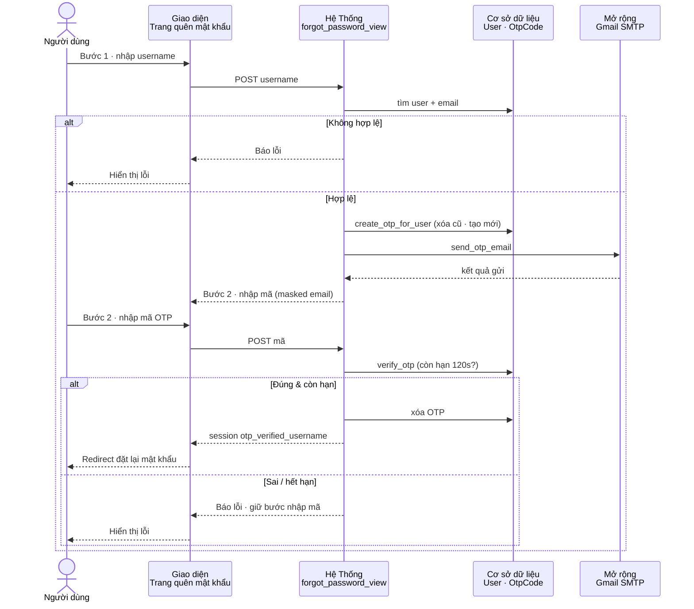
```mermaid
sequenceDiagram
  actor ND as Người dùng
  participant GD as Giao diện<br/>Trang quên mật khẩu
  participant HT as Hệ Thống<br/>forgot_password_view
  participant DB as Cơ sở dữ liệu<br/>User · OtpCode
  participant EX as Mở rộng<br/>Gmail SMTP
  ND->>GD: Bước 1 · nhập username
  GD->>HT: POST username
  HT->>DB: tìm user + email
  alt Không hợp lệ
    HT-->>GD: Báo lỗi
    GD-->>ND: Hiển thị lỗi
  else Hợp lệ
    HT->>DB: create_otp_for_user (xóa cũ · tạo mới)
    HT->>EX: send_otp_email
    EX-->>HT: kết quả gửi
    HT-->>GD: Bước 2 · nhập mã (masked email)
    ND->>GD: Bước 2 · nhập mã OTP
    GD->>HT: POST mã
    HT->>DB: verify_otp (còn hạn 120s?)
    alt Đúng & còn hạn
      HT->>DB: xóa OTP
      HT-->>GD: session otp_verified_username
      GD-->>ND: Redirect đặt lại mật khẩu
    else Sai / hết hạn
      HT-->>GD: Báo lỗi · giữ bước nhập mã
      GD-->>ND: Hiển thị lỗi
    end
  end
```

### 1.4 Khóa / Mở khóa tài khoản

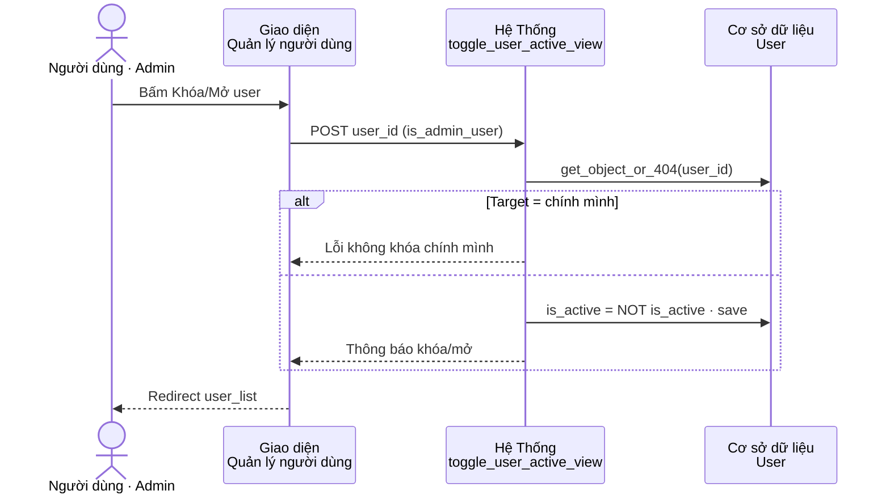
```mermaid
sequenceDiagram
  actor AD as Người dùng · Admin
  participant GD as Giao diện<br/>Quản lý người dùng
  participant HT as Hệ Thống<br/>toggle_user_active_view
  participant DB as Cơ sở dữ liệu<br/>User
  AD->>GD: Bấm Khóa/Mở user
  GD->>HT: POST user_id (is_admin_user)
  HT->>DB: get_object_or_404(user_id)
  alt Target = chính mình
    HT-->>GD: Lỗi không khóa chính mình
  else
    HT->>DB: is_active = NOT is_active · save
    HT-->>GD: Thông báo khóa/mở
  end
  GD-->>AD: Redirect user_list
```

### 1.5 Đặt lại mật khẩu nhân viên

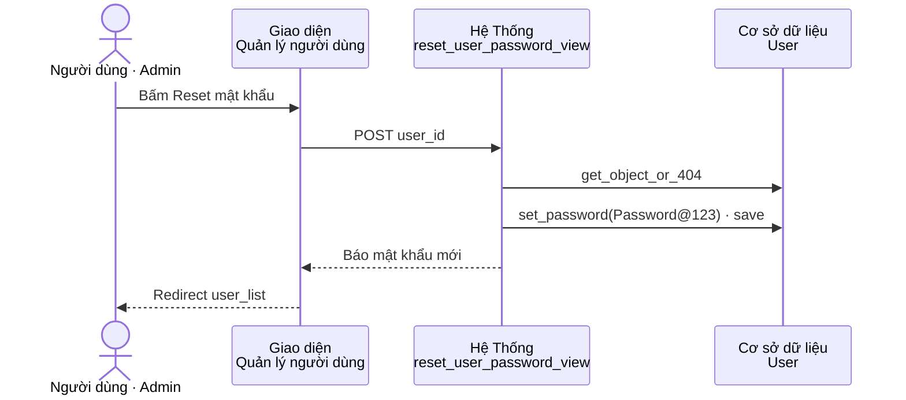
```mermaid
sequenceDiagram
  actor AD as Người dùng · Admin
  participant GD as Giao diện<br/>Quản lý người dùng
  participant HT as Hệ Thống<br/>reset_user_password_view
  participant DB as Cơ sở dữ liệu<br/>User
  AD->>GD: Bấm Reset mật khẩu
  GD->>HT: POST user_id
  HT->>DB: get_object_or_404
  HT->>DB: set_password(Password@123) · save
  HT-->>GD: Báo mật khẩu mới
  GD-->>AD: Redirect user_list
```

### 1.6 Gán vai trò & quyền

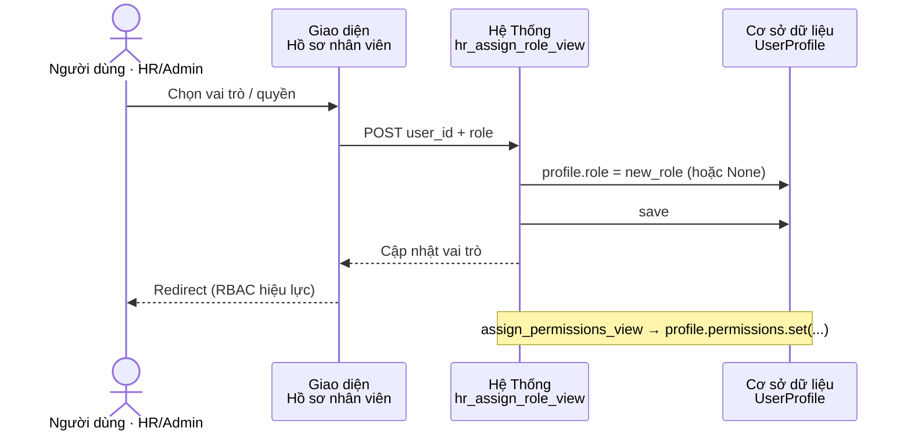
```mermaid
sequenceDiagram
  actor HR as Người dùng · HR/Admin
  participant GD as Giao diện<br/>Hồ sơ nhân viên
  participant HT as Hệ Thống<br/>hr_assign_role_view
  participant DB as Cơ sở dữ liệu<br/>UserProfile
  HR->>GD: Chọn vai trò / quyền
  GD->>HT: POST user_id + role
  HT->>DB: profile.role = new_role (hoặc None)
  HT->>DB: save
  HT-->>GD: Cập nhật vai trò
  GD-->>HR: Redirect (RBAC hiệu lực)
  note over HT,DB: assign_permissions_view → profile.permissions.set(...)
```

### 1.7 Tạo tài khoản mới (Admin)

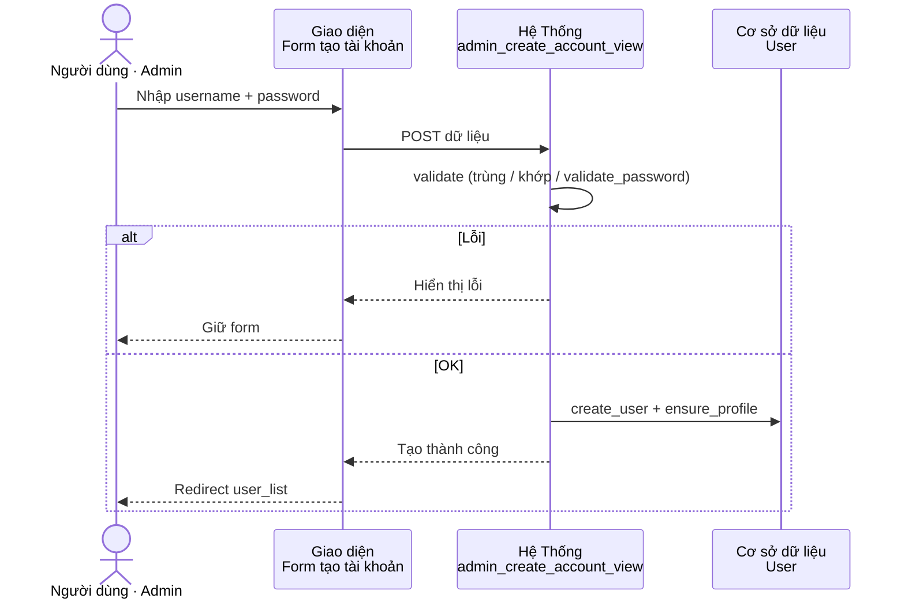
```mermaid
sequenceDiagram
  actor AD as Người dùng · Admin
  participant GD as Giao diện<br/>Form tạo tài khoản
  participant HT as Hệ Thống<br/>admin_create_account_view
  participant DB as Cơ sở dữ liệu<br/>User
  AD->>GD: Nhập username + password
  GD->>HT: POST dữ liệu
  HT->>HT: validate (trùng / khớp / validate_password)
  alt Lỗi
    HT-->>GD: Hiển thị lỗi
    GD-->>AD: Giữ form
  else OK
    HT->>DB: create_user + ensure_profile
    HT-->>GD: Tạo thành công
    GD-->>AD: Redirect user_list
  end
```

---

## 2. Quản lý hồ sơ nhân viên

### 2.1 Xem hồ sơ nhân viên

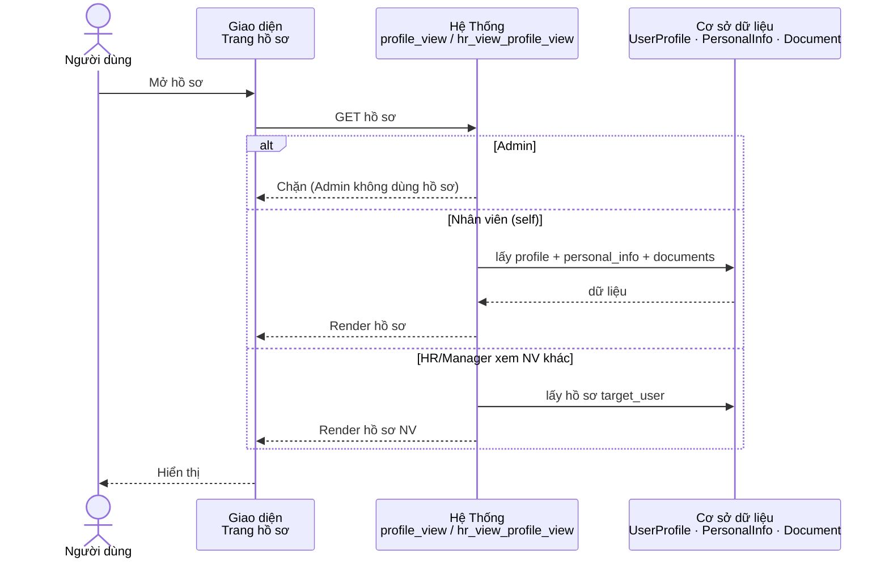
```mermaid
sequenceDiagram
  actor ND as Người dùng
  participant GD as Giao diện<br/>Trang hồ sơ
  participant HT as Hệ Thống<br/>profile_view / hr_view_profile_view
  participant DB as Cơ sở dữ liệu<br/>UserProfile · PersonalInfo · Document
  ND->>GD: Mở hồ sơ
  GD->>HT: GET hồ sơ
  alt Admin
    HT-->>GD: Chặn (Admin không dùng hồ sơ)
  else Nhân viên (self)
    HT->>DB: lấy profile + personal_info + documents
    DB-->>HT: dữ liệu
    HT-->>GD: Render hồ sơ
  else HR/Manager xem NV khác
    HT->>DB: lấy hồ sơ target_user
    HT-->>GD: Render hồ sơ NV
  end
  GD-->>ND: Hiển thị
```

### 2.2 Tạo nhân viên mới

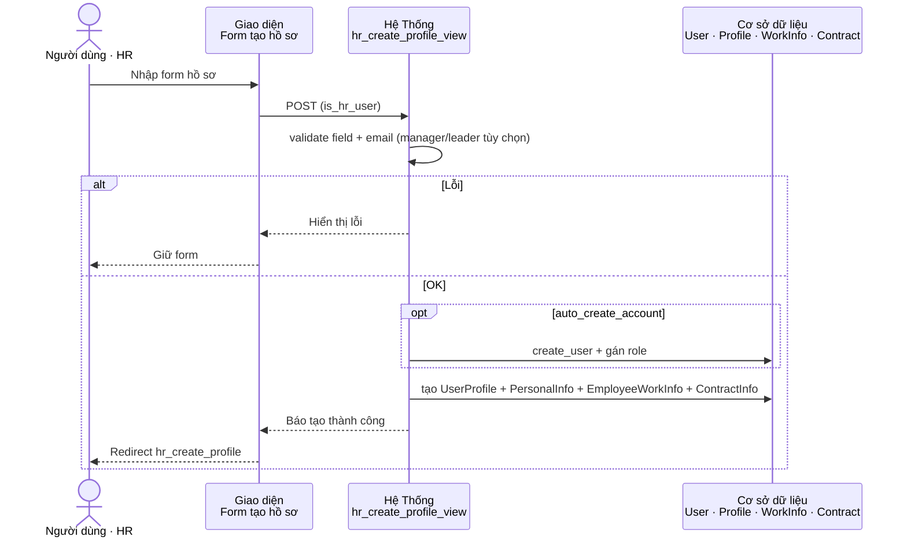
```mermaid
sequenceDiagram
  actor HR as Người dùng · HR
  participant GD as Giao diện<br/>Form tạo hồ sơ
  participant HT as Hệ Thống<br/>hr_create_profile_view
  participant DB as Cơ sở dữ liệu<br/>User · Profile · WorkInfo · Contract
  HR->>GD: Nhập form hồ sơ
  GD->>HT: POST (is_hr_user)
  HT->>HT: validate field + email (manager/leader tùy chọn)
  alt Lỗi
    HT-->>GD: Hiển thị lỗi
    GD-->>HR: Giữ form
  else OK
    opt auto_create_account
      HT->>DB: create_user + gán role
    end
    HT->>DB: tạo UserProfile + PersonalInfo + EmployeeWorkInfo + ContractInfo
    HT-->>GD: Báo tạo thành công
    GD-->>HR: Redirect hr_create_profile
  end
```

### 2.3 Chỉnh sửa thông tin cá nhân

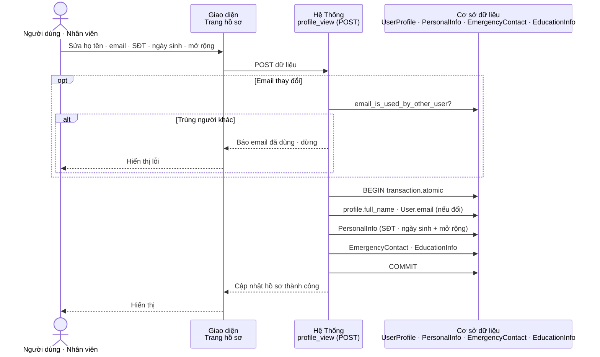
```mermaid
sequenceDiagram
  actor ND as Người dùng · Nhân viên
  participant GD as Giao diện<br/>Trang hồ sơ
  participant HT as Hệ Thống<br/>profile_view (POST)
  participant DB as Cơ sở dữ liệu<br/>UserProfile · PersonalInfo · EmergencyContact · EducationInfo
  ND->>GD: Sửa họ tên · email · SĐT · ngày sinh · mở rộng
  GD->>HT: POST dữ liệu
  opt Email thay đổi
    HT->>DB: email_is_used_by_other_user?
    alt Trùng người khác
      HT-->>GD: Báo email đã dùng · dừng
      GD-->>ND: Hiển thị lỗi
    end
  end
  HT->>DB: BEGIN transaction.atomic
  HT->>DB: profile.full_name · User.email (nếu đổi)
  HT->>DB: PersonalInfo (SĐT · ngày sinh + mở rộng)
  HT->>DB: EmergencyContact · EducationInfo
  HT->>DB: COMMIT
  HT-->>GD: Cập nhật hồ sơ thành công
  GD-->>ND: Hiển thị
```

### 2.4 Cập nhật thông tin công việc

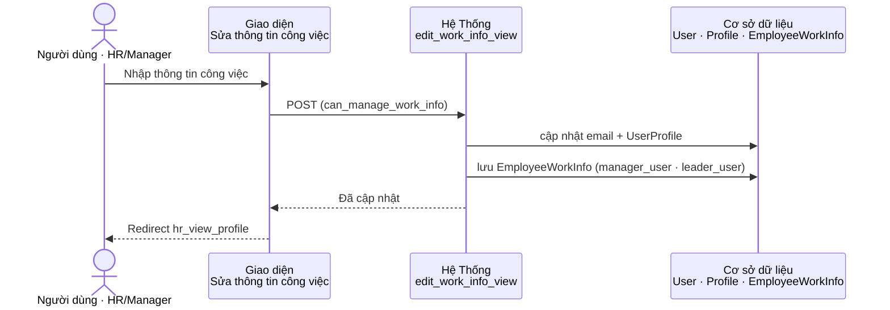
```mermaid
sequenceDiagram
  actor HR as Người dùng · HR/Manager
  participant GD as Giao diện<br/>Sửa thông tin công việc
  participant HT as Hệ Thống<br/>edit_work_info_view
  participant DB as Cơ sở dữ liệu<br/>User · Profile · EmployeeWorkInfo
  HR->>GD: Nhập thông tin công việc
  GD->>HT: POST (can_manage_work_info)
  HT->>DB: cập nhật email + UserProfile
  HT->>DB: lưu EmployeeWorkInfo (manager_user · leader_user)
  HT-->>GD: Đã cập nhật
  GD-->>HR: Redirect hr_view_profile
```

### 2.5 Quản lý tài liệu nhân viên

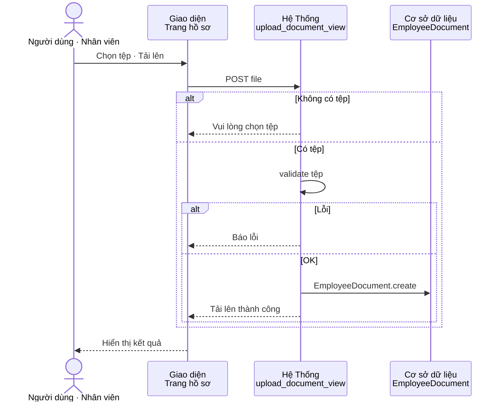
```mermaid
sequenceDiagram
  actor ND as Người dùng · Nhân viên
  participant GD as Giao diện<br/>Trang hồ sơ
  participant HT as Hệ Thống<br/>upload_document_view
  participant DB as Cơ sở dữ liệu<br/>EmployeeDocument
  ND->>GD: Chọn tệp · Tải lên
  GD->>HT: POST file
  alt Không có tệp
    HT-->>GD: Vui lòng chọn tệp
  else Có tệp
    HT->>HT: validate tệp
    alt Lỗi
      HT-->>GD: Báo lỗi
    else OK
      HT->>DB: EmployeeDocument.create
      HT-->>GD: Tải lên thành công
    end
  end
  GD-->>ND: Hiển thị kết quả
```

### 2.6 Tra cứu danh sách nhân viên

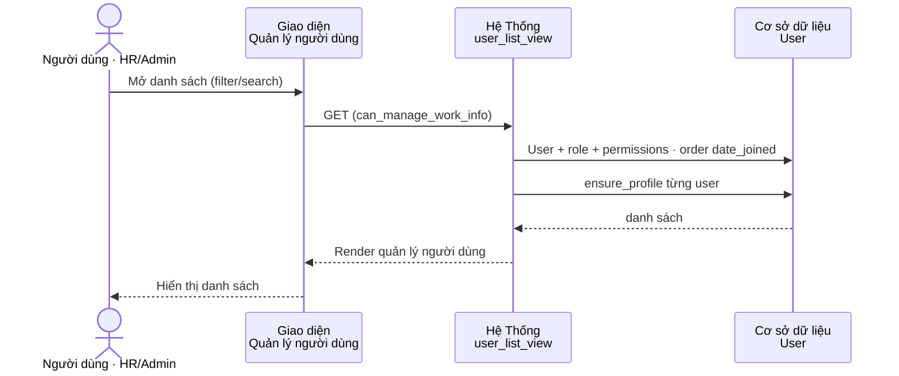
```mermaid
sequenceDiagram
  actor HR as Người dùng · HR/Admin
  participant GD as Giao diện<br/>Quản lý người dùng
  participant HT as Hệ Thống<br/>user_list_view
  participant DB as Cơ sở dữ liệu<br/>User
  HR->>GD: Mở danh sách (filter/search)
  GD->>HT: GET (can_manage_work_info)
  HT->>DB: User + role + permissions · order date_joined
  HT->>DB: ensure_profile từng user
  DB-->>HT: danh sách
  HT-->>GD: Render quản lý người dùng
  GD-->>HR: Hiển thị danh sách
```

---

## 3. Quản lý hợp đồng lao động

### 3.1 Xem hợp đồng lao động

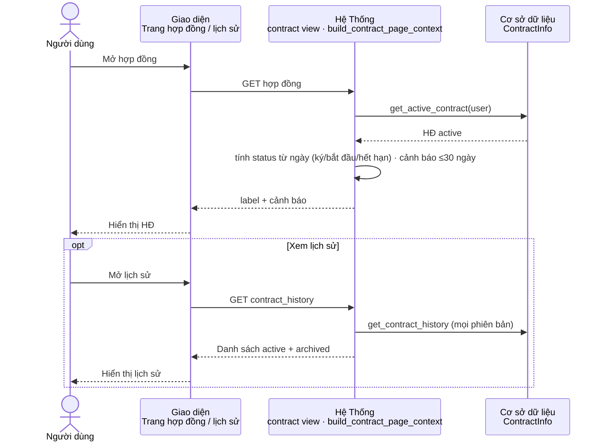
```mermaid
sequenceDiagram
  actor ND as Người dùng
  participant GD as Giao diện<br/>Trang hợp đồng / lịch sử
  participant HT as Hệ Thống<br/>contract view · build_contract_page_context
  participant DB as Cơ sở dữ liệu<br/>ContractInfo
  ND->>GD: Mở hợp đồng
  GD->>HT: GET hợp đồng
  HT->>DB: get_active_contract(user)
  DB-->>HT: HĐ active
  HT->>HT: tính status từ ngày (ký/bắt đầu/hết hạn) · cảnh báo ≤30 ngày
  HT-->>GD: label + cảnh báo
  GD-->>ND: Hiển thị HĐ
  opt Xem lịch sử
    ND->>GD: Mở lịch sử
    GD->>HT: GET contract_history
    HT->>DB: get_contract_history (mọi phiên bản)
    HT-->>GD: Danh sách active + archived
    GD-->>ND: Hiển thị lịch sử
  end
```

### 3.2 Tạo hợp đồng lao động

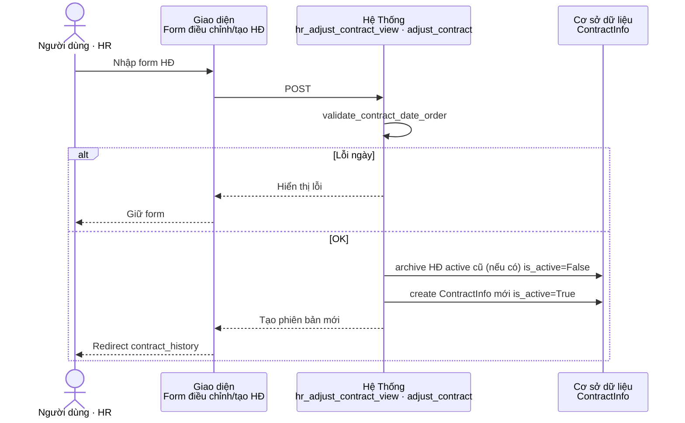
```mermaid
sequenceDiagram
  actor HR as Người dùng · HR
  participant GD as Giao diện<br/>Form điều chỉnh/tạo HĐ
  participant HT as Hệ Thống<br/>hr_adjust_contract_view · adjust_contract
  participant DB as Cơ sở dữ liệu<br/>ContractInfo
  HR->>GD: Nhập form HĐ
  GD->>HT: POST
  HT->>HT: validate_contract_date_order
  alt Lỗi ngày
    HT-->>GD: Hiển thị lỗi
    GD-->>HR: Giữ form
  else OK
    HT->>DB: archive HĐ active cũ (nếu có) is_active=False
    HT->>DB: create ContractInfo mới is_active=True
    HT-->>GD: Tạo phiên bản mới
    GD-->>HR: Redirect contract_history
  end
```

### 3.3 Chỉnh sửa hợp đồng lao động

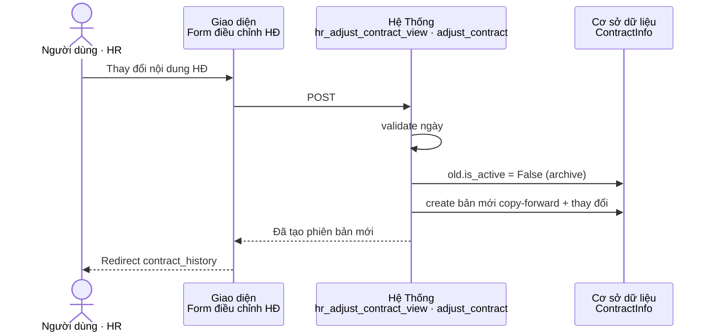
```mermaid
sequenceDiagram
  actor HR as Người dùng · HR
  participant GD as Giao diện<br/>Form điều chỉnh HĐ
  participant HT as Hệ Thống<br/>hr_adjust_contract_view · adjust_contract
  participant DB as Cơ sở dữ liệu<br/>ContractInfo
  HR->>GD: Thay đổi nội dung HĐ
  GD->>HT: POST
  HT->>HT: validate ngày
  HT->>DB: old.is_active = False (archive)
  HT->>DB: create bản mới copy-forward + thay đổi
  HT-->>GD: Đã tạo phiên bản mới
  GD-->>HR: Redirect contract_history
```

### 3.4 Gia hạn hợp đồng lao động

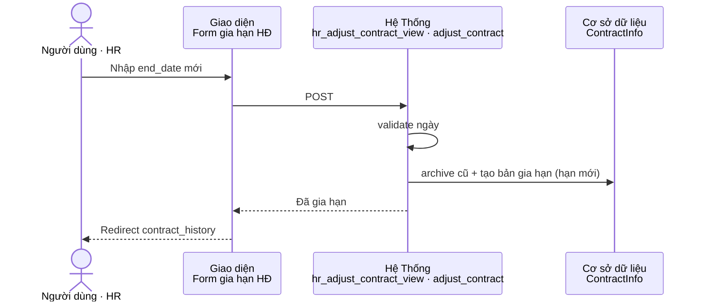
```mermaid
sequenceDiagram
  actor HR as Người dùng · HR
  participant GD as Giao diện<br/>Form gia hạn HĐ
  participant HT as Hệ Thống<br/>hr_adjust_contract_view · adjust_contract
  participant DB as Cơ sở dữ liệu<br/>ContractInfo
  HR->>GD: Nhập end_date mới
  GD->>HT: POST
  HT->>HT: validate ngày
  HT->>DB: archive cũ + tạo bản gia hạn (hạn mới)
  HT-->>GD: Đã gia hạn
  GD-->>HR: Redirect contract_history
```

### 3.5 Cảnh báo hợp đồng sắp hết hạn (Tự động)

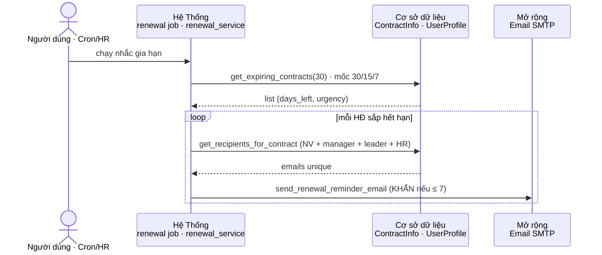
```mermaid
sequenceDiagram
  actor CR as Người dùng · Cron/HR
  participant HT as Hệ Thống<br/>renewal job · renewal_service
  participant DB as Cơ sở dữ liệu<br/>ContractInfo · UserProfile
  participant EX as Mở rộng<br/>Email SMTP
  CR->>HT: chạy nhắc gia hạn
  HT->>DB: get_expiring_contracts(30) · mốc 30/15/7
  DB-->>HT: list (days_left, urgency)
  loop mỗi HĐ sắp hết hạn
    HT->>DB: get_recipients_for_contract (NV + manager + leader + HR)
    DB-->>HT: emails unique
    HT->>EX: send_renewal_reminder_email (KHẨN nếu ≤ 7)
  end
```

### 3.6 Tự động khóa hợp đồng hết hạn (Tự động)

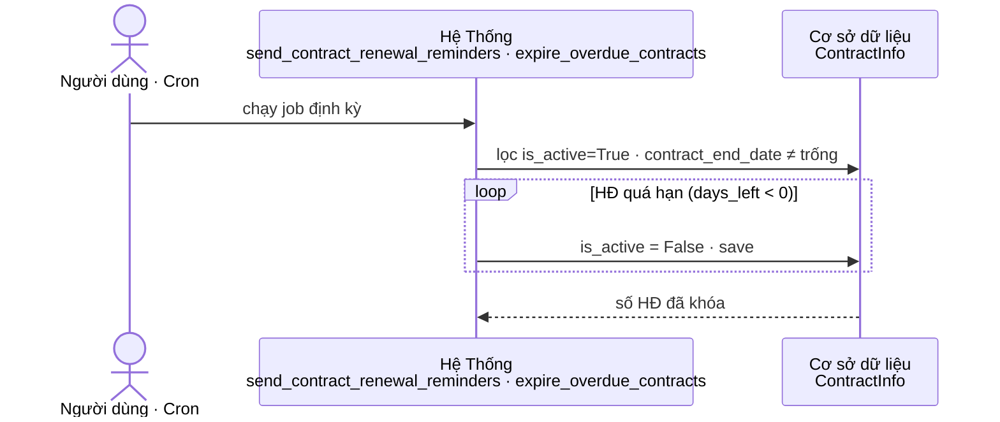
```mermaid
sequenceDiagram
  actor CR as Người dùng · Cron
  participant HT as Hệ Thống<br/>send_contract_renewal_reminders · expire_overdue_contracts
  participant DB as Cơ sở dữ liệu<br/>ContractInfo
  CR->>HT: chạy job định kỳ
  HT->>DB: lọc is_active=True · contract_end_date ≠ trống
  loop HĐ quá hạn (days_left < 0)
    HT->>DB: is_active = False · save
  end
  DB-->>HT: số HĐ đã khóa
```

---

## 4. Quản lý chấm công (FaceID)

### 4.1 Đăng ký khuôn mặt lần đầu

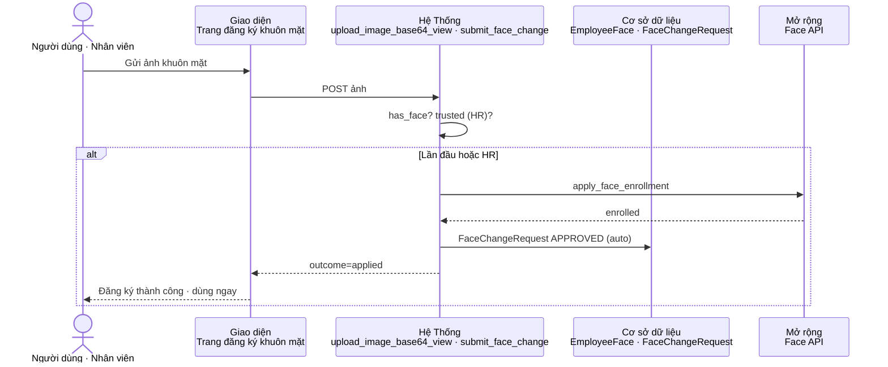
```mermaid
sequenceDiagram
  actor ND as Người dùng · Nhân viên
  participant GD as Giao diện<br/>Trang đăng ký khuôn mặt
  participant HT as Hệ Thống<br/>upload_image_base64_view · submit_face_change
  participant DB as Cơ sở dữ liệu<br/>EmployeeFace · FaceChangeRequest
  participant EX as Mở rộng<br/>Face API
  ND->>GD: Gửi ảnh khuôn mặt
  GD->>HT: POST ảnh
  HT->>HT: has_face? trusted (HR)?
  alt Lần đầu hoặc HR
    HT->>EX: apply_face_enrollment
    EX-->>HT: enrolled
    HT->>DB: FaceChangeRequest APPROVED (auto)
    HT-->>GD: outcome=applied
    GD-->>ND: Đăng ký thành công · dùng ngay
  end
```

### 4.2 Cập nhật khuôn mặt

```mermaid
sequenceDiagram
  actor ND as Người dùng · Nhân viên
  participant GD as Giao diện<br/>Trang đổi khuôn mặt
  participant HT as Hệ Thống<br/>upload_image_base64_view · submit_face_change
  participant DB as Cơ sở dữ liệu<br/>FaceChangeRequest
  ND->>GD: Gửi ảnh mới (đã có mặt)
  GD->>HT: POST ảnh (self-service)
  HT->>DB: xóa PENDING cũ
  HT->>DB: tạo FaceChangeRequest PENDING (lưu ảnh)
  HT-->>GD: outcome=pending
  GD-->>ND: Chờ HR duyệt · chưa đổi mặt nhận diện
```

### 4.3 Duyệt yêu cầu đổi khuôn mặt

```mermaid
sequenceDiagram
  actor HR as Người dùng · HR
  participant GD as Giao diện<br/>Trang duyệt đổi mặt
  participant HT as Hệ Thống<br/>face_change action · face_change_service
  participant DB as Cơ sở dữ liệu<br/>FaceChangeRequest · EmployeeFace
  participant EX as Mở rộng<br/>Face API
  HR->>GD: Bấm Duyệt / Từ chối
  GD->>HT: POST req_id (is_hr_user)
  alt Duyệt
    HT->>DB: kiểm status == PENDING
    HT->>EX: apply enrollment
    HT->>DB: status=APPROVED · xóa ảnh tạm
  else Từ chối
    HT->>DB: status=REJECTED · giữ ảnh minh chứng
  end
  HT-->>GD: Kết quả
  GD-->>HR: Redirect face_change_review
```

### 4.4 Chấm công vào (Check-in)

```mermaid
sequenceDiagram
  actor ND as Người dùng · Nhân viên
  participant GD as Giao diện<br/>Camera chấm công
  participant HT as Hệ Thống<br/>face_check_view
  participant DB as Cơ sở dữ liệu<br/>AttendanceRecord
  participant EX as Mở rộng<br/>Cache lockout · Face verify
  ND->>GD: Gửi ảnh
  GD->>HT: POST ảnh
  HT->>EX: is_locked?
  alt Bị khóa
    HT-->>GD: 423 retry_after
  else
    HT->>EX: verify_face_for_user
    alt wrong_person
      HT->>EX: register_failure
      HT-->>GD: 403 fails_left
    else success
      HT->>DB: get_or_create record hôm nay (select_for_update)
      HT->>HT: decide_next_action = check_in
      HT->>DB: record_check_in (on_time/late)
      HT->>EX: clear_failures
      HT-->>GD: 200 giờ vào + status
    end
  end
  GD-->>ND: Hiển thị kết quả
```

### 4.5 Chấm công ra (Check-out)

```mermaid
sequenceDiagram
  actor ND as Người dùng · Nhân viên
  participant GD as Giao diện<br/>Camera chấm công
  participant HT as Hệ Thống<br/>face_check_view
  participant DB as Cơ sở dữ liệu<br/>AttendanceRecord
  ND->>GD: Gửi ảnh (lần 2, verify OK)
  GD->>HT: POST ảnh
  HT->>HT: decide_next_action
  alt check_out
    HT->>DB: record_check_out (giờ ra)
    HT-->>GD: 200 giờ ra
  else done
    HT-->>GD: 200 no-op (đã đủ vào/ra)
  end
  GD-->>ND: Hiển thị kết quả
```

### 4.6 Xem lịch sử chấm công

```mermaid
sequenceDiagram
  actor ND as Người dùng · Nhân viên
  participant GD as Giao diện<br/>Trang chấm công
  participant HT as Hệ Thống<br/>attendance_view
  participant DB as Cơ sở dữ liệu<br/>AttendanceRecord · AdjustmentRequest
  ND->>GD: Mở /attendance/
  GD->>HT: GET
  HT->>DB: _history_rows (tháng hiện tại)
  HT->>DB: map AdjustmentRequest theo record
  DB-->>HT: bản ghi + trạng thái
  HT-->>GD: Bảng lịch sử + nút điều chỉnh
  GD-->>ND: Hiển thị
```

### 4.7 Yêu cầu điều chỉnh giờ công

```mermaid
sequenceDiagram
  actor ND as Người dùng · Nhân viên
  participant GD as Giao diện<br/>Form điều chỉnh
  participant HT as Hệ Thống<br/>submit_adjustment_view
  participant DB as Cơ sở dữ liệu<br/>AdjustmentRequest · AttendanceRecord
  ND->>GD: Mở record_id
  GD->>HT: GET
  HT->>DB: đã có request? (OneToOne)
  alt Đã có / khác tháng
    HT-->>GD: Báo lỗi
    GD-->>ND: Hiển thị lỗi
  else Hợp lệ
    ND->>GD: Nhập lý do + giờ + minh chứng
    GD->>HT: POST form
    HT->>DB: tạo AdjustmentRequest pending
    HT->>DB: record.status = pending_adjustment
    HT-->>GD: Đã gửi tới HR
    GD-->>ND: Hiển thị
  end
```

### 4.8 Duyệt yêu cầu điều chỉnh

```mermaid
sequenceDiagram
  actor HR as Người dùng · HR
  participant GD as Giao diện<br/>Trang duyệt điều chỉnh
  participant HT as Hệ Thống<br/>adjustment action · adjustment_review_service
  participant DB as Cơ sở dữ liệu<br/>AdjustmentRequest · AttendanceRecord
  HR->>GD: Bấm Duyệt / Từ chối
  GD->>HT: POST adj_id (is_hr_user)
  alt Duyệt
    HT->>DB: áp giờ khai báo · recompute_record_status
    HT->>DB: adj.status=approved
  else Từ chối
    HT->>DB: recompute_record_status · adj.status=rejected
  end
  HT-->>GD: Kết quả
  GD-->>HR: Redirect review
```

### 4.9 Theo dõi trạng thái khuôn mặt

```mermaid
sequenceDiagram
  actor ND as Người dùng · Nhân viên
  participant GD as Giao diện<br/>Trang chấm công / hồ sơ mặt
  participant HT as Hệ Thống<br/>face status
  participant DB as Cơ sở dữ liệu<br/>EmployeeFace · FaceChangeRequest
  ND->>GD: Xem trạng thái khuôn mặt
  GD->>HT: GET
  HT->>DB: có EmployeeFace?
  alt Chưa có
    HT-->>GD: Chưa đăng ký
  else Có
    HT->>DB: FaceChangeRequest PENDING?
    alt Có pending
      HT-->>GD: Chờ HR duyệt đổi mặt
    else
      HT-->>GD: Đang dùng (Active)
    end
  end
  GD-->>ND: Hiển thị trạng thái
```

---

## 5. Quản lý nghỉ phép

### 5.1 Nộp đơn xin nghỉ phép

```mermaid
sequenceDiagram
  actor ND as Người dùng · Nhân viên
  participant GD as Giao diện<br/>Form nghỉ phép
  participant HT as Hệ Thống<br/>leave_view · create_leave_request
  participant DB as Cơ sở dữ liệu<br/>LeaveRequest · ContractInfo
  participant EX as Mở rộng<br/>Notification
  ND->>GD: Nhập đơn nghỉ
  GD->>HT: POST
  HT->>HT: _resolve_initial_status (theo leader/manager)
  alt Có leader/manager
    HT->>DB: status=PENDING · days = end−start+1
  else Trống cả 2 · là HR
    HT->>DB: status=APPROVED (tự duyệt)
    HT->>EX: create_notification
  else Trống cả 2 · nhân viên thường
    HT->>DB: status=LEADER_APPROVED (thẳng HR L2)
  end
  HT->>DB: get_user_leave_stats (remaining)
  alt days > remaining
    HT-->>GD: Cảnh báo vượt quỹ (vẫn gửi)
  else
    HT-->>GD: Gửi đơn thành công
  end
  GD-->>ND: Hiển thị kết quả
```

### 5.2 Xem đơn nghỉ phép của tôi

```mermaid
sequenceDiagram
  actor ND as Người dùng · Nhân viên
  participant GD as Giao diện<br/>Trang nghỉ phép
  participant HT as Hệ Thống<br/>leave_view · leaves.services
  participant DB as Cơ sở dữ liệu<br/>LeaveRequest · ContractInfo
  ND->>GD: Mở /leave/
  GD->>HT: GET
  HT->>DB: get_user_leave_stats (approved · annual_leave_days)
  HT->>DB: get_user_leave_requests (đơn của user)
  DB-->>HT: dữ liệu
  HT-->>GD: Quỹ phép + bảng đơn
  GD-->>ND: Hiển thị
```

### 5.3 Phê duyệt cấp L1

```mermaid
sequenceDiagram
  actor MG as Người dùng · Quản lý/Leader
  participant GD as Giao diện<br/>Trang duyệt nghỉ phép
  participant HT as Hệ Thống<br/>leave_approve_action · approve_leave_request
  participant DB as Cơ sở dữ liệu<br/>LeaveRequest
  MG->>GD: Bấm Duyệt
  GD->>HT: POST pk (can_manage_requests)
  alt Tự duyệt
    HT-->>GD: Chặn
  else PENDING + đúng supervisor
    alt NV là HR
      HT->>DB: status=APPROVED (skip L2)
    else
      HT->>DB: status=LEADER_APPROVED
    end
  end
  HT-->>GD: Kết quả
  GD-->>MG: Redirect leave_approval
```

### 5.4 Phê duyệt cấp L2

```mermaid
sequenceDiagram
  actor HR as Người dùng · HR
  participant GD as Giao diện<br/>Trang duyệt bước 2
  participant HT as Hệ Thống<br/>leave_approve_action · approve_leave_request
  participant DB as Cơ sở dữ liệu<br/>LeaveRequest
  participant EX as Mở rộng<br/>Notification
  HR->>GD: Bấm Duyệt cuối
  GD->>HT: POST pk
  HT->>DB: kiểm LEADER_APPROVED + là HR
  HT->>DB: approved_by=HR · status=APPROVED
  HT->>EX: tạo notification cho NV
  HT-->>GD: Kết quả
  GD-->>HR: Redirect leave_approval
```

### 5.5 Từ chối đơn nghỉ phép

```mermaid
sequenceDiagram
  actor AP as Người dùng · Quản lý/HR
  participant GD as Giao diện<br/>Trang duyệt nghỉ phép
  participant HT as Hệ Thống<br/>leave_reject_action · reject_leave_request
  participant DB as Cơ sở dữ liệu<br/>LeaveRequest
  participant EX as Mở rộng<br/>Notification
  AP->>GD: Nhập lý do · Từ chối
  GD->>HT: POST pk + lý do
  HT->>DB: status=REJECTED · rejected_reason
  HT->>EX: tạo notification
  HT-->>GD: Kết quả
  GD-->>AP: Redirect leave_approval
```

### 5.6 Xem quỹ phép còn lại

```mermaid
sequenceDiagram
  actor ND as Người dùng · Nhân viên
  participant GD as Giao diện<br/>Trang nghỉ phép
  participant HT as Hệ Thống<br/>leave_view · get_user_leave_stats
  participant DB as Cơ sở dữ liệu<br/>LeaveRequest · ContractInfo
  ND->>GD: Mở /leave/
  GD->>HT: GET
  HT->>DB: annual_leave_days (HĐ active)
  HT->>DB: used = Sum(days) đơn APPROVED năm nay
  DB-->>HT: số liệu
  HT-->>GD: remaining = max(total−used, 0) · pending_count
  GD-->>ND: Hiển thị quỹ phép
```

---

## 6. Quản lý tăng ca (OT)

### 6.1 Đăng ký tăng ca

```mermaid
sequenceDiagram
  actor ND as Người dùng · Nhân viên
  participant GD as Giao diện<br/>Form tăng ca · OvertimeForm
  participant HT as Hệ Thống<br/>overtime_view · create_overtime_request
  participant DB as Cơ sở dữ liệu<br/>OvertimeRequest
  participant EX as Mở rộng<br/>Notification
  ND->>GD: Nhập đơn OT
  GD->>GD: validate end_time > start_time
  alt Sai giờ
    GD-->>ND: Giờ kết thúc phải sau bắt đầu
  else OK
    GD->>HT: POST
    HT->>HT: _resolve_initial_status (theo leader/manager)
    alt Có leader/manager
      HT->>DB: status=PENDING · hours = end−start
    else Trống cả 2 · là HR
      HT->>DB: status=APPROVED (tự duyệt)
      HT->>EX: create_notification
    else Trống cả 2 · nhân viên thường
      HT->>DB: status=LEADER_APPROVED (thẳng HR L2)
    end
    HT-->>GD: Gửi đơn thành công
    GD-->>ND: Hiển thị kết quả
  end
```

### 6.2 Xem đơn tăng ca của tôi

```mermaid
sequenceDiagram
  actor ND as Người dùng · Nhân viên
  participant GD as Giao diện<br/>Trang tăng ca
  participant HT as Hệ Thống<br/>overtime_view · overtime.services
  participant DB as Cơ sở dữ liệu<br/>OvertimeRequest
  ND->>GD: Mở /overtime/
  GD->>HT: GET
  HT->>DB: stats (total_hours · total_pay · pending_count)
  HT->>DB: danh sách đơn của user
  DB-->>HT: dữ liệu
  HT-->>GD: Form + bảng đơn OT
  GD-->>ND: Hiển thị
```

### 6.3 Phê duyệt OT cấp L1

```mermaid
sequenceDiagram
  actor MG as Người dùng · Quản lý/Leader
  participant GD as Giao diện<br/>Trang duyệt OT
  participant HT as Hệ Thống<br/>overtime_approve_action · approve_overtime_request
  participant DB as Cơ sở dữ liệu<br/>OvertimeRequest
  MG->>GD: Bấm Duyệt
  GD->>HT: POST pk (can_manage_requests)
  alt Tự duyệt
    HT-->>GD: Chặn
  else PENDING + supervisor
    alt NV là HR
      HT->>DB: status=APPROVED (skip L2)
    else
      HT->>DB: status=LEADER_APPROVED
    end
  end
  HT-->>GD: Kết quả
  GD-->>MG: Redirect overtime_approval
```

### 6.4 Phê duyệt OT cấp L2

```mermaid
sequenceDiagram
  actor HR as Người dùng · HR
  participant GD as Giao diện<br/>Trang duyệt bước 2
  participant HT as Hệ Thống<br/>overtime_approve_action · approve_overtime_request
  participant DB as Cơ sở dữ liệu<br/>OvertimeRequest
  participant EX as Mở rộng<br/>Notification
  HR->>GD: Bấm Duyệt cuối
  GD->>HT: POST pk
  HT->>DB: kiểm LEADER_APPROVED + là HR
  HT->>DB: status=APPROVED · approved_by=HR
  HT->>EX: notification cho NV
  HT-->>GD: Kết quả
  GD-->>HR: Redirect overtime_approval
```

### 6.5 Từ chối đơn tăng ca

```mermaid
sequenceDiagram
  actor AP as Người dùng · Quản lý/HR
  participant GD as Giao diện<br/>Trang duyệt OT
  participant HT as Hệ Thống<br/>overtime_reject_action · reject_overtime_request
  participant DB as Cơ sở dữ liệu<br/>OvertimeRequest
  participant EX as Mở rộng<br/>Notification
  AP->>GD: Nhập lý do · Từ chối
  GD->>HT: POST pk + lý do
  HT->>DB: kiểm đúng cấp · status=REJECTED · lý do
  HT->>EX: notification
  HT-->>GD: Kết quả
  GD-->>AP: Redirect overtime_approval
```

---

## 7. Đánh giá hiệu suất (KPI)

### 7.1 Xem phiếu đánh giá của tôi

```mermaid
sequenceDiagram
  actor MG as Người dùng · Manager/Leader
  participant GD as Giao diện<br/>Trang đánh giá
  participant HT as Hệ Thống<br/>evaluations_view · build_evaluations_page_context
  participant DB as Cơ sở dữ liệu<br/>Evaluation
  MG->>GD: Mở /evaluations/ (GET filter)
  GD->>HT: GET
  HT->>DB: lấy đánh giá liên quan
  DB-->>HT: dữ liệu
  HT->>HT: exclude_self_records (bỏ phiếu của chính người xem)
  HT-->>GD: Danh sách + score + rating
  GD-->>MG: Hiển thị
```

### 7.2 Lập phiếu đánh giá

```mermaid
sequenceDiagram
  actor MG as Người dùng · Manager/Leader
  participant GD as Giao diện<br/>Form đánh giá
  participant HT as Hệ Thống<br/>evaluations_view · create_evaluation
  participant DB as Cơ sở dữ liệu<br/>Evaluation
  MG->>GD: Nhập score · nhận xét
  GD->>HT: POST
  HT->>HT: can_submit_evaluation_demo?
  HT->>HT: score → rating (≥90 A · ≥75 B · ≥60 C · <60 D)
  HT->>DB: create Evaluation status=submitted
  HT-->>GD: Đã gửi đánh giá
  GD-->>MG: Hiển thị
```

### 7.3 Gửi phiếu đánh giá

```mermaid
sequenceDiagram
  actor HR as Người dùng · HR
  participant GD as Giao diện<br/>Trang HR xác nhận
  participant HT as Hệ Thống<br/>evaluation_hr_approval_view
  participant DB as Cơ sở dữ liệu<br/>Evaluation
  note over HT,DB: Lập = gửi cùng lúc (create_evaluation → status=submitted)
  HR->>GD: Mở trang xác nhận
  GD->>HT: GET
  HT->>DB: get_pending_evaluations_for_hr (status=submitted)
  DB-->>HT: danh sách chờ
  HT-->>GD: Hiển thị phiếu chờ xác nhận
  GD-->>HR: Hiển thị
```

### 7.4 Xác nhận phiếu đánh giá

```mermaid
sequenceDiagram
  actor HR as Người dùng · HR
  participant GD as Giao diện<br/>Trang HR xác nhận
  participant HT as Hệ Thống<br/>evaluation_hr_acknowledge_action · acknowledge_evaluation
  participant DB as Cơ sở dữ liệu<br/>Evaluation
  HR->>GD: Nhập hr_note · Xác nhận
  GD->>HT: POST pk (can_acknowledge)
  HT->>DB: kiểm status=submitted
  HT->>DB: status=acknowledged · acknowledged_by/at
  HT-->>GD: Kết quả
  GD-->>HR: Redirect evaluation_hr_approval
```

---

## 8. Khen thưởng & Kỷ luật

### 8.1 Xem quyết định thưởng/phạt

```mermaid
sequenceDiagram
  actor ND as Người dùng · Leader/Manager/HR
  participant GD as Giao diện<br/>Trang khen thưởng/xử phạt
  participant HT as Hệ Thống<br/>rewards_penalties_view
  participant DB as Cơ sở dữ liệu<br/>RewardPenalty
  ND->>GD: Mở trang (employee/Admin bị chặn)
  GD->>HT: GET
  alt HR
    HT->>DB: chọn nhân viên (loại Admin)
  end
  HT->>DB: records của nhân viên · tính tổng
  DB-->>HT: phiếu + trạng thái
  HT-->>GD: Danh sách + tổng thưởng/phạt/net
  GD-->>ND: Hiển thị
```

### 8.2 Đề xuất khen thưởng

```mermaid
sequenceDiagram
  actor PR as Người dùng · Leader/Manager/HR
  participant GD as Giao diện<br/>Form · RewardPenaltyForm
  participant HT as Hệ Thống<br/>rewards_penalties_view · initial_status_for
  participant DB as Cơ sở dữ liệu<br/>RewardPenalty
  PR->>GD: Nhập reward + amount
  GD->>HT: POST create
  HT->>HT: validate (amount PositiveInteger)
  alt Lỗi
    HT-->>GD: Báo lỗi biểu mẫu
  else OK
    HT->>HT: initial_status_for(proposer)
    alt Leader lập
      HT->>DB: lưu phiếu · status=PENDING
    else Manager/HR lập
      HT->>DB: lưu phiếu · status=LEADER_APPROVED
    end
    HT-->>GD: Đã gửi tới HR
  end
  GD-->>PR: Hiển thị kết quả
```

### 8.3 Đề xuất xử phạt

```mermaid
sequenceDiagram
  actor PR as Người dùng · Người lập phiếu
  participant GD as Giao diện<br/>Form xử phạt
  participant HT as Hệ Thống<br/>rewards_penalties_view · initial_status_for
  participant DB as Cơ sở dữ liệu<br/>RewardPenalty
  PR->>GD: Nhập penalty + amount
  GD->>HT: POST create
  HT->>HT: validate amount ≥ 0 (PositiveInteger)
  HT->>HT: initial_status_for(proposer)
  HT->>DB: lưu phiếu · PENDING (Leader) / LEADER_APPROVED (Manager/HR)
  HT-->>GD: Đã gửi tới HR
  GD-->>PR: Hiển thị kết quả
```

### 8.4 Phê duyệt cấp L1

```mermaid
sequenceDiagram
  actor MG as Người dùng · Manager
  participant GD as Giao diện<br/>Trang duyệt
  participant HT as Hệ Thống<br/>approval action · approve_reward_penalty
  participant DB as Cơ sở dữ liệu<br/>RewardPenalty
  MG->>GD: Bấm Duyệt
  GD->>HT: POST approve pk
  HT->>HT: chặn nếu proposer==approver (không tự duyệt)
  HT->>DB: kiểm PENDING & _is_l1_approver (Manager)
  HT->>DB: status=LEADER_APPROVED · leader_approved_by/at
  HT-->>GD: Kết quả
  GD-->>MG: Redirect approval
```

### 8.5 Phê duyệt cấp L2

```mermaid
sequenceDiagram
  actor HR as Người dùng · HR
  participant GD as Giao diện<br/>Trang duyệt
  participant HT as Hệ Thống<br/>approval action · approve_reward_penalty
  participant DB as Cơ sở dữ liệu<br/>RewardPenalty
  participant EX as Mở rộng<br/>Notification
  HR->>GD: Bấm Duyệt cuối
  GD->>HT: POST approve pk
  HT->>HT: chặn nếu proposer==approver (HR lập phải HR khác duyệt)
  HT->>DB: kiểm LEADER_APPROVED & _is_l2_approver (HR)
  HT->>DB: status=APPROVED · approved_by
  HT->>EX: notification cho NV
  HT-->>GD: Kết quả
  GD-->>HR: Redirect approval
```

### 8.6 Từ chối đề xuất

```mermaid
sequenceDiagram
  actor AP as Người dùng · Người duyệt
  participant GD as Giao diện<br/>Trang duyệt
  participant HT as Hệ Thống<br/>reject action · reject_reward_penalty
  participant DB as Cơ sở dữ liệu<br/>RewardPenalty
  participant EX as Mở rộng<br/>Notification
  AP->>GD: Bấm Từ chối
  GD->>HT: POST reject pk
  HT->>DB: kiểm đúng cấp (L1/L2) & status hợp lệ
  HT->>DB: status=REJECTED
  HT->>EX: notification
  HT-->>GD: Kết quả
  GD-->>AP: Redirect approval
```

---

## 9. Báo cáo Công việc & Helpdesk Ticket

### 9.1 Gửi báo cáo công việc

```mermaid
sequenceDiagram
  actor ND as Người dùng · Nhân viên
  participant GD as Giao diện<br/>Trang báo cáo
  participant HT as Hệ Thống<br/>report_view
  participant DB as Cơ sở dữ liệu<br/>Report
  ND->>GD: Chọn hành động
  GD->>HT: POST action
  alt create
    HT->>DB: Report status=submitted · author
  else edit (can_edit_or_delete)
    HT->>DB: lưu nội dung
    opt status == needs_update
      HT->>DB: status=submitted (reset)
    end
  else delete (can_edit_or_delete)
    HT->>DB: xóa
  end
  HT-->>GD: Kết quả
  GD-->>ND: Redirect reports
```

### 9.2 Xem và phản hồi báo cáo

```mermaid
sequenceDiagram
  actor RC as Người dùng · Người nhận (quản lý)
  participant GD as Giao diện<br/>Chi tiết báo cáo
  participant HT as Hệ Thống<br/>report_detail_view
  participant DB as Cơ sở dữ liệu<br/>Report
  RC->>GD: Mở chi tiết (is_author/recipient)
  GD->>HT: GET
  opt is_recipient & chưa viewed
    HT->>DB: is_viewed=True · viewed_at
  end
  RC->>GD: Chọn hành động
  GD->>HT: POST
  alt needs_update
    HT->>DB: status=NEEDS_UPDATE · manager_note
  else acknowledge
    HT->>DB: status=ACKNOWLEDGED (khóa sửa/xóa)
  end
  HT-->>GD: Kết quả
  GD-->>RC: Redirect report_detail
```

### 9.3 Gửi ticket hỗ trợ/khiếu nại

```mermaid
sequenceDiagram
  actor ND as Người dùng · Nhân viên
  participant GD as Giao diện<br/>Trang ticket · TicketForm
  participant HT as Hệ Thống<br/>ticket_list_view
  participant DB as Cơ sở dữ liệu<br/>Ticket
  ND->>GD: Nhập tiêu đề + nội dung
  GD->>HT: POST create
  HT->>HT: validate form
  alt OK
    HT->>DB: Ticket status=new · author
    HT-->>GD: Tạo thành công
  else Lỗi
    HT-->>GD: Báo lỗi
  end
  GD-->>ND: Hiển thị kết quả
```

### 9.4 Xử lý ticket

```mermaid
sequenceDiagram
  actor HR as Người dùng · HR/Admin
  participant GD as Giao diện<br/>Trang xử lý ticket
  participant HT as Hệ Thống<br/>ticket_process_view
  participant DB as Cơ sở dữ liệu<br/>Ticket
  HR->>GD: Chọn hành động + ticket
  GD->>HT: POST (can_process_tickets · HR + Admin)
  alt receive
    HT->>DB: status=processing · assigned_to
  else resolve
    HT->>DB: status=resolved
  else close
    HT->>DB: status=closed
  else reject (có lý do)
    HT->>DB: status=rejected · rejection_reason
  end
  HT-->>GD: Kết quả
  GD-->>HR: Redirect ticket_process
```

---

## 10. Thống kê & Cài đặt hệ thống

> 10.5 *Cấu hình thông tin công ty* không có trong code → không vẽ.

### 10.1 Xem thống kê nhóm trực thuộc (Dashboard Quản lý)

```mermaid
sequenceDiagram
  actor MG as Người dùng · Quản lý/Leader
  participant GD as Giao diện<br/>Trang thống kê
  participant HT as Hệ Thống<br/>statistics_view
  participant DB as Cơ sở dữ liệu<br/>Attendance/Leave/OT/Eval
  MG->>GD: Mở /statistics/
  GD->>HT: GET (can_access_statistics)
  HT->>HT: xác định phạm vi (nhân viên trực thuộc)
  HT->>DB: tổng hợp theo nhóm
  DB-->>HT: số liệu
  HT-->>GD: Dashboard nhóm
  GD-->>MG: Hiển thị
```

### 10.2 Xem thống kê toàn công ty (Dashboard HR)

```mermaid
sequenceDiagram
  actor HR as Người dùng · HR
  participant GD as Giao diện<br/>Trang thống kê
  participant HT as Hệ Thống<br/>statistics_view
  participant DB as Cơ sở dữ liệu<br/>toàn bộ dữ liệu
  HR->>GD: Mở /statistics/ (Admin bị chặn)
  GD->>HT: GET
  HT->>HT: is_hr → phạm vi toàn công ty
  HT->>DB: tổng hợp theo phòng ban
  DB-->>HT: số liệu
  HT-->>GD: Dashboard tổng
  GD-->>HR: Hiển thị
```

### 10.3 Xuất báo cáo dữ liệu

```mermaid
sequenceDiagram
  actor ND as Người dùng · Người có quyền
  participant GD as Giao diện<br/>Trang thống kê
  participant HT as Hệ Thống<br/>export/print view
  participant DB as Cơ sở dữ liệu<br/>dữ liệu thống kê
  alt Excel
    ND->>GD: Bấm Xuất Excel
    GD->>HT: GET statistics_export_excel_view
    HT->>DB: query số liệu
    HT-->>GD: File .xlsx
  else In
    ND->>GD: Bấm In
    GD->>HT: GET statistics_print_view
    HT-->>GD: Trang in (HTTP 200)
  end
  GD-->>ND: Tải xuống / mở bản in
```

### 10.4 Cài đặt cá nhân

```mermaid
sequenceDiagram
  actor ND as Người dùng
  participant GD as Giao diện<br/>Trang cài đặt
  participant HT as Hệ Thống<br/>settings_view / account_update_view
  ND->>GD: Mở /settings/
  GD->>HT: GET
  HT-->>GD: Trang Cài đặt
  GD-->>ND: Hiển thị
  note over HT: Thông tin cá nhân sửa ở trang Hồ sơ (2.3) · account_update_view = placeholder
```

### 10.6 Cấu hình quy định nhân sự

```mermaid
sequenceDiagram
  actor HR as Người dùng · HR
  participant GD as Giao diện<br/>Trang cài đặt · WorkScheduleConfigForm
  participant HT as Hệ Thống<br/>settings_view
  participant DB as Cơ sở dữ liệu<br/>WorkScheduleConfig (singleton)
  HR->>GD: Mở /settings/
  GD->>HT: GET
  HT->>DB: get_solo()
  DB-->>HT: config hiện tại
  HT-->>GD: Hiển thị panel cấu hình
  HR->>GD: Sửa ca chuẩn + ân hạn trễ
  GD->>HT: POST form_section=work_schedule
  HT->>HT: validate (shift_start < end · late_grace)
  alt Hợp lệ
    HT->>DB: save (ca chuẩn + ân hạn trễ)
    HT-->>GD: Đã lưu cấu hình
  else Lỗi
    HT-->>GD: Render lại kèm lỗi
  end
  GD-->>HR: Hiển thị kết quả
```

<!-- BUILD-CURSOR -->
