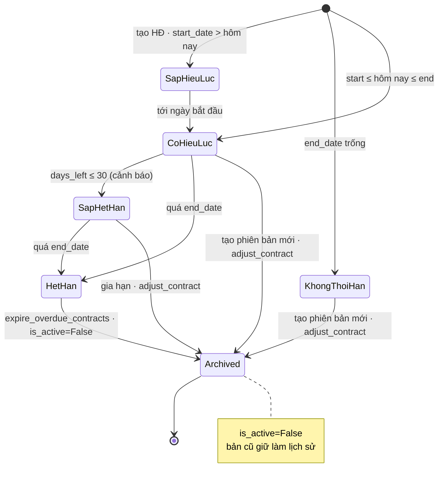
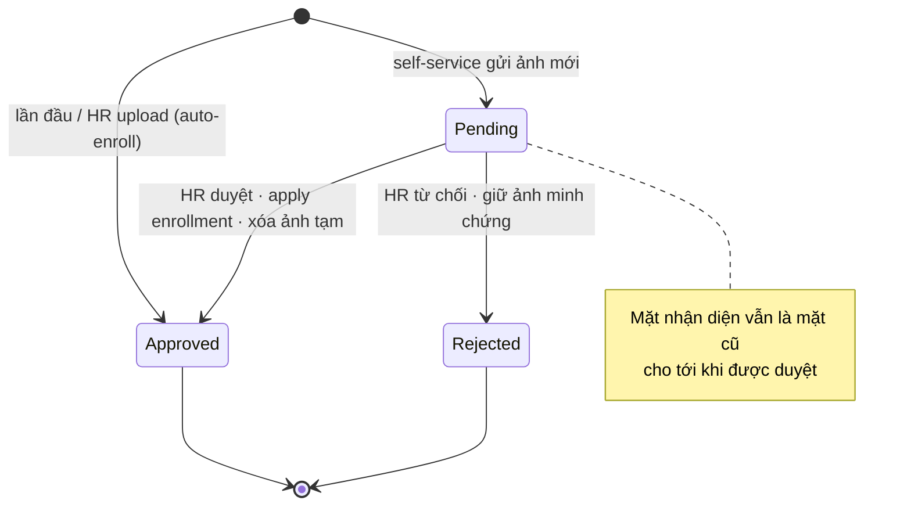
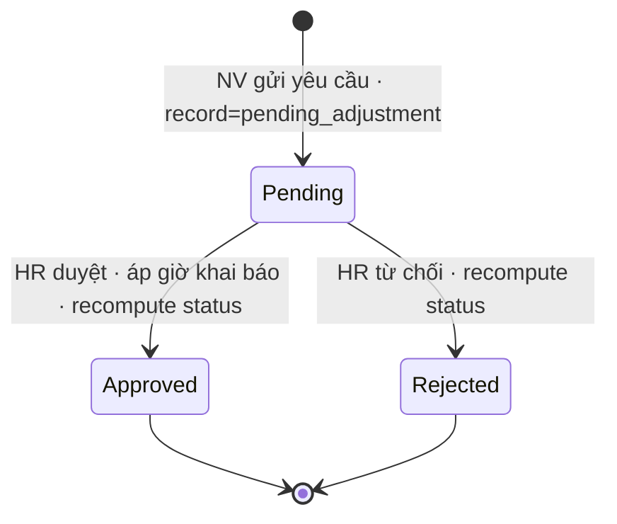
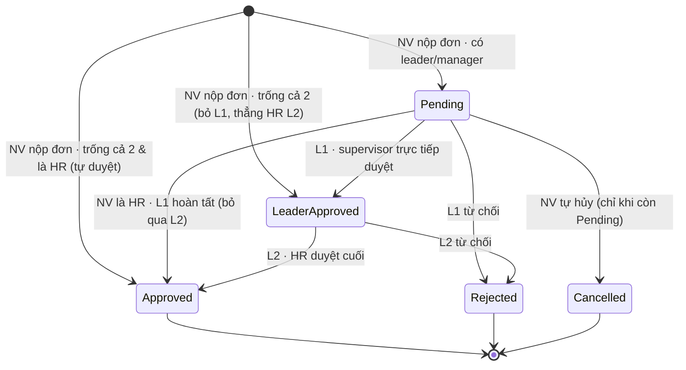
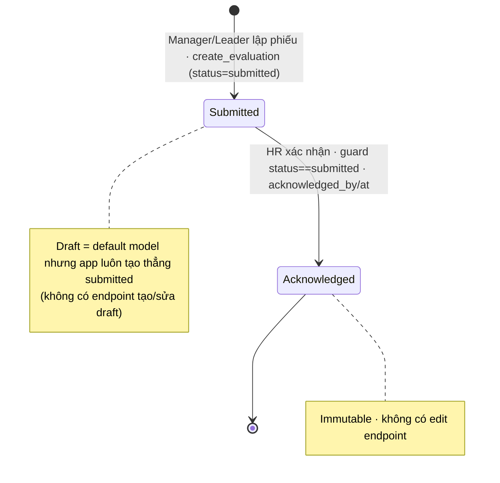
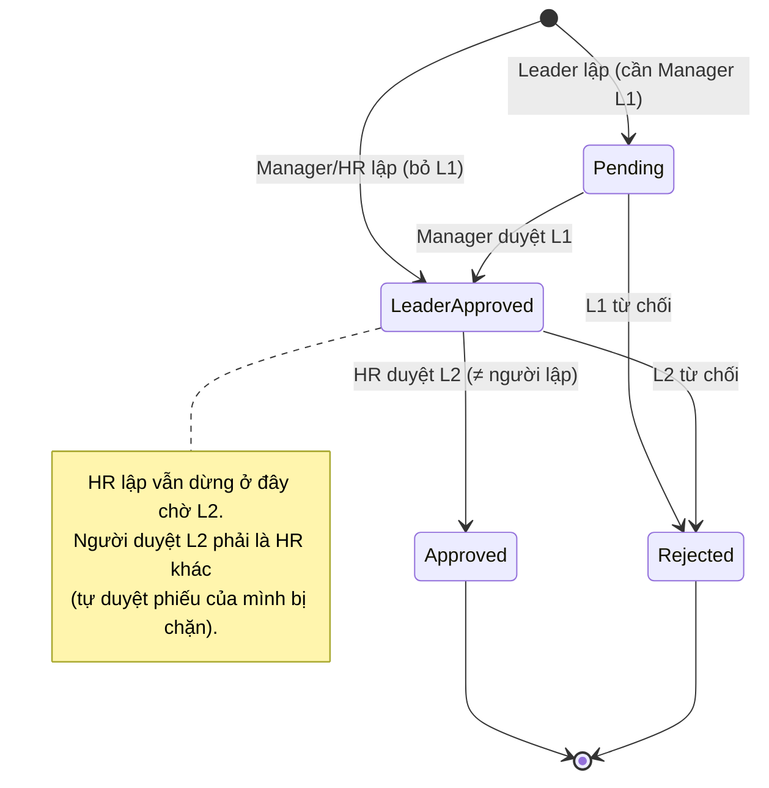
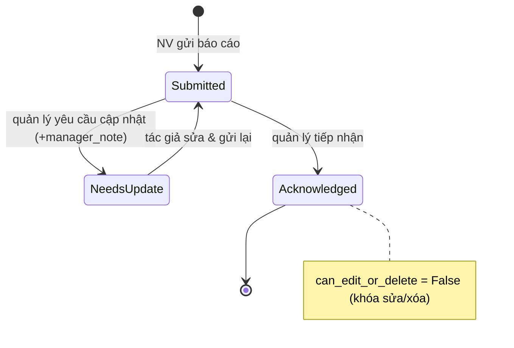
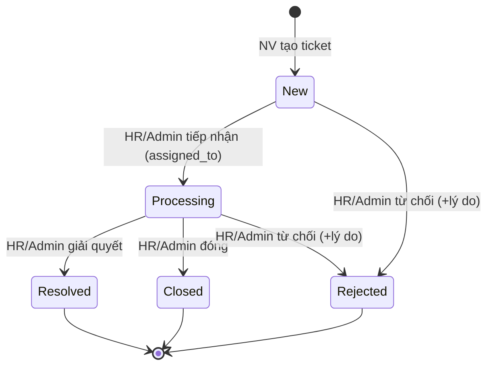

# State Diagrams — Business Web Project

> Máy trạng thái cho các entity có vòng đời nhiều trạng thái (gộp entity giống nhau).
> Thứ tự block ⇒ `svg/state-diagrams-NN.svg`. Ma trận: `docs/diagrams/COVERAGE.md` §State.
>
> Danh sách dự kiến: ST-CONTRACT (3.x) · ST-FACECHANGE (4.x) · ST-ADJUST (4.7-4.8) ·
> ST-APPROVAL2 (leave/OT 5-6) · ST-REWARD (8.x) · ST-REPORT (9.1-9.2) · ST-TICKET (9.3-9.4).

---

## ST-CONTRACT — Vòng đời hợp đồng lao động (mục 3.x)

> Status hiển thị tính từ ngày (không lưu field); `is_active` là cờ versioning.

## ST-FACECHANGE — Vòng đời yêu cầu đổi khuôn mặt (mục 4.1–4.3, 4.9)

## ST-ADJUST — Vòng đời yêu cầu điều chỉnh chấm công (mục 4.7–4.8)

## ST-APPROVAL2 — Vòng đời đơn duyệt 2 bước · dùng chung Nghỉ phép & Tăng ca (mục 5.x, 6.x)

## ST-EVAL — Vòng đời phiếu đánh giá hiệu suất (mục 7.x)

## ST-REWARD — Vòng đời phiếu khen thưởng / xử phạt (mục 8.x)

> Điểm khác ST-APPROVAL2: vai trò **người lập** quyết định có qua L1 hay không
> (Leader → cần Manager L1; Manager/HR → bỏ L1). HR lập KHÔNG bỏ L2: vẫn cần
> HR duyệt cuối, và phải là **HR khác** vì hệ thống chặn tự duyệt phiếu của chính mình.

## ST-REPORT — Vòng đời báo cáo công việc (mục 9.1–9.2)

## ST-TICKET — Vòng đời ticket hỗ trợ/khiếu nại (mục 9.3–9.4)

<!-- BUILD-CURSOR -->
