# 📊 Sơ Đồ Use Case — Hệ Thống HRMS

> **Hệ thống Quản lý Nhân sự (Human Resource Management System)**
> Môn học: SE104 – Nhập môn Công nghệ Phần mềm

---

## Quy ước ký hiệu

| Ký hiệu | Ý nghĩa |
|----------|----------|
| `actor` | Tác nhân (Actor) — hình người (stick figure) |
| `<<system>>` | Tác nhân hệ thống ngoài (External system) |
| `usecase` | Use Case — hình ellipse bo tròn |
| `-->` | Tương tác trực tiếp (Association) |
| `..>` | Quan hệ `<<include>>` hoặc `<<extend>>` |
| `rectangle` | Ranh giới hệ thống (System Boundary) |

> **Lưu ý:** Sơ đồ dùng **Mermaid** để tương thích tốt với hiển thị trên GitHub và các nền tảng markdown hiện đại. Render bằng VSCode (extension *PlantUML*), IntelliJ, hoặc <https://www.plantuml.com/plantuml>. GitHub không render trực tiếp PlantUML.

---

## 👥 Danh sách Tác nhân (Actors)

| Actor | Vai trò | Mô tả |
|-------|---------|-------|
| **Nhân viên (Employee)** | `employee` | Tác nhân cơ bản. Mọi user đều là nhân viên. |
| **Trưởng nhóm (Leader)** | `leader` | Quản lý trực tiếp cấp nhóm. Phê duyệt L1, đánh giá, đề xuất thưởng/phạt. |
| **Quản lý (Manager)** | `manager` | Quản lý cấp phòng ban. Phê duyệt L1, đánh giá, phản hồi báo cáo. |
| **Nhân sự (HR)** | `hr` | Quản lý hồ sơ, hợp đồng, phê duyệt L2, điều chỉnh công. |
| **Quản trị viên (Admin)** | `admin` | Quản lý tài khoản hệ thống, phân quyền, cấu hình. |
| **Service nhận diện (Remote API)** | External | Service từ xa (FastAPI + DeepFace). |
| **Gmail SMTP** | External | Gửi OTP đặt lại mật khẩu. |

---

## 🗺️ USE CASE TỔNG QUÁT — Toàn bộ Hệ thống

```mermaid
flowchart LR
    %% Actors
    Employee(["🧑‍💼 Nhân viên"])
    Leader(["👨‍💼 Trưởng nhóm"])
    Manager(["👔 Quản lý"])
    HR(["👩‍💻 Nhân sự HR"])
    Admin(["🛠️ Quản trị viên"])
    FaceAPI["🌐 Remote Face API"]
    SMTP["📧 Gmail SMTP"]

    %% System
    subgraph HRMS["🏢 Hệ thống Quản lý Nhân sự HRMS"]
        direction TB
        subgraph G1["1. Tài khoản & Xác thực"]
            UC_Login("Đăng nhập / Đăng xuất")
            UC_OTP("Quên mật khẩu qua OTP")
            UC_AccMgmt("Quản lý tài khoản")
            UC_RBAC("Phân quyền & Vai trò")
        end
        subgraph G2["2. Hồ sơ & Hợp đồng"]
            UC_ViewProfile("Xem hồ sơ cá nhân")
            UC_CreateProfile("Tạo hồ sơ nhân viên mới")
            UC_EditProfile("Cập nhật hồ sơ nhân viên")
            UC_Contract("Quản lý hợp đồng lao động")
            UC_ContractWarn("Cảnh báo HĐ sắp hết hạn")
        end
        subgraph G3["3. Chấm công & Khuôn mặt"]
            UC_FaceReg("Đăng ký / Cập nhật khuôn mặt")
            UC_FaceApprove("Duyệt yêu cầu đổi khuôn mặt")
            UC_CheckIn("Chấm công vào/ra bằng FaceID")
            UC_History("Xem lịch sử chấm công")
            UC_Adjust("Yêu cầu điều chỉnh giờ công")
            UC_AdjApprove("Duyệt điều chỉnh giờ công")
        end
        subgraph G4["4. Nghỉ phép"]
            UC_Leave("Nộp đơn nghỉ phép")
            UC_LeaveL1("Phê duyệt nghỉ phép L1")
            UC_LeaveL2("Phê duyệt nghỉ phép L2")
        end
        subgraph G5["5. Tăng ca"]
            UC_OT("Đăng ký tăng ca")
            UC_OTL1("Phê duyệt tăng ca L1")
            UC_OTL2("Phê duyệt tăng ca L2")
        end
        subgraph G6["6. Đánh giá hiệu suất"]
            UC_ViewEval("Xem phiếu đánh giá")
            UC_CreateEval("Lập phiếu đánh giá")
            UC_AckEval("Xác nhận đánh giá")
        end
        subgraph G7["7. Khen thưởng & Kỷ luật"]
            UC_ViewRW("Xem quyết định thưởng/phạt")
            UC_ProposeRW("Đề xuất khen thưởng/xử phạt")
            UC_ApproveRW("Duyệt quyết định thưởng/phạt")
        end
        subgraph G8["8. Báo cáo & Hỗ trợ"]
            UC_Report("Gửi báo cáo công việc")
            UC_ReviewReport("Phản hồi báo cáo")
            UC_Ticket("Gửi ticket hỗ trợ/khiếu nại")
            UC_HandleTicket("Xử lý ticket")
        end
        subgraph G9["9. Thống kê"]
            UC_Stats("Xem thống kê tổng hợp")
            UC_Export("Xuất báo cáo dữ liệu")
        end
        subgraph G10["10. Cài đặt hệ thống"]
            UC_Settings("Cài đặt cá nhân")
            UC_CompanyConfig("Cấu hình công ty")
            UC_HRConfig("Cấu hình quy định nhân sự")
        end
    end

    %% Relationships
    Employee --> UC_Login
    Employee --> UC_OTP
    Employee --> UC_ViewProfile
    Employee --> UC_FaceReg
    Employee --> UC_CheckIn
    Employee --> UC_History
    Employee --> UC_Adjust
    Employee --> UC_Leave
    Employee --> UC_OT
    Employee --> UC_ViewEval
    Employee --> UC_ViewRW
    Employee --> UC_Report
    Employee --> UC_Ticket
    Employee --> UC_Settings

    Leader --> UC_LeaveL1
    Leader --> UC_OTL1
    Leader --> UC_CreateEval
    Leader --> UC_ProposeRW
    Leader --> UC_ReviewReport

    Manager --> UC_LeaveL1
    Manager --> UC_OTL1
    Manager --> UC_CreateEval
    Manager --> UC_ProposeRW
    Manager --> UC_ReviewReport
    Manager --> UC_Stats

    HR --> UC_CreateProfile
    HR --> UC_EditProfile
    HR --> UC_Contract
    HR --> UC_ContractWarn
    HR --> UC_FaceApprove
    HR --> UC_AdjApprove
    HR --> UC_LeaveL2
    HR --> UC_OTL2
    HR --> UC_AckEval
    HR --> UC_ApproveRW
    HR --> UC_HandleTicket
    HR --> UC_Stats
    HR --> UC_Export
    HR --> UC_HRConfig
    HR --> UC_AccMgmt

    Admin --> UC_AccMgmt
    Admin --> UC_RBAC
    Admin --> UC_CompanyConfig
    Admin --> UC_Stats
    Admin --> UC_HandleTicket

    FaceAPI --> UC_FaceReg
    FaceAPI --> UC_CheckIn
    SMTP --> UC_OTP
```

---

## 📋 USE CASE CHI TIẾT TỪNG PHÂN HỆ

---

### UC-1. Tài khoản & Xác thực

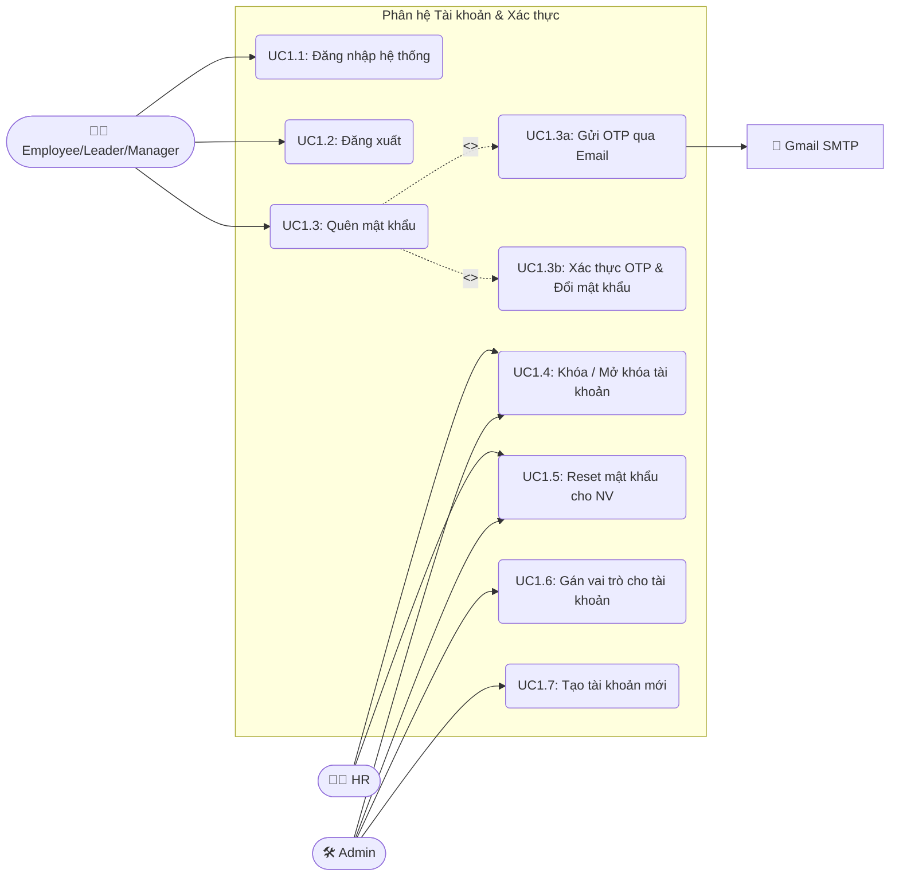

**Mô tả chi tiết:**

| Use Case | Mô tả | Actor |
|----------|-------|-------|
| UC1.1 | Nhập username + password. Kiểm tra `is_active`, xác thực, tạo session. | Nhân viên |
| UC1.2 | Hủy session đăng nhập, redirect về trang login. | Nhân viên |
| UC1.3 | Nhập email → nhận OTP 6 số (hết hạn 120 giây) → nhập OTP + mật khẩu mới. | Nhân viên |
| UC1.4 | Đặt `is_active = False/True` cho tài khoản nhân viên. HR chỉ thao tác Employee/Leader/Manager. Admin thao tác mọi tài khoản. | HR, Admin |
| UC1.5 | Tạo mật khẩu mới cho nhân viên (khi quên email hoặc bị khóa). | HR, Admin |
| UC1.6 | Gán vai trò (`admin`, `hr`, `manager`, `leader`, `employee`) cho tài khoản. | Admin |
| UC1.7 | Tạo tài khoản Django User mới, gán role ban đầu. | Admin |

---

### UC-2. Hồ sơ Nhân sự

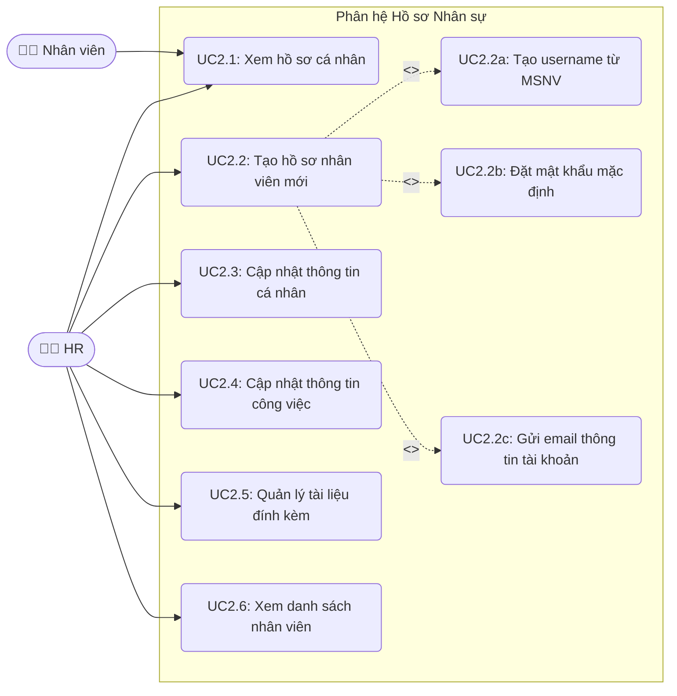

**Mô tả chi tiết:**

| Use Case | Mô tả | Actor |
|----------|-------|-------|
| UC2.1 | Xem thông tin cá nhân, công việc, học vấn, liên hệ khẩn cấp. NV chỉ xem của mình, HR xem tất cả. | Nhân viên, HR |
| UC2.2 | HR điền form tạo NV mới: **tự nhập MSNV (employee_id)**, thông tin cá nhân, công việc, upload ảnh khuôn mặt. | HR |
| UC2.2a | Hệ thống tạo username = MSNV viết thường, bỏ khoảng trắng; kiểm tra trùng. | Hệ thống |
| UC2.2b | Hệ thống đặt mật khẩu mặc định `{MSNV}@2026`. | Hệ thống |
| UC2.2c | Gửi email chứa username + mật khẩu mặc định cho NV mới. | Hệ thống |
| UC2.3 | HR chỉnh sửa thông tin cá nhân (SĐT, địa chỉ, CCCD...). | HR |
| UC2.4 | HR cập nhật thông tin công việc (phòng ban, chức danh, trạng thái, quản lý). | HR |
| UC2.5 | Upload/xóa tài liệu đính kèm hồ sơ nhân viên. | HR |
| UC2.6 | Xem danh sách toàn bộ nhân viên với bộ lọc, tìm kiếm. | HR |

---

### UC-3. Hợp đồng Lao động

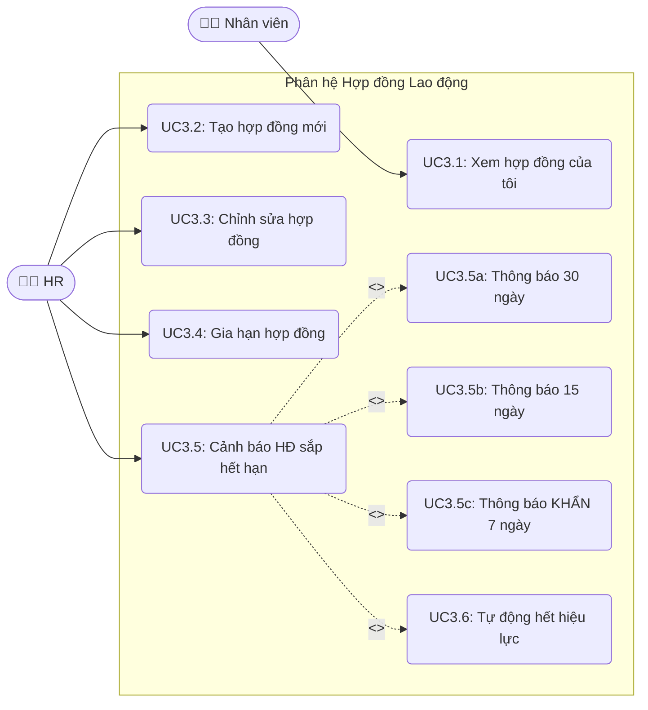

**Mô tả chi tiết:**

| Use Case | Mô tả | Actor |
|----------|-------|-------|
| UC3.1 | NV xem danh sách HĐ đã ký, HĐ đang hiệu lực (`is_active=True`). | Nhân viên |
| UC3.2 | HR tạo HĐ mới: loại HĐ, ngày ký, ngày hiệu lực, ngày hết hạn, ca làm, ngày phép. | HR |
| UC3.3 | HR chỉnh sửa nội dung HĐ chưa hết hiệu lực. | HR |
| UC3.4 | HR gia hạn HĐ cũ (tạo HĐ mới, đóng HĐ cũ `is_active=False`). | HR |
| UC3.5 | Batch job tự động cảnh báo tại mốc 30/15/7 ngày trước khi HĐ hết hạn. | Hệ thống |
| UC3.6 | HĐ quá hạn mà chưa gia hạn → tự động `is_active=False`. | Hệ thống |

---

### UC-4. Chấm công & Nhận diện Khuôn mặt

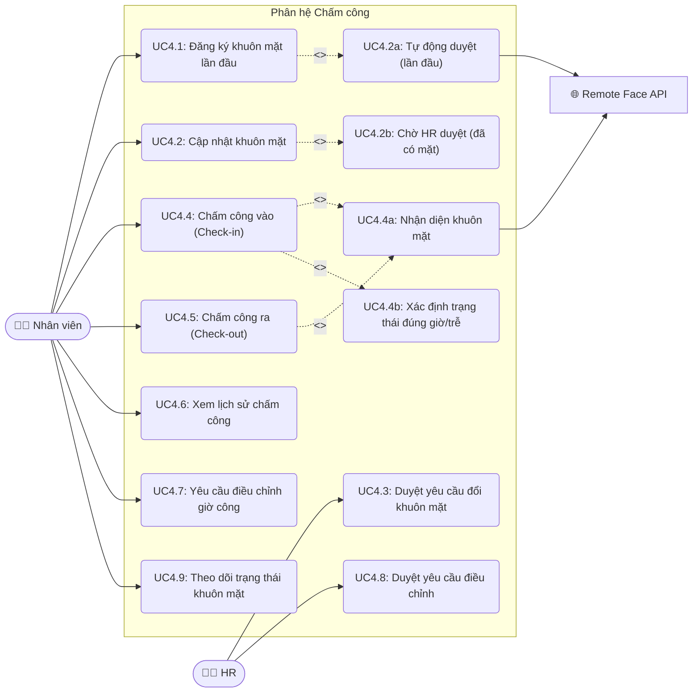

**Mô tả chi tiết:**

| Use Case | Mô tả | Actor |
|----------|-------|-------|
| UC4.1 | NV chưa có `EmployeeFace` → chụp ảnh → **tự động duyệt**, áp dụng ngay lập tức. | Nhân viên |
| UC4.2 | NV đã có khuôn mặt → chụp ảnh mới → tạo `FaceChangeRequest(pending)` → **chờ HR duyệt**. | Nhân viên |
| UC4.3 | HR xem danh sách yêu cầu, duyệt hoặc từ chối kèm ghi chú lý do. Duyệt → đẩy ảnh lên Remote API và cập nhật `EmployeeFace`. | HR |
| UC4.4 | NV nhấn nút chấm công → webcam chụp ảnh → gửi lên hệ thống → nhận diện khuôn mặt qua Remote API → ghi `check_in_time`. | Nhân viên |
| UC4.5 | Tương tự UC4.4 nhưng ghi `check_out_time`. | Nhân viên |
| UC4.6 | Xem bảng lịch sử chấm công trong tháng (ngày, giờ vào, giờ ra, trạng thái). | Nhân viên |
| UC4.7 | NV gửi yêu cầu điều chỉnh giờ công (quên chấm, lỗi kỹ thuật) kèm minh chứng. | Nhân viên |
| UC4.8 | HR xem yêu cầu điều chỉnh, duyệt (cập nhật giờ công) hoặc từ chối. | HR |
| UC4.9 | NV xem trạng thái khuôn mặt: Chưa đăng ký / Chờ duyệt / Bị từ chối / Đang hoạt động. | Nhân viên |

---

### UC-5. Nghỉ phép

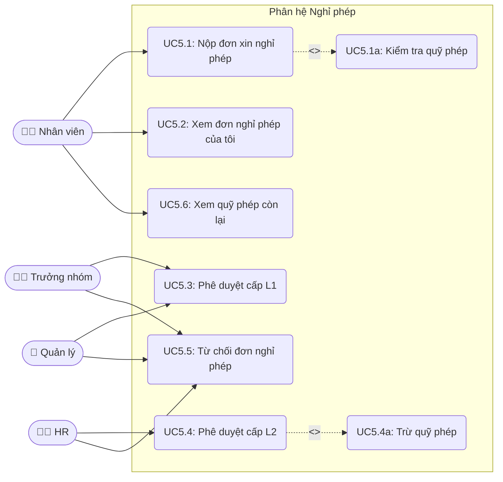

**Mô tả chi tiết:**

| Use Case | Mô tả | Actor |
|----------|-------|-------|
| UC5.1 | NV chọn loại phép (`annual`, `sick`, `personal`...), khoảng ngày, lý do, đính kèm minh chứng. Hệ thống kiểm tra quỹ phép. | Nhân viên |
| UC5.2 | NV xem danh sách đơn đã nộp và trạng thái (pending → leader_approved → approved / rejected). | Nhân viên |
| UC5.3 | Leader/Manager (là `leader_user` hoặc `manager_user` của NV) duyệt cấp 1. | Leader, Manager |
| UC5.4 | HR duyệt cấp 2 sau khi L1 đã duyệt. Duyệt thành công → trừ quỹ phép. | HR |
| UC5.5 | L1 hoặc L2 từ chối đơn, ghi lý do. | Leader, Manager, HR |
| UC5.6 | NV xem số ngày phép còn lại theo hợp đồng. | Nhân viên |

---

### UC-6. Tăng ca (OT)

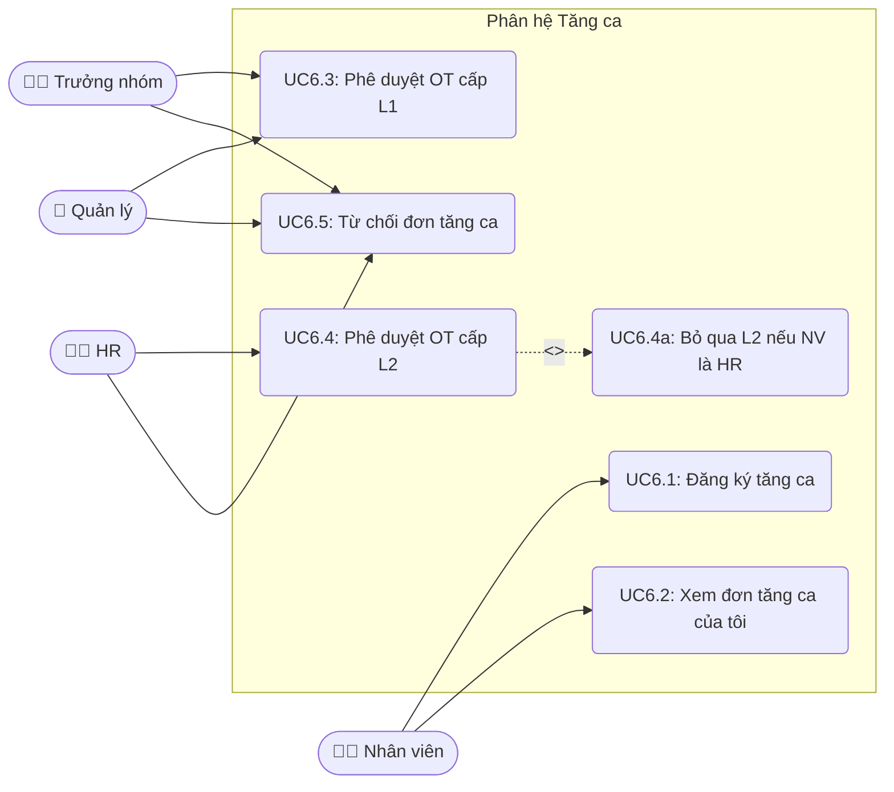

**Mô tả chi tiết:**

| Use Case | Mô tả | Actor |
|----------|-------|-------|
| UC6.1 | NV chọn ngày OT, giờ bắt đầu/kết thúc, lý do, đính kèm minh chứng. | Nhân viên |
| UC6.2 | NV xem danh sách đơn OT đã nộp và trạng thái. | Nhân viên |
| UC6.3 | Leader/Manager duyệt cấp 1 đơn OT. | Leader, Manager |
| UC6.4 | HR duyệt cấp 2. **Ngoại lệ:** Nếu người tạo đơn có role HR → sau L1 chuyển thẳng `approved`. | HR |
| UC6.5 | L1 hoặc L2 từ chối đơn, ghi lý do. | Leader, Manager, HR |

---

### UC-7. Đánh giá Hiệu suất

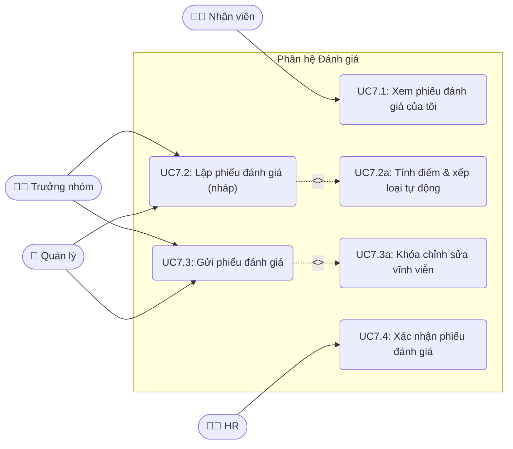

**Mô tả chi tiết:**

| Use Case | Mô tả | Actor |
|----------|-------|-------|
| UC7.1 | NV xem danh sách phiếu đánh giá mình đã nhận, điểm số, xếp loại. | Nhân viên |
| UC7.2 | Leader/Manager tạo phiếu nháp: chọn NV, loại đánh giá, nhập score (0–100), nội dung, minh chứng. Hệ thống **tự tính** rating A/B/C/D từ score khi `save()`. | Leader, Manager |
| UC7.3 | Leader/Manager nhấn gửi → `status=submitted` → **khóa vĩnh viễn** không thể chỉnh sửa. | Leader, Manager |
| UC7.4 | HR xem phiếu đánh giá, thêm `hr_note`, xác nhận → `status=acknowledged`. | HR |

---

### UC-8. Khen thưởng & Kỷ luật

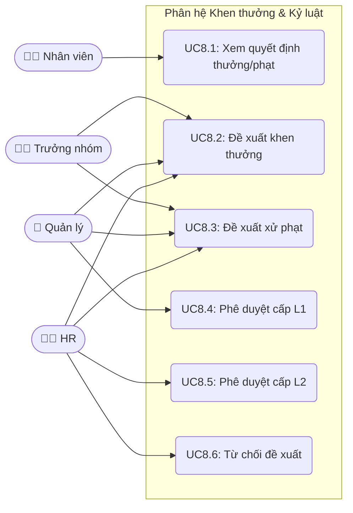

**Mô tả chi tiết:**

| Use Case | Mô tả | Actor |
|----------|-------|-------|
| UC8.1 | NV xem quyết định thưởng/phạt của mình. | Nhân viên |
| UC8.2 | Leader/Manager/HR lập phiếu khen thưởng: chọn NV, lý do, số tiền, minh chứng. | Leader, Manager, HR |
| UC8.3 | Leader/Manager/HR lập phiếu xử phạt: chọn NV, lý do, số tiền, minh chứng. | Leader, Manager, HR |
| UC8.4 | Manager duyệt L1 nếu Leader lập phiếu. Manager lập → bỏ qua L1, chuyển thẳng HR. | Manager |
| UC8.5 | HR duyệt L2 để ban hành quyết định chính thức. | HR |
| UC8.6 | HR từ chối đề xuất. | HR |

---

### UC-9. Báo cáo Công việc & Helpdesk Ticket

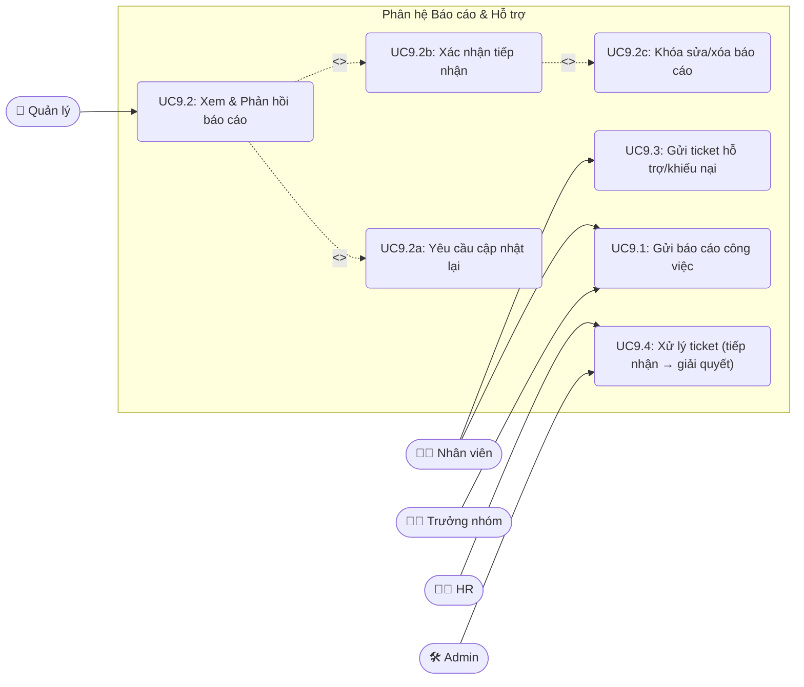

**Mô tả chi tiết:**

| Use Case | Mô tả | Actor |
|----------|-------|-------|
| UC9.1 | NV/Leader gửi báo cáo (tiêu đề, nội dung, file). Employee → gửi Leader; Leader → gửi Manager. | Nhân viên, Leader |
| UC9.2 | Manager/Leader xem báo cáo → `is_viewed=True`. | Manager, Leader |
| UC9.2a | Yêu cầu NV cập nhật lại → `status=needs_update`. | Manager, Leader |
| UC9.2b | Xác nhận tiếp nhận → `status=acknowledged` → **khóa** sửa/xóa. | Manager, Leader |
| UC9.3 | NV tạo ticket (loại: hỗ trợ/khiếu nại, mức ưu tiên, nội dung, file). Ticket ở `status=new`, **chưa gán** người xử lý. | Nhân viên |
| UC9.4 | Người có quyền tự nhận ticket (`assigned_to=self`, `processing`) → `resolved` → NV xác nhận (`closed`); hoặc `rejected` kèm lý do. | HR, Admin |

---

### UC-10. Thống kê & Cài đặt

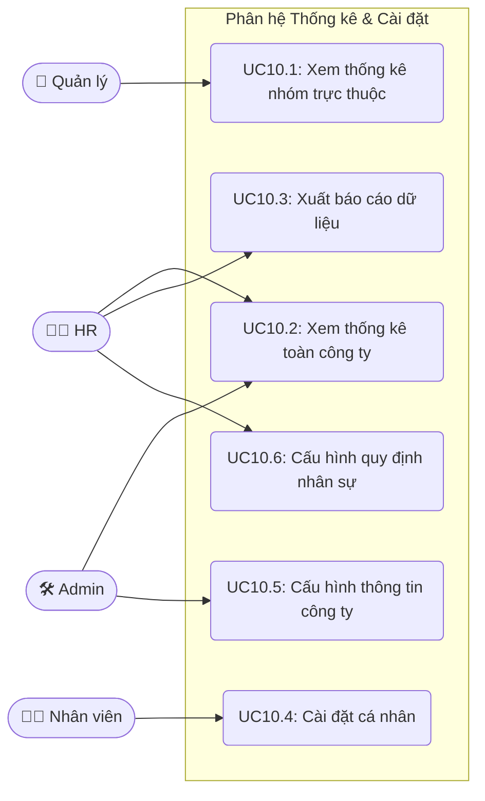

**Mô tả chi tiết:**

| Use Case | Mô tả | Actor |
|----------|-------|-------|
| UC10.1 | Manager/Leader xem thống kê chấm công, nghỉ phép, OT của nhân viên mình quản lý. | Manager |
| UC10.2 | HR/Admin xem dashboard thống kê tổng hợp toàn công ty. | HR, Admin |
| UC10.3 | HR xuất dữ liệu ra file báo cáo. | HR |
| UC10.4 | NV tùy chỉnh giao diện (dark mode, ngôn ngữ, thông báo email). | Nhân viên |
| UC10.5 | Admin cấu hình tên công ty, mã số thuế, email hệ thống. | Admin |
| UC10.6 | HR cấu hình giờ làm chuẩn, ngưỡng đi trễ, số ngày phép mặc định, giới hạn OT. | HR |
