# 📘 HRMS – Project Walkthrough Toàn Diện

> **Hệ thống Quản lý Nhân sự (Human Resource Management System)**
> Môn học: SE104 – Nhập môn Công nghệ Phần mềm
> Stack: Django · PostgreSQL (prod, Render) / SQLite3 (dev) · HTML · CSS tự viết (`style.css`) · JavaScript thuần · Font Awesome · Chart.js (trang thống kê) · Remote Face API (DeepFace/Facenet512)
> Deploy: Render PaaS (gunicorn + WhiteNoise) · Cloudinary (media) · Gmail SMTP — chi tiết: `deployment_architecture.md`

---

## 1. Tổng Quan Kiến Trúc

### 1.1 Tech Stack

| Tầng | Công nghệ |
|------|-----------|
| **Backend** | Django (Python) — MTV pattern |
| **Database** | SQLite3 (dev) → **PostgreSQL** (production, Render — qua `dj-database-url` + `psycopg2`) |
| **Deploy** | Render Web Service (`gunicorn`) · WhiteNoise (static) · Cloudinary (media) — xem `deployment_architecture.md` |
| **Frontend** | HTML + CSS tự viết (`accounts/static/accounts/css/style.css`) · JavaScript thuần (`accounts.js`) · Font Awesome (icon) · Chart.js (biểu đồ thống kê) · Google Fonts (Inter) — **không** dùng Tailwind/Alpine |
| **AI** | Nhận diện khuôn mặt chạy trên **service từ xa** (FastAPI + DeepFace `Facenet512` + FAISS, host HuggingFace Space). Django chỉ gọi HTTP, không nạp model local. |
| **Email** | Gmail SMTP (OTP đặt lại mật khẩu) |
| **Kiến trúc** | Client–Server · Multi-App Django · 3 lớp · deploy lên Render (PaaS) |

> [!NOTE]
> Các tính năng sau **đã bị loại bỏ** khỏi phạm vi hiện tại: CEO role, Super_User role, Audit Log, Cơ chế tính lương (BangLuong).

### 1.2 Cấu Trúc 3 Lớp

```
┌─────────────────────────────────────┐
│  Presentation Layer                 │  Templates (HTML + CSS tự viết + JS thuần)
│  → Views, Forms, URL routing        │
├─────────────────────────────────────┤
│  Business Logic Layer               │  Services, validation, workflows
│  → services/, forms validation      │
├─────────────────────────────────────┤
│  Data Layer                         │  Models, Django ORM
│  → models/, migrations/             │
└─────────────────────────────────────┘
```

> Mỗi app theo cấu trúc package hoá: `models/`, `views/`, `forms/`, `services/`, `urls.py`, `templates/`, `migrations/`. Mỗi model nằm trong 1 file riêng (VD: `accounts/models/role_model.py`).

### 1.3 Cấu Trúc App (10 Django Apps)

```
business_web/               ← Project root (settings, urls, wsgi)
├── accounts/               ← Tài khoản, đăng nhập, phân quyền, RBAC
├── employee_profiles/      ← Hồ sơ nhân sự (thông tin cá nhân, công việc)
├── contracts/              ← Hợp đồng lao động, cảnh báo hết hạn
├── attendance/             ← Chấm công FaceID, bảng công, điều chỉnh
├── leaves/                 ← Nghỉ phép, quỹ phép
├── overtime/               ← Tăng ca (OT), phê duyệt OT
├── performance/            ← Đánh giá nhân viên định kỳ
├── rewards_discipline/     ← Khen thưởng, xử phạt
├── reports_interactions/   ← Báo cáo công việc, helpdesk ticket
└── stats_reports/          ← Thống kê tổng hợp (không có model riêng)
```

### 1.4 Kiến Trúc Triển Khai (Deployment)

Hệ thống deploy lên **Render PaaS**: `gunicorn` chạy WSGI app, WhiteNoise serve static, **PostgreSQL** (Render) làm DB, **Cloudinary** giữ media, **Gmail SMTP** gửi email, **HuggingFace Space** chạy face API. Build qua `business_web/build.sh` (`pip install → collectstatic → migrate → ensure_superuser`).

> 📐 **Sơ đồ System Architecture + Deployment đầy đủ + bảng env var + deployment gaps:** xem `deployment_architecture.md`.

---

## 2. Data Models

### 2.1 App: `accounts` — Tài Khoản & Phân Quyền

#### `Role`
| Trường | Kiểu | Mô tả |
|--------|------|-------|
| `name` | CharField (unique, choices) | `admin` \| `hr` \| `manager` \| `leader` \| `employee` |
| `description` | TextField | Mô tả vai trò |

> [!IMPORTANT]
> Chỉ có **5 vai trò** trong code thực tế (`ROLE_CHOICES`). Không có `CEO` hay `Super_User`.

#### `CustomPermission`
| Trường | Kiểu | Mô tả |
|--------|------|-------|
| `codename` | CharField (unique) | Mã quyền hạn (VD: `can_export_reports`) |
| `name` | CharField | Tên hiển thị |
| `description` | TextField | Giải thích quyền |

#### `UserProfile`
> **1 User Django ↔ 1 UserProfile** (OneToOne, `related_name='profile'`)

| Trường | Kiểu | Mô tả |
|--------|------|-------|
| `user` | OneToOneField → User | Django User sở hữu profile |
| `role` | ForeignKey → Role (SET_NULL) | Vai trò hệ thống (RBAC) |
| `permissions` | ManyToManyField → CustomPermission | Quyền riêng lẻ |
| `full_name` | CharField | Họ tên đầy đủ |
| `employee_id` | CharField (unique) | MSNV — **HR nhập tay** khi tạo hồ sơ (không auto-sinh) |

> Helper: `has_custom_permission(codename)`, `get_role_name()`.

#### `OtpCode`
| Trường | Kiểu | Mô tả |
|--------|------|-------|
| `user` | ForeignKey → User | User yêu cầu reset mật khẩu |
| `code` | CharField(6) | Mã OTP 6 chữ số |
| `created_at` | DateTimeField (auto) | Hết hạn sau **120 giây** (`OTP_EXPIRY_SECONDS=120`, method `is_expired()`) |

#### `Notification`
> **1 User ↔ N Notification** (ForeignKey, `related_name='notifications'`). Sinh tự động khi có sự kiện: đổi vai trò, duyệt/từ chối nghỉ phép · OT · thưởng/phạt, cập nhật hồ sơ. Helper service `create_notification(user, title, message, link)`.

| Trường | Kiểu | Mô tả |
|--------|------|-------|
| `user` | ForeignKey → User | Người nhận thông báo |
| `title` | CharField(255) | Tiêu đề |
| `message` | TextField | Nội dung |
| `link` | CharField(255, nullable) | Liên kết điều hướng (tuỳ chọn) |
| `is_read` | BooleanField (default=False) | Đã đọc? (set khi mở chuông / trang thông báo) |
| `created_at` | DateTimeField (auto) | Thời điểm tạo |

> `login_history_model.py`, `role_permission_model.py`, `user_role_model.py` hiện là **placeholder** (chưa có model). RBAC vận hành qua `UserProfile.role` + `permissions` M2M.

---

### 2.2 App: `employee_profiles` — Hồ Sơ Nhân Sự

#### `PersonalInfo`
> **1 User ↔ 1 PersonalInfo** (OneToOne, `related_name='personal_info'`)

| Trường | Kiểu | Mô tả |
|--------|------|-------|
| `user` | OneToOneField → User | Chủ sở hữu |
| `phone_number` | CharField(20) | Số điện thoại |
| `date_of_birth` | CharField(10) | Ngày sinh DD/MM/YYYY |
| `gender` | CharField | Giới tính |
| `marital_status` | CharField | Tình trạng hôn nhân |
| `nationality` | CharField | Quốc tịch |
| `id_card_number` | CharField | Số CCCD/CMND |
| `id_card_issue_place` | CharField | Nơi cấp |
| `id_card_issue_date` | CharField | Ngày cấp |
| `permanent_address` | TextField | Địa chỉ thường trú |
| `temporary_address` | TextField | Địa chỉ tạm trú |

> Property `employee_id` lấy gián tiếp từ `UserProfile`.

#### `EmployeeWorkInfo`
> **1 User ↔ 1 EmployeeWorkInfo** (OneToOne, `related_name='work_info'`)

| Trường | Kiểu | Mô tả |
|--------|------|-------|
| `user` | OneToOneField → User | Chủ sở hữu |
| `employee_type` | CharField | Loại NV: Toàn thời gian, Bán thời gian, Thực tập |
| `department` | CharField | Phòng ban |
| `position` | CharField | Chức danh |
| `workplace` | CharField | Nơi làm việc |
| `probation_start` | CharField | Ngày bắt đầu thử việc |
| `official_start_date` | CharField | Ngày làm việc chính thức |
| `work_status` | CharField (choices) | `working`, `probation`, `paused`, `resigned` |
| `manager_user` | ForeignKey → User (SET_NULL, `managed_employees`) | Quản lý trực tiếp |
| `leader_user` | ForeignKey → User (SET_NULL, `led_employees`) | Leader phụ trách |

#### `EducationAndSkills`
> **1 User ↔ 1 EducationAndSkills** (OneToOne, `related_name='education_and_skills'`)

| Trường | Kiểu | Mô tả |
|--------|------|-------|
| `education_level` | CharField | Trình độ học vấn |
| `degree` | CharField | Bằng cấp |
| `major` | CharField | Chuyên ngành |
| `certificates` | TextField | Chứng chỉ |
| `foreign_languages` | TextField | Ngoại ngữ |
| `professional_skills` | TextField | Kỹ năng chuyên môn |

#### `EmergencyContact`
> **1 User ↔ 1 EmergencyContact** (OneToOne, `related_name='emergency_contact'`)

| Trường | Kiểu | Mô tả |
|--------|------|-------|
| `user` | OneToOneField → User | Nhân viên |
| `contact_name` | CharField | Tên người liên hệ khẩn |
| `contact_phone` | CharField | Số điện thoại khẩn |
| `relation` | CharField | Mối quan hệ |
| `contact_address` | TextField | Địa chỉ người liên hệ |

#### `EmployeeDocument`
> **1 User ↔ N EmployeeDocument** (ForeignKey, `related_name='documents'`)

| Trường | Kiểu | Mô tả |
|--------|------|-------|
| `user` | ForeignKey → User | Nhân viên sở hữu |
| `title` | CharField | Tên/tiêu đề minh chứng |
| `document_type` | CharField | Loại tài liệu |
| `file` | FileField (`employee_documents/`) | File đính kèm |
| `uploaded_at` | DateTimeField (auto) | Thời gian tải lên |

---

### 2.3 App: `contracts` — Hợp Đồng Lao Động

#### `ContractInfo`
> **1 User ↔ N ContractInfo** (ForeignKey, `related_name='contracts'`) — mỗi NV ký nhiều HĐ theo thời gian; tại một thời điểm chỉ có **1 HĐ đang hiệu lực** (`is_active=True`).

| Trường | Kiểu | Mô tả |
|--------|------|-------|
| `user` | ForeignKey → User | Nhân viên có hợp đồng |
| `is_active` | BooleanField (default=True) | HĐ đang hiệu lực? |
| `contract_number` | CharField | Số HĐ — VD: `HD-2026-001` |
| `contract_type` | CharField | Loại HĐ — VD: Thử việc, Chính thức 1 năm |
| `contract_signed_date` | CharField | Ngày ký (DD/MM/YYYY) |
| `contract_start_date` | CharField | Ngày hiệu lực |
| `contract_end_date` | CharField | Ngày hết hạn (để trống = không thời hạn) |
| `contract_annual_leave_days` | PositiveIntegerField | Ngày phép/năm theo HĐ |
| `contract_standard_shift` | CharField | Ca làm tiêu chuẩn (text) — VD: 08:30-17:30 |
| `shift_start_time` | TimeField | Giờ bắt đầu ca — **đi trễ tính từ đây** |
| `shift_end_time` | TimeField | Giờ kết thúc ca — **về sớm tính từ đây** |
| `contract_attachment_reference` | CharField | Tên/link file PDF hợp đồng |

> **Ràng buộc nghiệp vụ:** `ngayBatDau >= ngayKy`, `ngayHetHan >= ngayBatDau`, mỗi NV chỉ giữ 1 HĐ `is_active=True` (enforce ở tầng service/view).

---

### 2.4 App: `attendance` — Chấm Công

#### `EmployeeFace`
> **1 User ↔ 1 EmployeeFace** (OneToOne, `related_name='employee_face'`)

| Trường | Kiểu | Mô tả |
|--------|------|-------|
| `user` | OneToOneField → User | Nhân viên sở hữu |
| `face_base64` | TextField | Ảnh khuôn mặt mã hóa Base64 — **chỉ để preview** trên UI |
| `slot_id` | PositiveSmallIntegerField (default=1) | Slot trên service từ xa (pin về 1, hỗ trợ multi-slot 1–5) |
| `content_type` | CharField | MIME type ảnh: `image/png`, `image/jpeg` |
| `created_at` / `updated_at` | DateTimeField | Tạo / cập nhật cuối |

> [!NOTE]
> Row `EmployeeFace` local chỉ giữ ảnh preview + `slot_id`. Toàn bộ embedding/so khớp do service từ xa xử lý. Cột `embedding` cũ **đã được xóa** ở migration `0008_remove_employeeface_embedding`.

#### `FaceChangeRequest`
> **Nghiệp vụ phê duyệt:** Chống gian lận chấm công hộ. Nếu nhân viên tự cập nhật khuôn mặt (khi đã có), hệ thống tạo `FaceChangeRequest` ở trạng thái `pending` và chờ HR duyệt. Nếu là **đăng ký lần đầu** hoặc do HR/Admin thao tác, yêu cầu sẽ được tự động `approved` và áp dụng ngay.

| Trường | Kiểu | Mô tả |
|--------|------|-------|
| `user` | ForeignKey → User | Nhân viên chủ khuôn mặt |
| `submitted_by` | ForeignKey → User (PROTECT) | Người nộp ảnh (giám sát upload thay) |
| `image_base64` | TextField | Ảnh khuôn mặt chờ duyệt |
| `content_type` | CharField(50, default `image/jpeg`) | MIME type ảnh |
| `image_sha256` | CharField(64) | SHA-256 của ảnh — audit / phát hiện đảo ảnh |
| `ip_address` | GenericIPAddressField (nullable) | IP người nộp |
| `status` | CharField | `pending` → `approved` / `rejected` |
| `reviewed_by` / `reviewed_at` | FK User / DateTime | Người duyệt (HR/Admin) |
| `hr_note` | TextField | Ghi chú từ HR (lý do từ chối / tự động) |
| `created_at` | DateTimeField (auto) | Thời gian nộp yêu cầu |

> Property `is_cross_user`: `True` nếu `submitted_by != user` (cờ nghi vấn đổi mặt hộ).

#### `AttendanceRecord`
> **1 User ↔ N AttendanceRecord** (`unique_together: user + record_date`)

| Trường | Kiểu | Mô tả |
|--------|------|-------|
| `user` | ForeignKey → User | Nhân viên chấm công |
| `record_date` | DateField | Ngày chấm công |
| `check_in_time` | TimeField (nullable) | Giờ vào làm |
| `check_out_time` | TimeField (nullable) | Giờ tan làm |
| `status` | CharField | `on_time`, `late`, `early_leave`, `no_checkout`, `absent` |

#### `AttendanceAdjustmentRequest`
> **1 AttendanceRecord ↔ 1 AdjustmentRequest** (OneToOne, `related_name='adjustment_request'`)

| Trường | Kiểu | Mô tả |
|--------|------|-------|
| `record` | OneToOneField → AttendanceRecord | Bản ghi cần điều chỉnh |
| `submitted_by` | ForeignKey → User (PROTECT) | Nhân viên nộp yêu cầu |
| `reason` | CharField (choices) | `forgot`, `technical`, `business_trip`, `other` |
| `reason_detail` | TextField | Chi tiết lý do |
| `claimed_check_in_time` | TimeField (nullable) | Giờ vào khai báo thực tế |
| `claimed_check_out_time` | TimeField (nullable) | Giờ ra khai báo thực tế |
| `evidence` | FileField (`attendance/adjustments/%Y/%m/`) | Ảnh/PDF minh chứng |
| `status` | CharField | `pending`, `approved`, `rejected` |
| `submitted_at` / `reviewed_at` | DateTimeField | Mốc nộp / mốc duyệt |
| `reviewed_by` | ForeignKey → User (SET_NULL) | HR duyệt |
| `hr_note` | TextField | Ghi chú từ HR |

---

### 2.5 App: `leaves` — Nghỉ Phép

#### `LeaveRequest`

| Trường | Kiểu | Mô tả |
|--------|------|-------|
| `user` | ForeignKey → User | Nhân viên gửi đơn |
| `leave_type` | CharField (choices) | `annual`, `sick`, `personal`, `maternity`, `business`, `other` |
| `start_date` / `end_date` | DateField | Khoảng ngày nghỉ |
| `days` | DecimalField(4,1) | Số ngày nghỉ |
| `reason` | TextField | Lý do |
| `status` | CharField (choices) | `pending` → `leader_approved` → `approved` / `rejected` |
| `leader_approved_by` / `leader_approved_at` | FK User / DateTime | Duyệt L1 (Leader/Manager) |
| `approved_by` | ForeignKey → User | HR duyệt L2 |
| `rejected_reason` | TextField | Lý do từ chối |
| `attachment` | FileField (`leaves/attachments/%Y/%m/`, nullable) | Minh chứng (PDF/JPG/PNG, ≤5MB) |
| `created_at` | DateTimeField (auto) | Thời điểm tạo |

> Property tiện ích: `date_range_display`, `leave_type_display`, `is_waiting`.
>
> **Quy tắc L1:** Ai được gán là `leader_user` **hoặc** `manager_user` của NV trong `EmployeeWorkInfo` thì người đó duyệt — không phân biệt theo số ngày nghỉ.

---

### 2.6 App: `overtime` — Tăng Ca

#### `OvertimeRequest`

| Trường | Kiểu | Mô tả |
|--------|------|-------|
| `user` | ForeignKey → User | Nhân viên đăng ký |
| `overtime_date` | DateField | Ngày tăng ca |
| `start_time` / `end_time` | TimeField | Giờ bắt đầu / kết thúc OT |
| `hours` | DecimalField(4,1) | Số giờ OT |
| `reason` | TextField | Lý do |
| `status` | CharField | `pending` → `leader_approved` → `approved` / `rejected` |
| `leader_approved_by` / `leader_approved_at` | FK User / DateTime | Duyệt L1 |
| `approved_by` | ForeignKey → User | HR duyệt L2 |
| `rejected_reason` | TextField | Lý do từ chối |
| `attachment` | FileField (`overtime/attachments/%Y/%m/`, nullable) | Minh chứng |
| `created_at` | DateTimeField (auto) | Thời điểm tạo |

> Property: `time_range_display`, `is_waiting`, `status_display_vi`.
>
> **Quy tắc L1:** Như leaves. **Ngoại lệ:** người tạo đơn có role HR → sau L1 chuyển thẳng `approved` (bỏ qua L2).

---

### 2.7 App: `performance` — Đánh Giá

#### `EvaluationCategory`
| Trường | Kiểu | Mô tả |
|--------|------|-------|
| `name` | CharField (unique) | Tên loại: Chuyên cần, Hiệu suất, Kỹ năng nhóm... |
| `description` | TextField | Mô tả loại đánh giá |
| `created_at` | DateTimeField (auto) | — |

#### `Evaluation`

| Trường | Kiểu | Mô tả |
|--------|------|-------|
| `employee` | ForeignKey → User (`evaluations_received`) | Nhân viên được đánh giá |
| `reviewer` | ForeignKey → User (`evaluations_given`) | Manager/Leader đánh giá |
| `category` | ForeignKey → EvaluationCategory (SET_NULL) | Loại đánh giá |
| `status` | CharField | `draft` → `submitted` → `acknowledged` |
| `rating` | CharField (choices) | `A`(≥90), `B`(≥75), `C`(≥60), `D`(<60) — **tự tính trong `save()` từ `score`**, không nhập tay |
| `score` | PositiveSmallIntegerField (0–100) | Điểm thang 100 |
| `evaluation_date` | DateField | Ngày đánh giá |
| `content` | TextField | Nội dung |
| `evidence_reference` | CharField | File minh chứng |
| `acknowledged_by` / `acknowledged_at` | FK User / DateTime | HR xác nhận |
| `hr_note` | TextField | Ghi chú phản hồi từ HR |
| `created_at` | DateTimeField (auto) | — |

> **Quy định:** Sau khi `submitted` → KHÔNG thể chỉnh sửa.

---

### 2.8 App: `rewards_discipline` — Khen Thưởng / Xử Phạt

#### `RewardPenalty`

| Trường | Kiểu | Mô tả |
|--------|------|-------|
| `employee` | ForeignKey → User | Nhân viên được thưởng/phạt |
| `record_type` | CharField (choices) | `reward` / `penalty` |
| `amount` | PositiveIntegerField (default=0) | Số tiền (VND), 0 = văn bản |
| `reason_title` | CharField | Tiêu đề lý do |
| `reason_detail` | TextField | Chi tiết lý do |
| `proposer` | ForeignKey → User (SET_NULL) | Người đề xuất (Leader/Manager/HR) |
| `status` | CharField (default `pending`) | `pending` → `leader_approved` → `approved` / `rejected` (duyệt 2 cấp) |
| `leader_approved_by` / `leader_approved_at` | FK User (SET_NULL) / DateTime | Manager duyệt L1 (khi Leader lập phiếu) |
| `approved_by` | ForeignKey → User (SET_NULL) | HR duyệt L2 (cuối) |
| `application_date` | DateField | Ngày áp dụng |
| `evidence_file` | FileField (`reward_evidence/`, nullable) | File minh chứng |
| `created_at` | DateTimeField (auto) | — |

> Property `evidence_filename` trả tên file gốc. **Quy tắc duyệt:** Leader lập → Manager duyệt L1 → HR duyệt L2. Manager/HR lập → bỏ qua L1, chuyển thẳng HR L2. Không tự duyệt phiếu của chính mình.

---

### 2.9 App: `reports_interactions` — Báo Cáo & Helpdesk

#### `Report`

| Trường | Kiểu | Mô tả |
|--------|------|-------|
| `author` | ForeignKey → User (`reports_sent`) | Người gửi báo cáo |
| `recipient` | ForeignKey → User (`reports_received`, nullable) | Quản lý nhận báo cáo |
| `title` / `content` | CharField / TextField | Tiêu đề / nội dung |
| `file_attachment` | FileField (`report_attachments/`) | File đính kèm |
| `is_viewed` / `viewed_at` | Boolean / DateTime | Quản lý đã xem? + mốc xem |
| `status` | CharField (choices) | `submitted` → `needs_update` → `acknowledged` |
| `manager_note` | TextField | Phản hồi/chỉ đạo của quản lý |
| `created_at` / `updated_at` | DateTimeField | — |

> Property `can_edit_or_delete` (khóa khi `acknowledged`), `filename`.
> **Quy định:** `status=acknowledged` → người gửi KHÔNG sửa/xóa. `is_viewed` set khi Manager mở xem; `status` mới là trạng thái nghiệp vụ chính thức.

#### `Ticket`

| Trường | Kiểu | Mô tả |
|--------|------|-------|
| `author` | ForeignKey → User (`tickets`) | Người tạo ticket |
| `ticket_type` | CharField (choices) | `support` / `complaint` |
| `priority` | CharField (choices) | `low`, `medium`, `high` |
| `title` / `content` | CharField / TextField | Tiêu đề / nội dung |
| `evidence_file` | FileField (`tickets/%Y/%m/`) | File minh chứng |
| `status` | CharField (choices) | `new` → `processing` → `resolved` → `closed` / `rejected` |
| `assigned_to` | ForeignKey → User (SET_NULL) | Người xử lý — **tự nhận (claim)** khi tiếp nhận, không auto-route |
| `rejection_reason` | TextField | Lý do từ chối |
| `created_at` / `updated_at` | DateTimeField | — |

---

### 2.10 App: `stats_reports` — Thống Kê Tổng Hợp

> App này **không có model riêng**. Đọc và tổng hợp dữ liệu **TRỰC TIẾP từ DB thật** của các app: `attendance`, `leaves`, `overtime`, `performance`, `rewards_discipline` (qua các builder trong `services/statistics_data.py` — **không còn mock data**).

---

## 3. Sơ Đồ Quan Hệ Model (ERD Tổng Quan)

```mermaid
erDiagram
    User ||--|| UserProfile : "has"
    User ||--|| PersonalInfo : "has"
    User ||--|| EmployeeWorkInfo : "has"
    User ||--|| EducationAndSkills : "has"
    User ||--|| EmergencyContact : "has"
    User ||--o{ ContractInfo : "signs (nhiều HĐ theo thời gian)"
    User ||--|| EmployeeFace : "has"
    User ||--o{ EmployeeDocument : "uploads"
    User ||--o{ AttendanceRecord : "clocks"
    User ||--o{ LeaveRequest : "submits"
    User ||--o{ OvertimeRequest : "registers"
    User ||--o{ OtpCode : "requests"
    User ||--o{ Notification : "receives"
    User ||--o{ RewardPenalty : "receives"
    User ||--o{ Evaluation : "receives (employee)"
    User ||--o{ Evaluation : "creates (reviewer)"
    User ||--o{ Report : "sends"
    User ||--o{ Ticket : "creates"
    UserProfile }o--|| Role : "assigned"
    UserProfile }o--o{ CustomPermission : "granted"
    AttendanceRecord ||--o| AttendanceAdjustmentRequest : "may have"
    EvaluationCategory ||--o{ Evaluation : "categorizes"
    EmployeeWorkInfo }o--|| User : "manager_user"
    EmployeeWorkInfo }o--|| User : "leader_user"
```

---

## 4. Ma Trận Phân Quyền (RBAC)

> [!NOTE]
> Hệ thống chỉ có **5 vai trò** được định nghĩa trong `Role` model: `admin`, `hr`, `manager`, `leader`, `employee`.

| Chức năng | Admin | HR | Manager | Leader | Employee |
|-----------|:---:|:---:|:---:|:---:|:---:|
| Quản lý tài khoản (tạo TK nhanh, gán role, khóa/mở, xóa, reset MK) | ✅ | | | | |
| Toàn quyền hồ sơ & hợp đồng | | ✅ | | | |
| Phê duyệt L2 (nghỉ phép, OT, thưởng/phạt) | | ✅ | | | |
| Điều chỉnh giờ công thủ công | | ✅ | | | |
| Phê duyệt L1 — nếu là `manager_user` của NV đó | | | ✅ | | |
| Phê duyệt L1 — nếu là `leader_user` của NV đó | | | | ✅ | |
| Đánh giá nhân viên, lập phiếu thưởng/phạt | | | ✅ | ✅ | |
| Xem/nộp dữ liệu của chính mình | | | | | ✅ |

> [!IMPORTANT]
> **Quy tắc L1 thực tế:** Cả Leader và Manager đều có thể duyệt L1. Điều kiện không phụ thuộc số ngày/giờ, chỉ kiểm tra: `approver in (employee.work_info.leader_user, employee.work_info.manager_user)`. Ai được gán supervisor trực tiếp của NV đó → người đó duyệt.

---

## 5. Workflow & Sequence Diagrams

### 5.1 Đăng Nhập & Bảo Mật

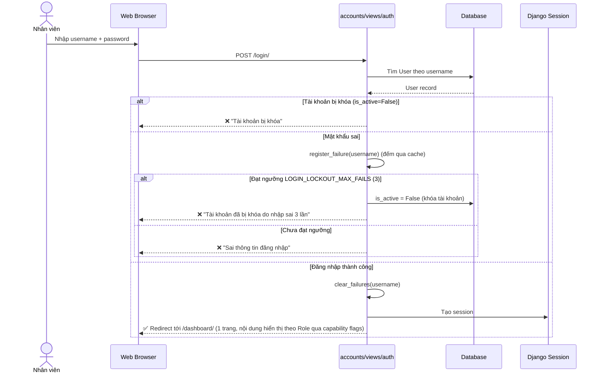

> [!NOTE]
> **Đã triển khai bảo mật đăng nhập:** sai mật khẩu liên tiếp `LOGIN_LOCKOUT_MAX_FAILS=3` lần (cửa sổ `LOGIN_LOCKOUT_WINDOW_SEC=900s`, đếm qua cache trong `login_lockout_service.py`) → tự khóa `is_active=False`, chờ HR/Admin mở khóa. Session timeout 30 phút qua `SESSION_COOKIE_AGE=1800` + `SESSION_SAVE_EVERY_REQUEST=True` (làm mới hạn mỗi request).

---

### 5.2 Quên Mật Khẩu (OTP qua Email)

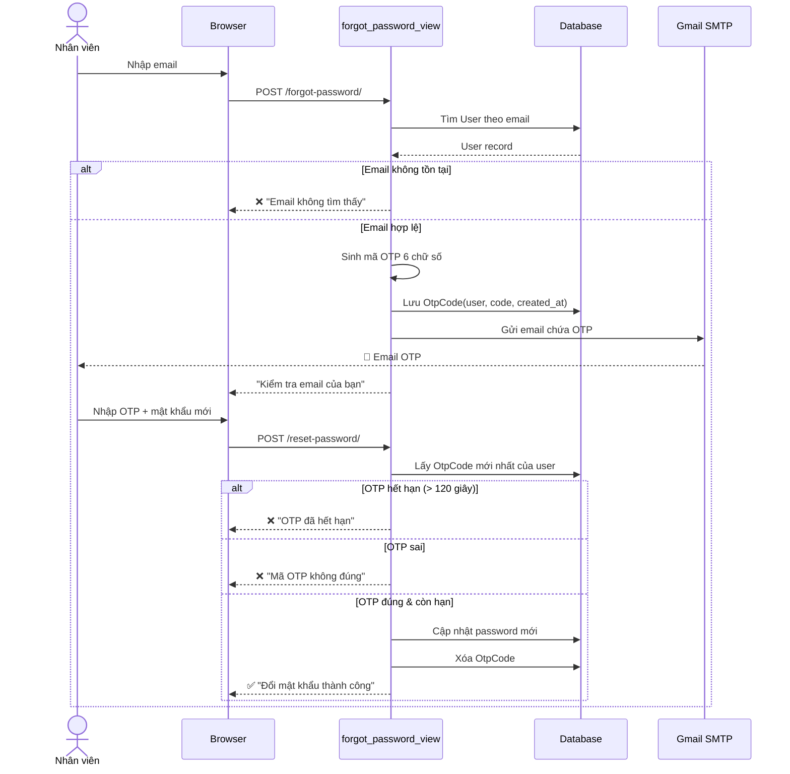

---

### 5.3 Tạo Hồ Sơ Nhân Viên Mới (HR)

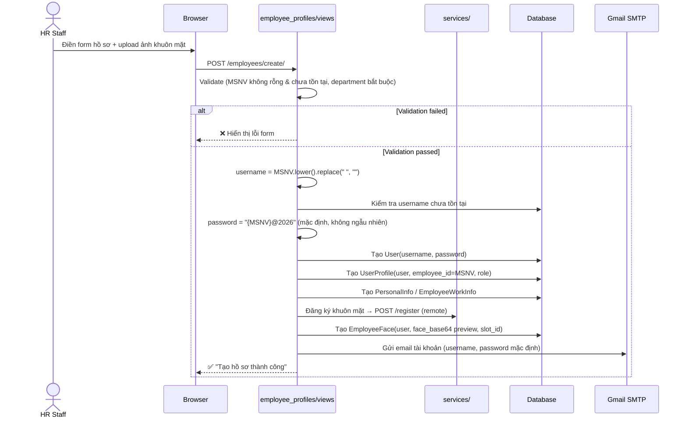

> [!NOTE]
> **Hai đường tạo tài khoản:**
> 1. **HR — Tạo hồ sơ nhân sự** (luồng trên): form hồ sơ đầy đủ, sinh username từ MSNV, đăng ký khuôn mặt, gửi email.
> 2. **Admin — Tạo tài khoản nhanh** (`admin_create_account_view`, route `users/create-account/`): chỉ nhập `username` + `password` + xác nhận (qua `validate_password`). Không tạo hồ sơ/khuôn mặt; vai trò gán sau ở trang Quản lý tài khoản. Admin giữ nguyên phiên đăng nhập hiện tại.

---

### 5.4a Đăng Ký / Cập Nhật Khuôn Mặt

> Quy trình này xử lý cả lần đầu đăng ký (tự động duyệt) và cập nhật khuôn mặt (chờ HR duyệt). Giao diện Cài đặt cung cấp thanh theo dõi trạng thái `FaceChangeRequest` trực quan.

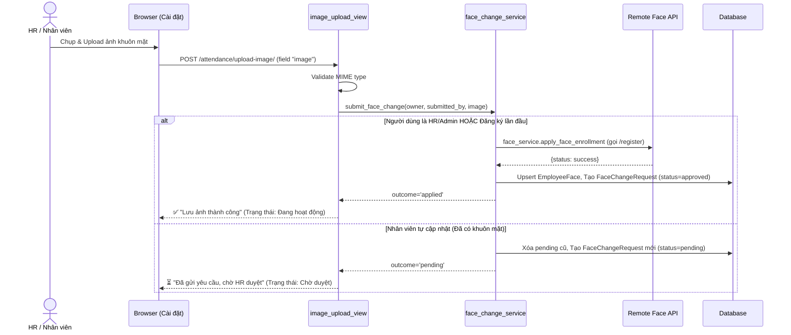

> **HR Duyệt:** Khi HR duyệt (`approve_face_change`), hệ thống mới đọc ảnh từ `FaceChangeRequest` và đẩy lên Remote Face API (`/register`), sau đó cập nhật `EmployeeFace`. Nếu từ chối, `status=rejected` kèm lý do.

---

### 5.4b Chấm Công FaceID (Remote `/recognize`)

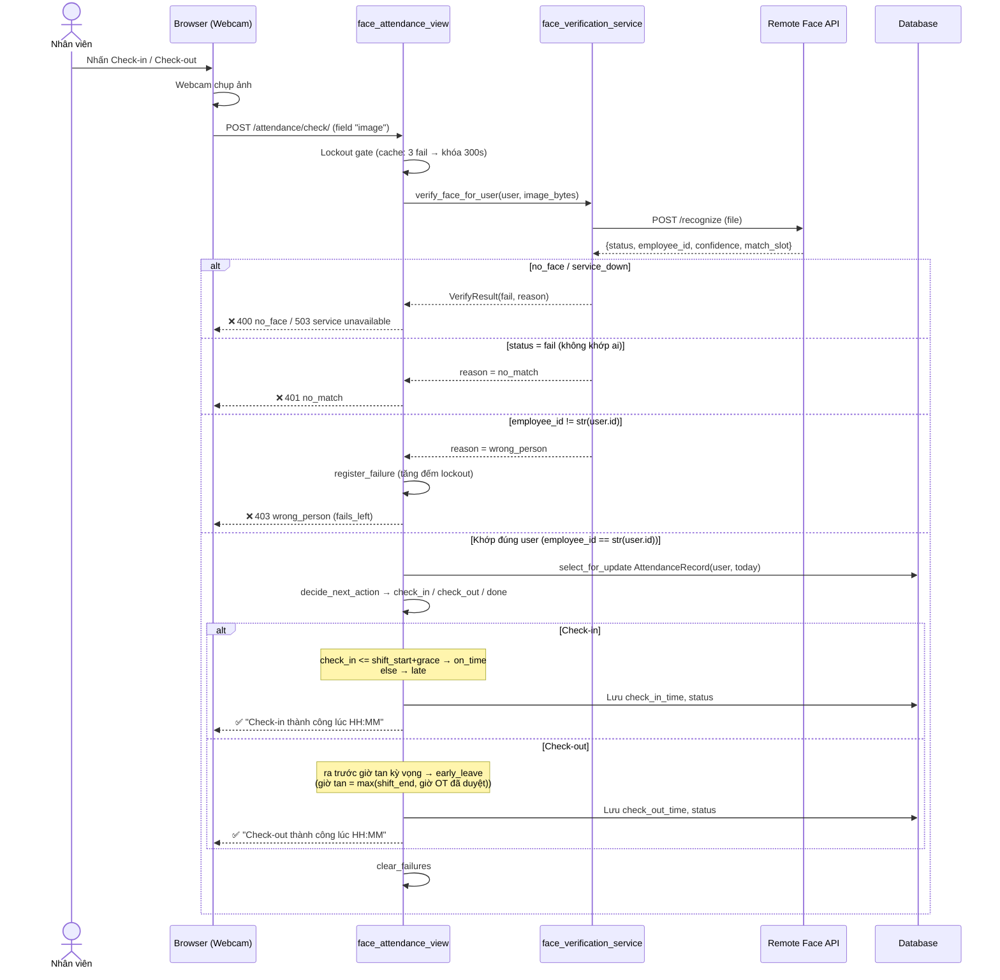

> [!NOTE]
> **Kiến trúc mới:** Django **không** so khớp embedding nữa. Toàn bộ trích xuất vector + tìm kiếm chạy trên service từ xa (FAISS, ngưỡng cosine `THRESHOLD = 0.40` phía server). Quy tắc 1:1 nằm ở `face_verification_service`: nhận diện hợp lệ ⟺ `recognize.employee_id == str(user.id)`.
>
> **Client (`attendance/services/face/face_api_client.py`):**
> - `register_face_remote()` → `POST {FACE_API_BASE_URL}/register`
> - `recognize_face_remote()` → `POST {FACE_API_BASE_URL}/recognize`
> - `health_check()` → `GET {FACE_API_BASE_URL}/health`
> - Cấu hình: `FACE_API_BASE_URL` (default HuggingFace Space), `FACE_API_TIMEOUT_SEC=30` trong `settings.py`.
> - Map lỗi: HTTP 400 + "no face" → `FaceApiError('no_face')`; lỗi mạng/timeout → `service_down`.

---

### 5.5 Nghỉ Phép — Luồng Phê Duyệt 2 Cấp

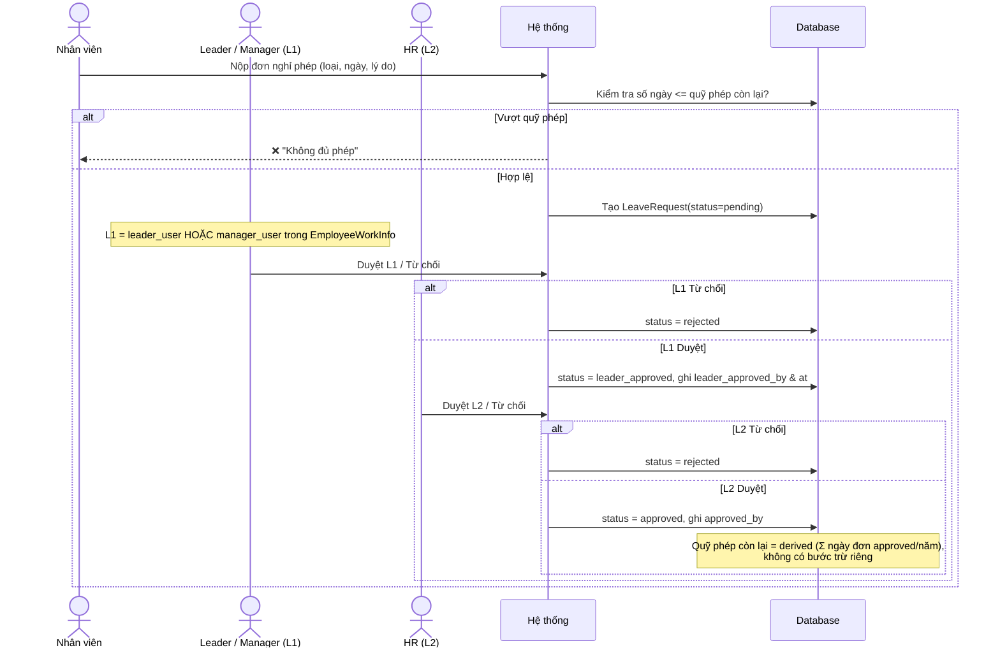

---

### 5.6 Tăng Ca OT — Luồng Phê Duyệt 2 Cấp

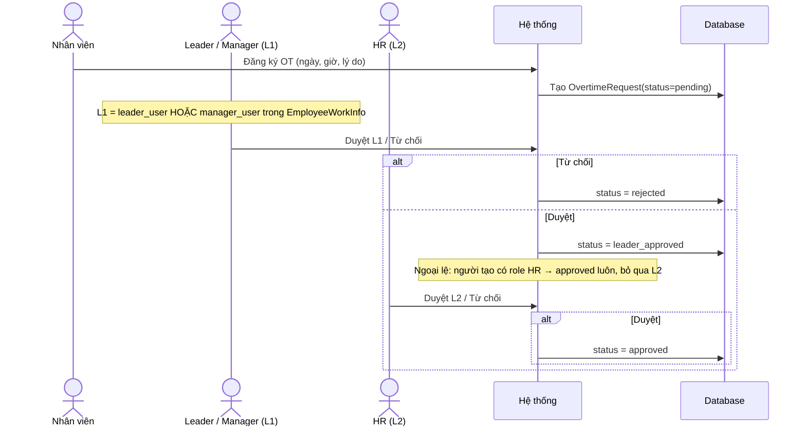

---

### 5.7 Hợp Đồng — Cảnh Báo Tự Động (Batch Job)

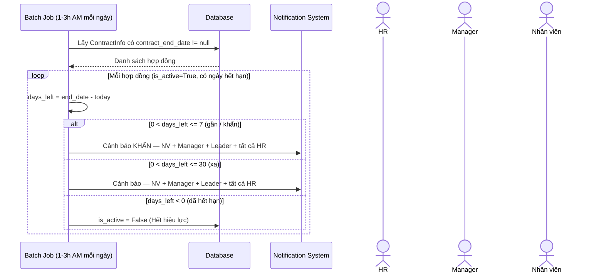

> Lập lịch qua Task Scheduler (`setup_task_scheduler.py`) trên Windows — **chỉ chạy ở máy local**. **Render free KHÔNG có cron** ⇒ trên prod batch job này hiện không tự chạy; cần Render Cron Job (paid), external scheduler gọi endpoint trigger, hoặc Celery beat + worker.

---

### 5.8 Đánh Giá Nhân Viên

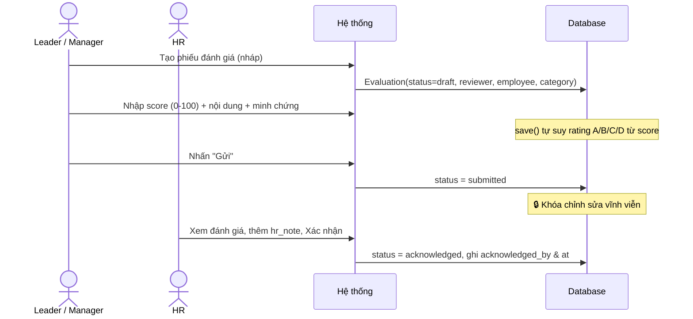

---

### 5.9 Khen Thưởng / Xử Phạt — Luồng 2 Cấp

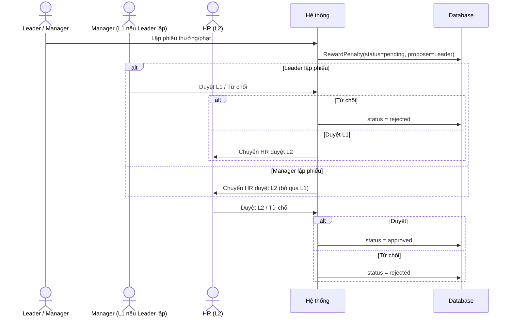

---

### 5.10 Báo Cáo Công Việc

```mermaid
sequenceDiagram
    actor Employee as Nhân viên / Leader
    actor Manager as Manager / HR
    participant System as Hệ thống
    participant DB as Database

    Note over Employee: Employee → gửi Leader; Leader → gửi Manager.<br/>Manager/HR không có nghĩa vụ nộp.

    Employee->>System: Tạo & gửi báo cáo (tiêu đề, nội dung, file)
    System->>DB: Report(author, recipient, is_viewed=False, status=submitted)

    Manager->>System: Xem báo cáo
    System->>DB: is_viewed = True, viewed_at = now()

    alt Cần bổ sung
        Manager->>System: Yêu cầu cập nhật + manager_note
        System->>DB: status = needs_update
    else Tiếp nhận
        Manager->>System: Xác nhận tiếp nhận
        System->>DB: status = acknowledged
        Note over DB: 🔒 Khóa sửa/xóa (can_edit_or_delete=False)
    end
```

---

### 5.11 Helpdesk Ticket — Tiếp Nhận & Xử Lý

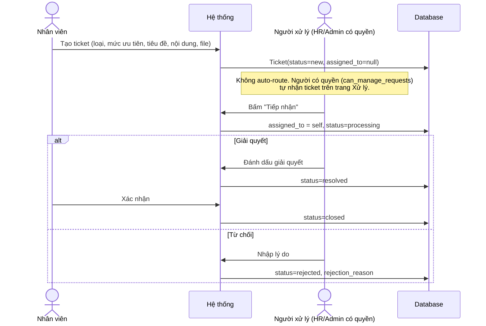

---

## 6. Vòng Đời Trạng Thái Các Đối Tượng

### Đơn Nghỉ Phép / Tăng Ca

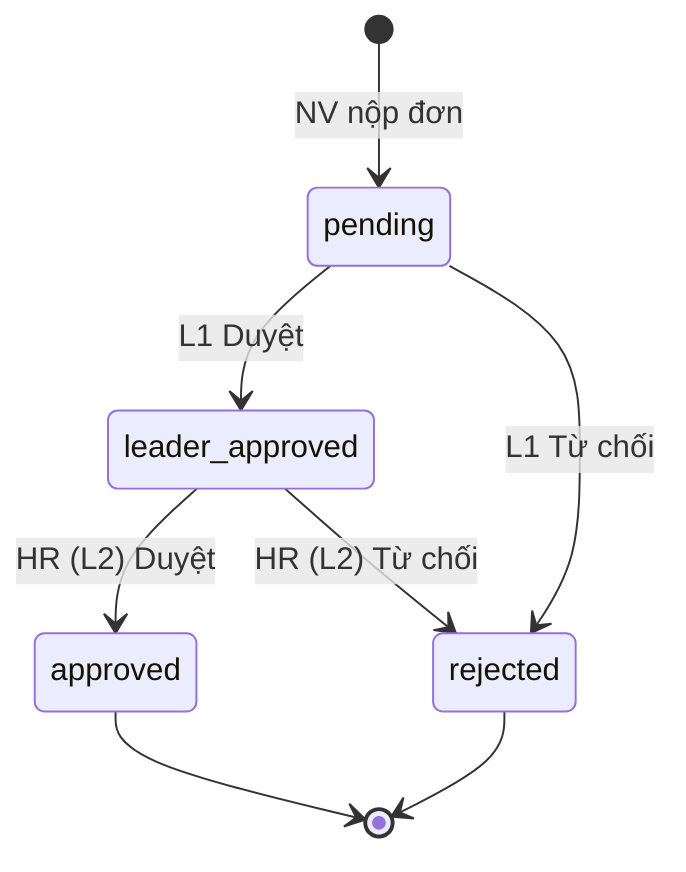

### Ticket Helpdesk

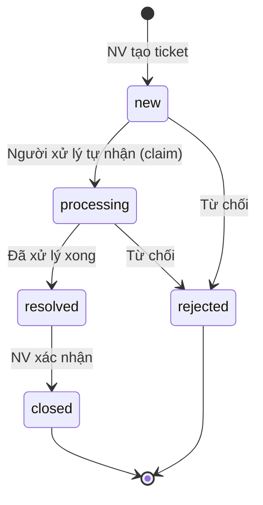

### Hợp Đồng

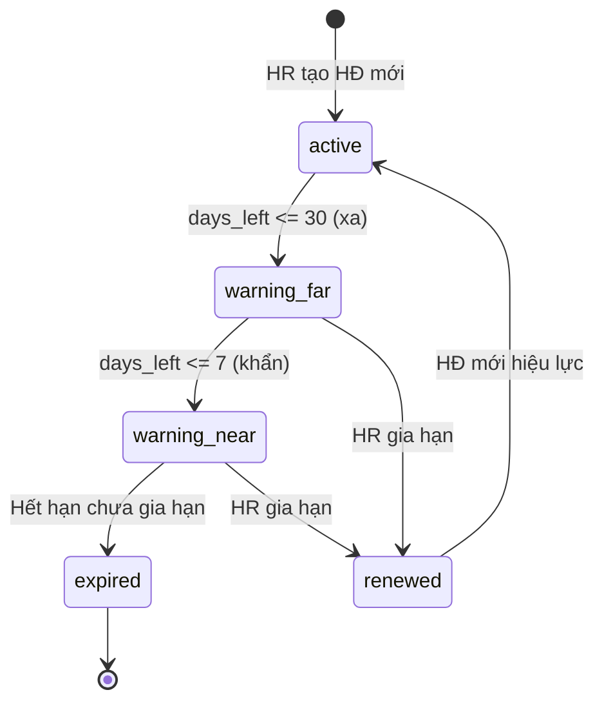

### Đánh Giá Nhân Viên

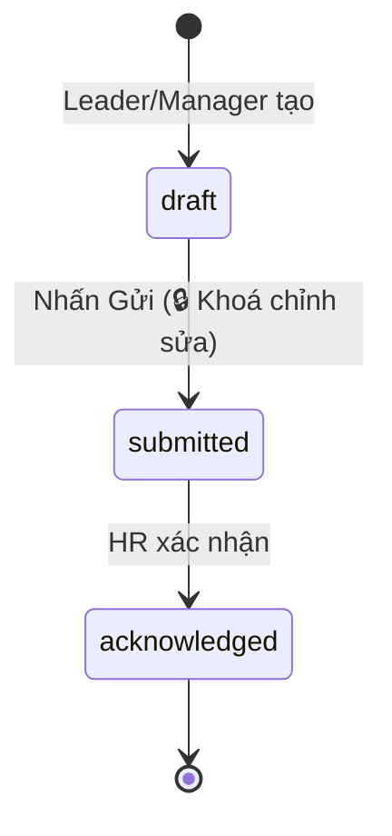

### Báo Cáo Công Việc

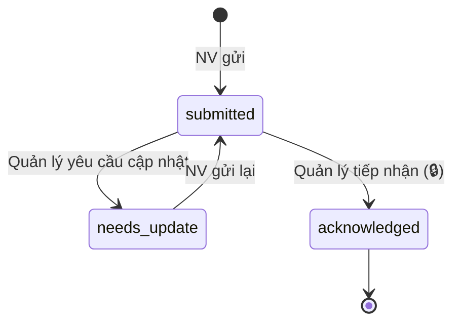

---

## 7. Quy Định Nghiệp Vụ Quan Trọng

| Mã | Nội dung | Trạng thái trong code |
|----|---------|------------------------|
| `QĐ_TK1` | Sai MK 3 lần → khóa `is_active=False` | ✅ `login_lockout_service` (cache, `LOGIN_LOCKOUT_MAX_FAILS=3`, window 900s) wired ở `AccountsLoginView` |
| `QĐ_TK2` | HR mở khóa Employee/Leader/Manager; Admin mở khóa mọi tài khoản | Có view khóa/mở (`account_status_view`) |
| `QĐ_Tao_MSNV` | HR **nhập MSNV tay** khi tạo hồ sơ | ✅ Nhập thủ công (không auto-sinh) |
| `QĐ_Tao_Username` | username = MSNV viết thường bỏ trắng; pass mặc định `{MSNV}@2026` | ✅ Triển khai |
| `QĐ_PheDuyet_L1` | `leader_user` HOẶC `manager_user` của NV → duyệt L1 | ✅ Triển khai |
| `QĐ_PheDuyet_L2` | Sau L1 → HR xác nhận | ✅ (OT: HR tự tạo → bỏ qua L2) |
| `QĐ_CapNhat_DuLieu` | Nghỉ phép/OT/thưởng-phạt chỉ hiệu lực sau L2 | ✅ |
| `QĐ_CanhBao` | 2 mốc: 30 ngày (xa) & 7 ngày (khẩn); người nhận: NV + Manager + Leader + tất cả HR | ✅ Batch job (`THRESHOLD_FAR=30`, `THRESHOLD_NEAR=7`) |
| `QĐ_DieuChinh` | HR chỉ sửa giờ công kỳ hiện tại (chưa chốt lương) | ✅ AdjustmentRequest |
| `QĐ_LuuTruDanhGia` | Sau `submitted` → không sửa đánh giá | ✅ |
| `QĐ_XacNhanBaoCao` | Sau `acknowledged` → khóa sửa/xóa báo cáo | ✅ `can_edit_or_delete` |
| `QĐ_DieuHuong` | Ticket `new` → người có quyền tự nhận (claim), không auto-route | ✅ Claim thủ công |
| `QĐ_NghiViec` | NV `resigned` → `is_active=False` | Yêu cầu nghiệp vụ |
| `QĐ_Session` | Không hoạt động 30 phút → tự đăng xuất | ✅ `SESSION_COOKIE_AGE=1800` + `SESSION_SAVE_EVERY_REQUEST=True` |

---

## 8. Tech Checklist Deploy

- [ ] Service nhận diện từ xa (`FACE_API_BASE_URL`) sống & `/health` ok; test `/register` + `/recognize` với webcam thực (server threshold cosine 0.40)
- [ ] `FACE_API_TIMEOUT_SEC` đủ lớn cho cold-start DeepFace; xử lý fallback khi service down (503)
- [ ] Batch Job (cảnh báo HĐ + `close_open_attendance`) chạy đúng giờ — ⚠️ Render free không có cron, cần Render Cron Job / external scheduler / Celery beat
- [ ] Gmail SMTP config qua `.env` cho OTP reset mật khẩu
- [x] `SESSION_COOKIE_AGE=1800` + `SESSION_SAVE_EVERY_REQUEST=True` — session timeout 30 phút
- [x] Đếm `failed_login` qua cache → khóa sau 3 lần sai (`login_lockout_service`)
- [ ] File upload: validate định dạng (PDF/JPG/PNG) và giới hạn 5MB
- [ ] RBAC test đủ 5 role không bị bypass
- [x] DB production: **PostgreSQL trên Render** (`dj-database-url` + `psycopg2`) — đã chuyển khỏi SQLite
- [x] HTTPS bắt buộc — đã enforce (`SECURE_SSL_REDIRECT` + HSTS khi `DEBUG=False`, Render terminate TLS)
- [x] Media bền qua redeploy: **Cloudinary** (`USE_CLOUDINARY=True`)

---

> 📌 **Ghi chú:** File phản ánh codebase đến ngày **03/06/2026** (đối chiếu trực tiếp với models trong `business_web/*/models/`, services & `settings.py`). Đã cập nhật: model `Notification`, khóa đăng nhập sau 3 lần sai (`login_lockout_service`), session timeout 30 phút, RewardPenalty duyệt 2 cấp, FaceChangeRequest (sha256/ip/content_type), Admin tạo tài khoản nhanh. Các mục đánh dấu "Yêu cầu nghiệp vụ" còn lại là quy định theo đặc tả nhưng chưa xác nhận trong code.
